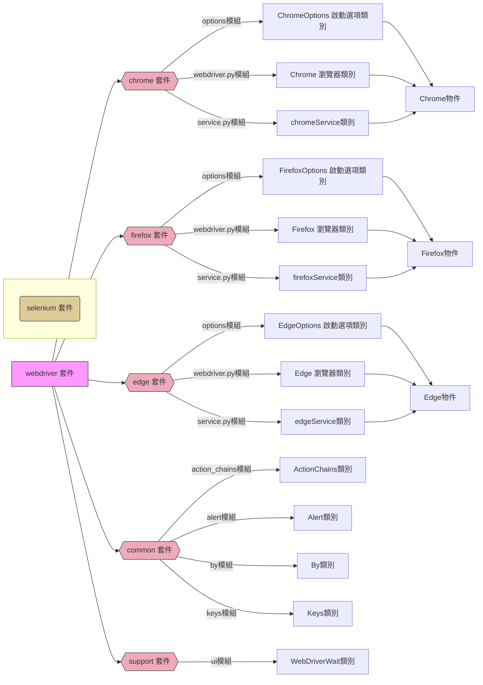

# selenium 套件


[Selenium](https://pypi.org/project/selenium/) 是一個開源的自動化操作網頁工具，它支援多種瀏覽器，並提供一個簡單的API，用戶可以使用多種程式語言（包括 Python）來編寫腳本。主要用途在於網頁爬蟲、自動化測試等應用，許多的網站測試框架，也都是以 selenium 為基礎所發展。

Selenium 使用符合 WebDriver W3C Protocol 的方式驅動 WebDriver 控制瀏覽器，並模擬用戶操作，這樣的設計確保了在不同瀏覽器中的一致性，使得腳本能夠以相同的方式運行，而不受底層瀏覽器實作的差異影響。

以爬蟲應用為例，動態網頁無法使用像 beautifulsoup 這樣的套件進行處理，需先使用 selenium 進行瀏覽器的操作，方便後續進行網頁資訊的擷取與分析。

:::info
**WebDriver W3C Protocol**

WebDriver W3C Protocol 定義了一系列的命令和事件，讓腳本能撰寫出模擬人與瀏覽器之間的互動。包括了瀏覽器的啟動、導航、元素查找、用戶輸入、狀態查詢等操作。 使用 WebDriver W3C Protocol 的好處在於能夠讓開發者<u>使用相同的命令和事件來操作各種不同的瀏覽器</u>，而不需要擔心不同瀏覽器實現的細節。
:::

## 安裝
### 下載瀏覽器驅動程式
要能夠使用 Selenium 操控不同的瀏覽器，必須要先安裝對應的瀏覽器驅動程式，常用的 Driver 如下：
* [Google Chrome Driver](https://googlechromelabs.github.io/chrome-for-testing/)
* [Microsoft Edge Driver](https://developer.microsoft.com/en-us/microsoft-edge/tools/webdriver/)
* [Firefox Driver](https://github.com/mozilla/geckodriver/releases)

請先下載瀏覽器驅動程式至專案目錄中，以 Chrome 為例，要將 chromedriver.exe 放到專案目錄下。

:::warning
實測之後發現，就算不先下載瀏覽器驅動程式，在第一次呼叫 `webdriver.Chrome()`、`webdriver.Firefox()` 或 `webdriver.Edge()` 時，Selenium 會自動將對應的瀏覽器驅動程式下載到`%USERPROFILE%\.cache\selenium` 使用者的家目錄中。


:::
### 下載 Selenium 套件
請先為專案建立虛擬環境，然後安裝 Selenium 套件
```bash=
py -m venv env                      # 建立 env 虛擬環境
env\Scripts\activate                # 啟動 env 虛擬環境
(env) pip install Selenium          # 安裝 Selenium 套件
(env) pip list                      # 檢視在 env 虛擬環境中裝了那些套件?
(env) pip install -U Selenium       # 更新套件命令
(env) deactivate                    # 離開 env 虛擬環境
```


## Selenium 套件的階層架構


## 不同的瀏覽器類別
在 Selenium 中對照不同瀏覽器都設計了對應的類別，這個類別支援了 WebDriver 協定，以便實例化後可使用相同的屬性與方法，操作不同的瀏覽器。

```python=
from selenium import webdriver

# 建立 Firefox 瀏覽器實例
browser = webdriver.Firefox()   # Firefox 瀏覽器
# browser = webdriver.Chrome()  # Chrome 瀏覽器
# browser = webdriver.Edge()    # Edge 瀏覽器

url = "https://www.google.com.tw/"
browser.get(url)
```

### 呼叫建構函式
建構瀏覽器物件時可以加上 Services 參數與 Options 參數，以 Firefox 瀏覽器為例
- a. Services 參數用於配置和啟動 service 服務，需先建立 Service 物件。
- b. Options 參數用於設定 Firefox 選項，需先建立 options 物件。

```python
from selenium import webdriver
from selenium.webdriver.firefox.options import Options
from selenium.webdriver.firefox.service import Service

# 建立 firefox_options 物件，用於配置 Firefox 選項
firefox_options = Options()
firefox_options.add_argument("--headless")  # 例如，設定為無頭模式

# 建立 Service 物件，用於配置和啟動 GeckoDriver 服務
firefox_service = Service("../drivers/geckodriver.exe")  # 請替換為實際的 GeckoDriver 路徑

# 使用 options 和 Service 來建立 Firefox 瀏覽器物件
browser = webdriver.Firefox(options=firefox_options, service=firefox_service)

# 現在你可以使用 browser 來操作 Firefox 瀏覽器了
browser.get("https://www.example.com")

# 獲取網頁標題
title = browser.title
print("網頁標題:", title)
```

#### a. Services 服務物件
不同瀏覽器有不同的 Service 類別，可透過 executable_path 參數設定【瀏覽器驅動程式的路徑】，建立 Service 物件。

沒有明確提供 Service 物件時，Selenium 會自動搜索系統的 PATH 變數以查找瀏覽器驅動程式的可執行檔，若還是找不到瀏覽器驅動程式，Selenium 會自動將對應的瀏覽器驅動程式下載到 `%USERPROFILE%\.cache\selenium` 使用者的家目錄中。
 
```python=
from selenium import webdriver
from selenium.webdriver.chrome.service import Service # 配置和啟動 ChromeDriver 服務

# 假設瀏覽器驅動程式放在上層目錄的 drivers 子目錄。
chrome_service = Service(executable_path='../drivers/chromedriver.exe')

# 建立 Chrome 瀏覽器實例
browser = webdriver.Chrome(service=chrome_service)

url = "https://www.google.com.tw/"
browser.get(url)
```
#### b. Options 選項物件
Options 選項物件可用來設定瀏覽器的選項或實驗性的選項，例如以無視窗模式進行背景的運作或設定下載路徑，而不同的瀏覽器要搭配不同的選項，但同樣的都需要建立 Options 選項物件。
* ChromeOptions()：Chrome 啟動選項物件
* FirefoxOptions()：Mozilla Firefox 啟動選項物件
* EdgeOptions()：Microsoft Edge 啟動選項物件
* IeOptions()：Internet Explorer 啟動選項物件
* SafariOptions()：Safari 啟動選項物件
* ChromiumOptions()：Chromium 啟動選項物件

Options 選項物件有二種建立方式，二者是等效的
```python=
# 方法1
from selenium.webdriver.firefox.options import Options

firefox_options = Options()
firefox_options.add_argument("--headless") 
browser = webdriver.Firefox(options=firefox_options)
```
```python=
# 方法2
firefox_options = webdriver.FirefoxOptions()

firefox_options.add_argument("--headless") 
browser = webdriver.Firefox(options=firefox_options)
```

Options 選項物件的方法
* add_argument(argument)： 將命令列參數添加到瀏覽器選項中。
* add_experimental_option(name, value)： 添加實驗性的選項。

範例程式碼：
```python=
from selenium import webdriver

# 建立 EdgeOptions 物件，用於設定 Edge  選項
edge_options = webdriver.EdgeOptions()

edge_options.add_argument("--inprivate")  # 設定為無痕模式
edge_options.add_argument("--start-maximized")  # 設定為最大化
edge_options.add_argument("--start-fullscreen")  # 設定為全螢幕
edge_options.add_argument("--ignore-certificate-errors")  # 忽略憑證錯誤
edge_options.add_argument("--ignore-ssl-errors")  # 忽略 SSL 錯誤
edge_options.add_argument("--allow-running-insecure-content")  # 允許執行不安全的內容
edge_options.add_argument("--user-agent=Mozilla/5.0")  # 設定使用者代理
edge_options.add_argument("--disable-popup-blocking")  # 禁用彈出攔截
edge_options.add_argument("--disable-extensions")  # 禁用擴展

# 某些網站開啟時在終端機會有警告訊息出現，若不想看到的話，可以使用  add_experimental_option 方法，排除特定的開發者日誌，此處排除 'enable-logging'
edge_options.add_experimental_option('excludeSwitches', ['enable-logging'])
# 設定檔案下載路徑
edge_options.add_experimental_option(
    "prefs", {"download.default_directory": "C:\\Users\\user\\Downloads"}
)
# 關閉彈出視窗
edge_options.add_experimental_option(
    "prefs", {"profile.default_content_settings.popups": 0}  # 設定關閉彈出視窗 0 為關閉，1 為開啟
)

# 建立 Edge 瀏覽器實例，並套用上述設定
browser = webdriver.Edge(options=edge_options)
browser.get("https://tw.yahoo.com/")  # 打開 Yahoo 台灣的首頁
browser.quit()  # 關閉瀏覽器
```

## 瀏覽器物件的屬性與方法


以下用瀏覽器物件模型(BOM)與文件物件模型(DOM)的角度來介紹瀏覽器物件的屬性與方法

### 1. 瀏覽器物件模型
瀏覽器物件模型(Browser Object Model; BOM) 是瀏覽器提供的物件，讓我們可以操作與溝通瀏覽器。

#### 瀏覽器物件屬性
* current_url 屬性： 獲取目前瀏覽器視窗的 URL。
* title 屬性： 獲取目前瀏覽器視窗的標題。

#### 瀏覽器物件方法
* `get(url)`： 載入指定的 URL。
* `implicitly_wait(10)`： 設定隱性等待時間的最大秒數。
* `back()`： 在瀏覽器中模擬後退操作。
* `forward()`： 在瀏覽器中模擬前進操作。
* `refresh()`： 刷新當前頁面。
* `switch_to.window(window_name)`： 切換到指定的視窗。
* `execute_script(script, *args)`： 執行 JavaScript 腳本。
* `save_screenshot()`：對網頁的可視頁面進行截圖並儲存。
* `maximize_window()`： 最大化瀏覽器視窗。
* `minimize_window()`： 最小化瀏覽器視窗。
* `set_window_size(width, height)`： 設置瀏覽器視窗大小。
* `close()`： 關閉目前視窗。
* `quit()`： 關閉整個瀏覽器。

範例程式碼
```python=
import time

from selenium import webdriver

# 建立 WebDriver 實例
browser = webdriver.Chrome()

# 使用 get() 方法載入指定的 URL
browser.get("https://www.example.com")

# 設定隱性等待時間
browser.implicitly_wait(3)  # 等待的最大秒數

# 使用 current_url 屬性獲取目前瀏覽器視窗的 URL
current_url = browser.current_url
print("目前網頁的 URL:", current_url)

# 使用 title 屬性獲取目前瀏覽器視窗的標題
title = browser.title
print("目前網頁標題:", title)

print("開啟新的頁籤載入新的網頁")
# 開啟新的頁籤
browser.execute_script("window.open('', '_blank');")
time.sleep(1)  # 等待 1 秒，確保新的頁籤已經被打開
# 切換到新的頁籤
browser.switch_to.window(browser.window_handles[1])
# 在新的頁籤載入新的 URL
browser.get("https://www.ncut.edu.tw/")
print("對整個網頁進行截圖")
browser.save_screenshot("_screenshot.png")
browser.get("https://www.google.com.tw/")
time.sleep(3)  # 等待 3 秒

# 使用 back() 方法在瀏覽器中模擬後退操作
print("上一頁")
browser.back()
time.sleep(3)  # 等待 3 秒

# 使用 forward() 方法在瀏覽器中模擬前進操作
print("下一頁")
browser.forward()
time.sleep(3)  # 等待 3 秒

# 使用 refresh() 方法刷新目前頁面
print("刷新目前頁面")
browser.refresh()
time.sleep(3)  # 等待 3 秒

# 使用 maximize_window() 方法最大化瀏覽器視窗
print("最大化瀏覽器視窗")
browser.maximize_window()
time.sleep(3)  # 等待 3 秒

# 使用 minimize_window() 方法最小化瀏覽器視窗
print("最小化瀏覽器視窗")
browser.minimize_window()
time.sleep(3)  # 等待 3 秒

# 使用 set_window_size(width, height) 方法設置瀏覽器視窗大小
print("設置視窗大小為 800x600")
browser.set_window_size(800, 600)
time.sleep(3)  # 等待 3 秒

# 使用 close() 方法關閉目前頁面
print("關閉目前頁面")
browser.close()
time.sleep(3)  # 等待 3 秒

# 使用 quit() 方法關閉瀏覽器
print("關閉瀏覽器")
browser.quit()
```

### 2. 文件物件模型


文件物件模型(Document Object Model; DOM) 提供了一個文件（樹）的結構化表示法，並定義讓程式可以存取並改變文件架構、風格和內容的方法。

#### 元素定位方法
元素定位即為 DOM 的遍歷
1. 查找單一元素用 `find_element(定位方法:By常量類別, value='定位值')`
2. 查找多個元素用 `find_elements(定位方法:By常量類別, value='定位值')`

Selenium 對於定位方法定義了 By 常量類別，必須使用 `from selenium.webdriver.common.by import By` 引用後才能使用。
* By.ID：透過元素的 ID 屬性進行定位。
使用方式：find_element(By.ID, 'element_id')
* By.NAME：透過元素的 Name 屬性進行定位。
使用方式：find_element(By.NAME, 'element_name')
* By.CLASS_NAME：透過元素的 Class 屬性進行定位。
使用方式：find_element(By.CLASS_NAME, 'element_class')
* By.TAG_NAME：透過元素的標籤名稱進行定位。
使用方式：find_element(By.TAG_NAME, 'tag_name')
* By.LINK_TEXT：透過元素的連結文字進行定位，通常用於 `<a>` 元素。
使用方式：find_element(By.LINK_TEXT, 'link_text')
* By.PARTIAL_LINK_TEXT：透過部分連結文字進行定位。
使用方式：find_element(By.PARTIAL_LINK_TEXT, 'partial_link_text')
* By.XPATH：透過 XPath 表達式進行定位，提供了靈活的選擇。
使用方式：find_element(By.XPATH, 'xpath_expression')
* By.CSS_SELECTOR：透過 CSS 選擇器進行定位，也是一種靈活的選擇方式。
使用方式：find_element(By.CSS_SELECTOR, 'css_selector')

以上所有方法皆會返回 WebElement 物件，以此物件可進行各種操作，例如取得屬性、模擬點擊等等。

#### WebElement 物件的屬性與方法
找到元素後，就可以對元素進行相關操作，即為 DOM 的操作。
1. 屬性
    * text：取得元素的文字內容。
    * tag_name：取得元素的標籤名稱。
    * size：取得元素的寬度和高度。，例:`{'height': 42, 'width': 90}`
    * location：取得元素在頁面中的位置，例:`{'x': 380, 'y': 79}`。
2. 方法
    * get_attribute(attribute_name)：獲取元素在 HTML 中定義屬性值，返回字串。
    * get_property(name)：獲取 JavaScript 物件屬性的值。
    * click()：模擬點擊操作。
    * send_keys(*values)：用於對輸入欄位元素輸入文字。
    * clear()：用於清空元素的內容，通常應用在輸入欄位。
    * submit()：用於提交表單，通常應用在包含輸入欄位和提交按鈕的表單上。
    * execute_script(script, *args)：用於執行 JavaScript 腳本，可以實現一些特殊的操作，例如修改元素屬性、滾動頁面等。*args 是可選的，可將參數傳遞給 JavaScript 函數。
    * is_displayed()： 檢查元素是否可見。
    * is_enabled()： 檢查元素是否可用。
    * is_selected()： 檢查元素是否被選中（對於 checkbox 或 radio button）。

<!-- 
* double_click()：連續按兩下滑鼠左鍵。
* context_click()：按下滑鼠右鍵 ( 需搭配指定元素定位 )。
相對定位
由於 DOM 為樹狀結構，樹狀結構最重要的觀念就是 Node 彼此之間的關係，這邊可以分成以下兩種關係：
1. 父子關係(Parent and Child)
簡單來說就是上下層節點，上層為 Parent Node ，下層為 Child Node 。
2. 兄弟關係(Siblings)
簡單來說就是同一層節點，彼此間只有 Previous 以及 Next 兩種。
* parent()：元素的父節點
* children()：元素的子節點
* find_next_sibling()：元素的下一個兄弟節點
* find_previous_sibling()：元素的上一個兄弟節點 -->

範例程式碼：
```python=
from selenium import webdriver
from selenium.webdriver.common.by import By
import time

# 建立 WebDriver 實例
browser = webdriver.Chrome()

# 設定隱性等待時間
browser.implicitly_wait(10)  # 等待的最大秒數

# 使用 get() 方法載入指定的 URL
browser.get("https://www.ncut.edu.tw/")

# 使用 find_element 方法找到指定名稱的元素屬性
name_element = browser.find_element(By.NAME, "sitesearch")
print("\n透過名稱找到的元素屬性:", name_element.get_attribute("value"))

# 使用 find_element 方法找到指定 ID 的元素文字
id_element = browser.find_element(By.ID, "Hln_2066")
print("\n透過 ID 找到的元素文字:", id_element.text)
print("元素的標籤名稱:", id_element.tag_name)
print("元素的寬度和高度:", id_element.size)
print("元素在頁面中的位置:", id_element.location)

# 使用 find_element 方法找到指定類別名稱的元素文字
class_element = browser.find_element(By.CLASS_NAME, "focusable")
print("\n透過類別名稱找到的元素文字:", class_element.text)

# 使用 find_element 方法找到指定標籤名稱的元素屬性
tag_element = browser.find_element(By.TAG_NAME, "form")
print("\n透過標籤名稱找到的元素屬性:", tag_element.get_attribute("action"))

# 使用 find_element 方法找到指定連結文字的元素文字
link_text_element = browser.find_element(By.LINK_TEXT, "單簽平台")
print("\n透過連結文字找到的元素文字:", link_text_element.text)

# 使用 find_element 方法找到包含指定文字的元素文字
partial_link_text_element = browser.find_element(By.PARTIAL_LINK_TEXT, "跳到")
print("\n透過部分連結文字找到的元素文字:", partial_link_text_element.text)

# 使用 find_element 方法找到符合 XPath 表達式的元素文字
xpath_element = browser.find_element(By.XPATH, "//div[@class='meditor']")
print("\n透過 XPath 表達式找到的元素文字:", xpath_element.text)

# 使用 find_element 方法找到符合 CSS 選擇器的元素屬性
css_element = browser.find_element(By.CSS_SELECTOR, "#start-C")
print("\n透過 CSS 選擇器找到的元素屬性:", css_element.get_attribute("title"))

# WebElement 的其他方法
css_element = browser.find_element(By.CSS_SELECTOR, "a.btn.btn-primary.navbar-toggle1")
css_element.click()  # 點擊元素
css_element = browser.find_element(By.CSS_SELECTOR, "#q")
css_element.send_keys("資訊工程系")  # 輸入文字
css_element.clear()  # 清空輸入框
css_element.send_keys("電子計算機中心")
css_element = browser.find_element(By.CSS_SELECTOR, "input.gsch_btn")
css_element.submit()  # 提交表單
time.sleep(3)  # 暫停 3 秒

# 使用 JavaScript 執行腳本: 滾動到網頁底部
browser.back()  # 回上一頁
browser.execute_script("window.scrollTo(0, document.body.scrollHeight)")
time.sleep(3)  # 暫停 3 秒

# 關閉瀏覽器
browser.quit()
```

### 3.對複雜操作建立的物件 ActionChains
WebElement 物件自帶的方法只能對單一元素進行基本互動，例如點擊、輸入文字、獲取屬性值等。但當我們需要模擬複雜的使用者動作，例如滑鼠的移動、雙擊、右鍵點擊，或者需要將一連串的動作組合起來執行時，WebElement自帶方法就顯得力有未逮了，此時就要改用 ActionChains 物件。ActionChains 允許我們為所有動作建立一個序列，然後使用 perform() 一次性執行這些動作。

ActionChains 物件常用的方法如下：
* move_to_element(to_element): 將滑鼠移動到指定的元素。
* click(on_element=None): 點擊當前滑鼠位置或指定的元素。
* context_click(on_element=None): 右鍵點擊當前滑鼠位置或指定的元素。
* double_click(on_element=None): 雙擊當前滑鼠位置或指定的元素。
* drag_and_drop(source, target): 拖放操作，將來源元素拖放到目標元素。
* *send_keys(keys_to_send): 向當前的元素發送鍵盤輸入。
* key_down(value, element=None): 模擬按下某個按鍵。
* key_up(value, element=None): 模擬釋放某個按鍵。
* move_by_offset(xoffset, yoffset): 將滑鼠相對於當前位置移動指定的偏移量。
* perform(): 執行建立的所有動作。

範例程式碼：
```python=
from time import sleep
from selenium import webdriver
from selenium.webdriver.common.action_chains import ActionChains
from selenium.webdriver.common.by import By

# 建立 Chrome WebDriver 實例
browser = webdriver.Chrome()

# 前往指定的網址
browser.get("https://www.ncut.edu.tw/")
browser.execute_script("window.scrollTo(0, 800)")  # 滾動到網頁 x = 0, y = 800 的位置
sleep(3)  # 等待5秒，方便觀察

# 建立 ActionChains 物件，用於執行一連串的滑鼠與鍵盤動作
actions = ActionChains(browser)

# 假設 element1 和 element2 是兩個網頁上的元素
xpath_expression = "//a[@title='獎助學金']"
element1 = browser.find_element(By.XPATH, xpath_expression)
xpath_expression = "//a[@title='演講']"
element2 = browser.find_element(By.XPATH, xpath_expression)

# 移動滑鼠游標到 element1 上，然後點擊，接著移動到 element2 再點擊
actions.move_to_element(element1).click().perform()
sleep(3)  # 等待3秒，方便觀察
actions.move_to_element(element2).click().perform()
sleep(3)  # 等待3秒，方便觀察
browser.execute_script("window.scrollTo(0, 0)")  # 滾動到網頁 x = 0, y = 0 的位置
sleep(3)  # 等待3秒，方便觀察

browser.quit()  # 關閉瀏覽器
```

:::danger
**互動元素的處理**

Selenium 在處理網頁互動元素時，須留意網頁載入是否完成，某些要互動才有作用的元素，例如：游標停駐才會出現選單、點擊才會出現選項時，必須先將畫面捲到對應的元素位置，才能進行互動，通常可用

1. 等待網頁載入需要的元素
```python=
from selenium.webdriver.common.by import By
from selenium.webdriver.support.ui import WebDriverWait
from selenium.webdriver.support import expected_conditions as EC

# 等待需要懸停的元素列表出現
css_elements = WebDriverWait(browser, 10).until(
    EC.visibility_of_all_elements_located((By.CSS_SELECTOR, "button.bpa-btn.bpa-select-btn"))

# 從元素列表中選取第一個元素
css_element = css_elements[0] if css_elements else None
```
2. 使用 ActionChains 移動到元素位置
```python=
from selenium.webdriver.common.by import By
from selenium.webdriver.common.action_chains import ActionChains

# 找到需要懸停的元素
css_element = browser.find_elements(By.CSS_SELECTOR, "button.bpa-btn.bpa-select-btn")[0]

# 使用 ActionChains 進行懸停操作
hover = ActionChains(browser).move_to_element(css_element).click()
hover.perform()
```
3. 或使用 execute_script 捲動到元素位置
```python=
from selenium.webdriver.common.by import By

# 找到需要懸停的元素
css_element = browser.find_elements(By.CSS_SELECTOR, "button.bpa-btn.bpa-select-btn")[0]
# 取得元素位置
location = css_element.location
# 使用 execute_script 方法將頁面捲動到指定元素的位置
browser.execute_script(f"window.scrollTo(0, {location['y']});")
css_element.click()
```
:::

## 搭配模組
當使用 Selenium 時，以下是常見的搭配模組：
1. selenium.webdriver.chrome.service.Service：
用途：配置和啟動 ChromeDriver 服務，負責與 Chrome 瀏覽器的通信。
2. selenium.webdriver.common.action_chains.ActionChains：
用途：用於模擬滑鼠和鍵盤的複雜操作，如點擊、雙擊、拖放等。ActionChains是一個類別。
3. selenium.webdriver.common.by.By
用途：定義了 8 種可供選擇的元素定位方法，請見上一小節。
4. selenium.webdriver.common.keys.Keys：
用途：提供了一個 Keys 類別，其中包含了各種鍵盤按鍵的常數。這些按鍵可用於模擬鍵盤操作，例如 Keys.RETURN 代表 Enter 鍵。
5. selenium.webdriver.common.alert.Alert：
用途：處理 JavaScript 彈出視窗，例如 Alert(driver).accept() 可以接受彈出視窗，Alert(driver).dismiss() 可以取消彈出視窗。
6. selenium.webdriver.support.ui.WebDriverWait：
用途：實現顯示等待的功能，即在特定條件發生或超過最大等待時間前，等待某個元素或其他條件變為真。
7. selenium.webdriver.support.expected_conditions：
用途：包含了一組預期條件的類別，這些類別用於與 WebDriverWait 一起使用，例如 expected_conditions.presence_of_element_located 可以用於確保元素已經出現在頁面上。

範例程式碼：
```python=
from selenium import webdriver
from selenium.webdriver.chrome.service import Service  # 新增 import
from selenium.webdriver.common.keys import Keys
from selenium.webdriver.common.alert import Alert
from selenium.webdriver.common.by import By
from selenium.webdriver.support.ui import WebDriverWait
from selenium.webdriver.support import expected_conditions as EC
import time

# 設置 ChromeDriver 服務（可選）
chrome_service = Service(executable_path='drivers/chromedriver.exe')  # 請替換成 ChromeDriver 真實路徑
browser = webdriver.Chrome(service=chrome_service)

# 使用 get() 方法載入指定的 URL
browser.get("https://www.google.com")

# 1. 使用 Keys 類別模擬鍵盤操作
search_box = browser.find_element(By.NAME, "q")
search_box.send_keys("Selenium with Keys.RETURN", Keys.RETURN)

# 2. 使用 WebDriverWait 和 expected_conditions 進行等待元素出現
search_box = WebDriverWait(browser, 10).until(EC.presence_of_element_located((By.NAME, "q")))
search_box.clear()  # 清空輸入框
search_box.send_keys("Selenium WebDriverWait", Keys.RETURN)
time.sleep(3)  # 暫停 3 秒

# 3. 使用 Alert 模組處理 JavaScript 彈出視窗
js_code = "alert('您好, 這是一個警告視窗!');"
browser.execute_script(js_code)

# 切換到彈出視窗
alert = Alert(browser)

# 取得彈出視窗文字內容並輸出
print("警告訊息:", alert.text)
time.sleep(3)  # 暫停 3 秒

# 接受彈出視窗
alert.accept()

# 關閉瀏覽器
browser.quit()
```

## 實作範例
### 1. 自動操作Chrome瀏覽器
自動開啟Chrome瀏覽器，並輸入查詢字串 "Python Selenium” 按下搜尋後，在結果頁上模擬按鍵，若遇防火牆提示，請選擇允許存取
```python=
# Chrome 輸入框的原始碼
'''<input class="gLFyf gsfi" maxlength="2048" name="q" type="text"
jsaction="paste:puy29d" aria-autocomplete="both" aria-haspopup="false" autocapitalize="off" autocomplete="off" autocorrect="off" role="combobox"
spellcheck="false" title="Google 搜尋" value="" aria-label="搜尋" data-ved="0ahUKEwiXjtqu_rzmAhUkGqYKHZJ0DPIQ39UDCAY">'''

from selenium import webdriver
from selenium.webdriver.common.by import By
from selenium.webdriver.common.keys import Keys

browser = webdriver.Chrome()  # 啟動 Chrome webdriver
browser.get('https://www.google.com')
print('瀏覽器名稱：' + browser.name)  # 顯示瀏覽器名稱
print('目前網址：' + browser.current_url)  # 顯示目前網址
print('網頁標題：' + browser.title)  # 顯示網頁標題
# print(browser.page_source)                             # 顯示網頁標題
browser.set_window_size(800, 600)  # 設定視窗大小
print(browser.get_window_size())  # 顯示視窗大小
qelement = browser.find_element(By.NAME, "q")  # 找到 name = q 的標籤(即輸入框)
qelement.send_keys("Python Selenium")  # 輸入關鍵字
qelement.submit()  # 送出
htmlelement = browser.find_element(By.TAG_NAME, "html")  # 尋找 html 標籤
htmlelement.send_keys(Keys.END)  # 按下 'End' 鍵
browser.refresh()  # 按瀏覽器的更新 F5
browser.back()  # 按瀏覽器上一頁
browser.forward()  # 按瀏覽器下一頁
# browser.quit()                                         # 關閉瀏覽器並結束webdriver                                       # 關閉瀏覽器並結束webdriver
```

### 2. 自動點擊連結
```python=
from selenium import webdriver
from selenium.webdriver.common.by import By
from time import sleep

browser = webdriver.Chrome()
browser.get('http://www.cwb.gov.tw')
browser.set_window_position(0, 0)  # 設定瀏覽器位置
browser.find_element(By.LINK_TEXT, '天氣').click()  # 點擊天氣預報連結文字
sleep(5)
browser.find_element(By.LINK_TEXT, '紫外線觀測').click()  # 點擊紫外線觀測連結文字
# browser.find_element(By.CSS_SELECTOR, 'a.Forecast15').click()
browser.set_window_size(1024, 1024)  # 設定瀏覽器大小
sleep(10)
browser.quit()
```

### 3. 自動下載檔案
```python=
from selenium import webdriver
from selenium.webdriver.common.by import By
from time import sleep
import os

chrome_options = webdriver.ChromeOptions()
prefs = {'profile.default_content_settings.popups': 0, 'download.default_directory': os.getcwd()}
chrome_options.add_experimental_option('prefs', prefs)

browser = webdriver.Chrome(options=chrome_options)  # 啟動 Chrome webdriver
browser.get('https://sourceforge.net/projects/portable-python/files/Portable%20Python%203.10/')
browser.find_element(By.PARTIAL_LINK_TEXT, "Python-3.10.5 x64.exe").click()

sleep(15)  # 等待片刻，方便觀察（實際使用時應根據需要進行等待）

browser.quit()  # 關閉瀏覽器

```

### 4. 啟用無頭模式截圖操作
啟用無頭模式（Headless Mode）是指在瀏覽器運行的情況下，但在沒有實際顯示瀏覽器視窗的情況下執行測試或網頁操作，有減少資源消耗與提高執行速度的好處。
```python=
from selenium import webdriver

chrome_options = webdriver.ChromeOptions()
chrome_options.add_argument("--headless")

# 建立 ChromeDriver 實例，並使用了選項
browser = webdriver.Chrome(options=chrome_options)

# 使用 get() 方法載入指定的 URL
browser.get("https://www.example.com")

# 在無頭模式下，將截圖保存為文件
browser.save_screenshot("chrome_headless_screenshot.png")

browser.quit()  # 關閉瀏覽器
```

### 5. 下載網站的 json 檔
行政院環境保護署的環境資源資料開放平臺的日空氣品質指標(AQI)：https://data.moenv.gov.tw/dataset/detail/AQX_P_434
```python=
import datetime
import json
import os
from time import sleep

from selenium import webdriver
from selenium.webdriver.common.by import By

url = "https://data.moenv.gov.tw/dataset/detail/AQX_P_434"
yesterday = datetime.date.today() - datetime.timedelta(days=1)
stryesterday = yesterday.strftime("%Y-%m-%d")  # 昨天日期的字串

filename = "Preview_Data.json"  # 要下載的 json 檔案名稱
if os.path.exists(filename):
    os.remove(filename)  # 避免重複多個下載，將已存在的 json 檔案刪除

# 建立 ChromeOptions 物件，用來設定啟動 Chrome 瀏覽器的選項
chrome_options = webdriver.ChromeOptions()
# 設定 Chrome 瀏覽器的偏好選項：關閉彈出視窗（popups）並設定下載目錄為當前工作目錄（os.getcwd()）
prefs = {'profile.default_content_settings.popups': 0, 'download.default_directory': os.getcwd()}
# 將偏好選項加入 ChromeOptions 物件中
chrome_options.add_experimental_option('prefs', prefs)
# 使用設定好的 ChromeOptions 物件來啟動 Chrome webdriver
browser = webdriver.Chrome(options=chrome_options)

browser.implicitly_wait(6)  # 隱含等待 6 秒
# browser.maximize_window()  # 最大化視窗
browser.get(url)

# 進行條件輸入
css_element = browser.find_elements(By.CSS_SELECTOR, "button.bpa-btn.bpa-select-btn")[0]
# 取得元素位置
location = css_element.location
print(location['x'], location['y'], sep=', ')
# 使用 execute_script 方法將頁面捲動到指定元素的位置
browser.execute_script(f"window.scrollTo(0, {location['y']}-232);")
# browser.execute_script("window.scrollTo(0, 1400)")  # 滾動到網頁 x = 0, y = 1400 的位置

css_element.click()  # 點選第1個欄位
css_element = browser.find_element(
    By.CSS_SELECTOR, "ul.bpa-select-popup.bpa-select-popup--open > li:nth-child(3)"
)
css_element.click()  # 選擇監測日期
sleep(1)  # 等待1秒

css_element = browser.find_elements(By.CSS_SELECTOR, "button.bpa-btn.bpa-select-btn")[1]
css_element.click()  # 點選第2個欄位
css_element = browser.find_element(
    By.CSS_SELECTOR, "ul.bpa-select-popup.bpa-select-popup--open > li:nth-child(1)"
)
css_element.click()  # 選擇數值等於
sleep(1)  # 等待1秒

css_element = browser.find_element(By.CSS_SELECTOR, "input.bpa-input")
css_element.click()  # 點選第3個欄位
css_element.send_keys(stryesterday)  # 輸入文字

css_element = browser.find_element(By.CSS_SELECTOR, "svg.svg-inline--fa.fa-search.fa-w-16")
css_element.click()  # 點選搜尋按鈕
sleep(1)  # 等待1秒

css_element = browser.find_element(By.CSS_SELECTOR, "button#bpa-dropdown-filter-data-btn")
css_element.click()  # 點選篩選後資料按鈕

css_element = browser.find_element(
    # By.CSS_SELECTOR, "ul > li#bpa-dropdown-filter-data-option-2 > span"
    By.CSS_SELECTOR,
    "li#bpa-dropdown-filter-data-option-2",
)
css_element.click()  # 點選搜尋按鈕
sleep(5)  # 等待檔案下載完畢

browser.quit()  # 關閉瀏覽器並結束 webdriver

# 以下進行下載回來的 json 檔案處理
with open(filename, encoding='utf-8-sig') as json_file:
    data_list = json.load(json_file)  # <class 'list'>

print('-' * 60)
print(F"{'測站名稱':8} {'監測日期':12} {'空氣品質指標':8} {'細懸浮微粒副指標':10}")
print('-' * 60)
for rec in data_list:
    print(
        F"{rec['sitename']:<10}{rec['monitordate']:<14}{rec['aqi']:>9}{rec['pm25subindex']:>15}",
        end='',
    )
    print()
print('-' * 60)
```

### 進階：XPATH 定位法
XPath（XML Path Language）是一種用來在 XML 文件中定位節點的語言，也可以用於 HTML 文件中。在 Selenium 中，XPath 是一種常用的元素定位方式之一，可以用來定位 HTML 或 XML 中的元素。
```htmlembedded=
<!DOCTYPE html>
<html lang="en">
<head>
    <meta charset="UTF-8">
    <meta name="viewport" content="width=device-width, initial-scale=1.0">
    <title>進階 XPath 範例</title>
</head>

<body>
    <div id="container">
        <h1>進階 XPath 範例</h1>
        <div class="content">
            <p>這是一個段落。</p>
            <button class="submit-btn">提交</button>
        </div>
        <ul>
            <li>項目 1</li>
            <li>項目 2</li>
            <li>項目 3</li>
        </ul>
        <ul class="nested-list">
            <li>類別 A
                <ul>
                    <li>子類別 1</li>
                    <li>子類別 2</li>
                </ul>
            </li>
            <li>類別 B
                <ul>
                    <li>子類別 3</li>
                    <li>子類別 4</li>
                </ul>
            </li>
        </ul>
    </div>
</body>
</html>
```

在 Selenium 中，可以使用 selenium.webdriver.common.by.By 來表示不同的定位方式，以下是一些使用 XPath 的例子：
```python=
from selenium import webdriver
from selenium.webdriver.common.by import By

# 使用 Chrome 驅動程式啟動瀏覽器
browser = webdriver.Chrome()

# 打開網頁
browser.get("file:///D:/pyTest/myscrapy/index.html")  # 請替換成實際的檔案路徑或 URL

# 1. 使用 XPath 選擇所有段落元素
paragraphs = browser.find_elements(By.XPATH, "//p")
for paragraph in paragraphs:
    print("段落文字:", paragraph.text)

# 2. 使用 XPath 選擇所有以 "類別" 開頭的 li 元素
categories = browser.find_elements(By.XPATH, "//li[starts-with(text(), '類別')]")
for category in categories:
    print("類別文字:", category.text)

# 3. 使用 XPath 選擇最後一個 li 元素
last_li = browser.find_element(By.XPATH, "(//li)[last()]")
print("最後一個 li 文字:", last_li.text)

# 4. 使用 XPath 選擇指定層級的元素（選擇第二層 ul）
try:
    nested_ul = browser.find_element(By.XPATH, "//ul[@class='nested-list']//ul")
    print("嵌套 UL 文字:", nested_ul.text)
except Exception as e:
    print("錯誤:", str(e))

# 5. 使用 XPath 選擇包含指定文本的元素
subcategory_2 = browser.find_element(By.XPATH, "//li[contains(text(), '子類別 2')]")
print("子類別 2 文字:", subcategory_2.text)

# 關閉瀏覽器
browser.quit()
```
## 參考
* [Selenium 函式庫](https://steam.oxxostudio.tw/category/python/spider/selenium.html)
* [如何使用find_element(s)取得網頁元素](https://aitmr1234567890.medium.com/520fdaa983f9)
* [Selenium相對定位器的使用](https://clarissarjtai.medium.com/7a30a7e2192f)
* [手把手python爬蟲教學(一): xpath](https://lufor129.medium.com/518553fd676d)
* [selenium xpath定位之会变动的元素](https://blog.csdn.net/weixin_43590262/article/details/109529000)
* [關於新版本selenium定位元素報錯](https://blog.csdn.net/m0_49076971/article/details/126233151)
* [Selenium报错：Element is not clickable at point（x, y）原因及解决办法汇总](https://blog.csdn.net/qq_27283619/article/details/89278110)