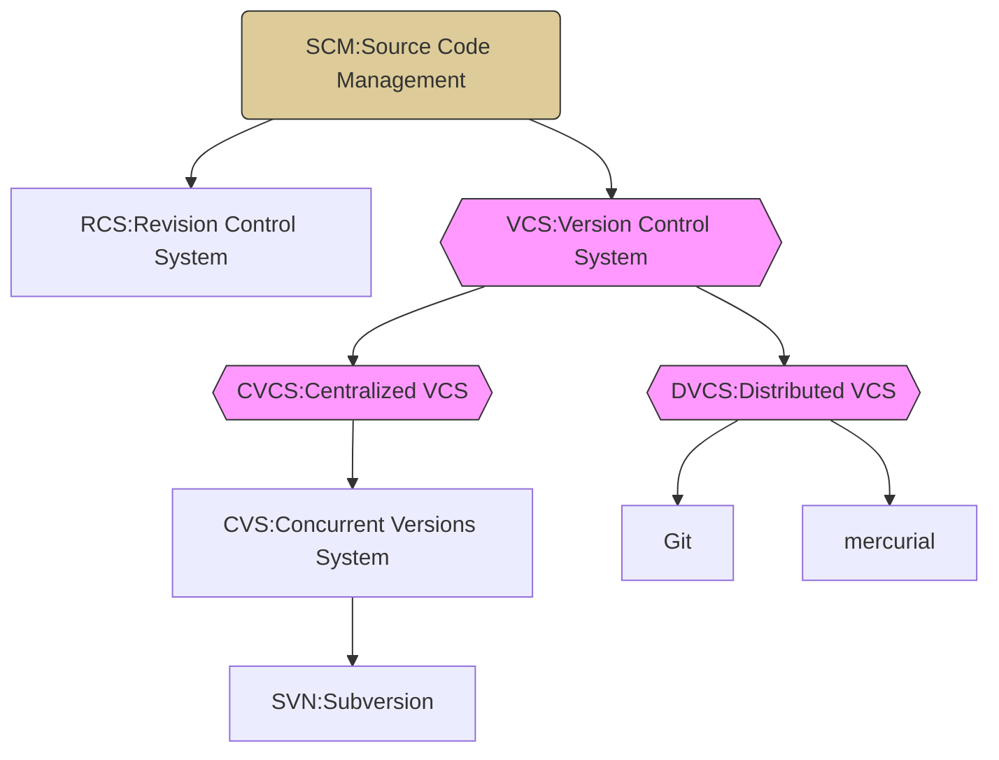

<style>
.highlight {color:red}
.elegant {color:blue}
</style>

<!-- ## Python安裝與架構介紹 -->


<!-- ## VScode基礎介紹 -->


## 源代碼管理(Source code management;SCM)
源代碼管理 SCM 是一種管理軟體程式碼的系統。它可讓您儲存、組織和追蹤程式碼，並與其他開發人員協作。SCM 可幫助您避免程式碼衝突、追蹤程式碼變更並還原先前的版本。 SCM 也是版本控制(Version Control)的同義詞。
### 演進脈絡


- Revision Control System (RCS)：
RCS 是運作在單機上的版本控制系統。它是早期的版本控制系統，用於跟踪和管理單個檔案的歷史版本。每個檔案都有自己的 RCS 版本控制，並且運作在單一的本地機器上。
- Centralized VCS (集中式版本控制系統)：
Centralized VCS 運作在中央伺服器和區域網路上。在這種系統中，程式碼儲存在中央伺服器上，每位開發者在工作時需連線到中央伺服器進行操作。典型的例子是 Concurrent Versions System (CVS) 或 Subversion (SVN)。儘管中央伺服器在區域網路內運作，但它並不限於區域網路，可以在 WAN 網路上進行操作，但仍需要與中央伺服器保持連線。
- Distributed VCS (分散式版本控制系統)：
Distributed VCS 可以運作在區域網路或網際網路上。這是相對於集中式版本控制系統的進階版本。在 DVCS 中，每位開發者都擁有完整的程式碼儲存庫副本，可以在本地工作而不需持續連線到中央伺服器。開發者可以離線進行工作並在完成後推送變更到遠端伺服器上。著名的 DVCS 實作是 Git 和 Mercurial。


目前最流行的分散式版本控制系統是 Git ，是 Linus Torvalds 在 2005 年為了管理 Linux 核心所創造。

<!-- ## Git 整體概念 -->


<!-- ### Git for Windows -->


<!-- ### GitHub Desktop -->


<!-- ## Git 與 VScode 的整合 -->


:::success
更多的 Git 使用方式，請參考：
- [Git 介紹與在 Windows 系統下安裝](https://progressbar.tw/posts/1)
- [甚麼是 Git/Github？為什麼需要專案版本管理？](https://pythonviz.com/git/version-control-and-git-concepts/)
:::

## 如虎添翼
### Windows 重要 Hotkey
- Alt + Space
    > 快速搜尋
- Win + Space
    > 切換中文輸入法
- Win + P
    > 投影模式選擇
- Win + Print Screen
    > 截圖工具
- Shift + Win + 【left | right】
    > 雙螢幕視窗切換

### 第三方工具
- [Cmder](https://blog.miniasp.com/post/2015/09/27/Useful-tool-Cmder)
    > 具有 Linux 溫度的終端機程式，可取代內建的cmd 與 powershell，安裝 mini 版即可。若要與 VScode 結合請參考：[Seamless VS Code Integration](https://github.com/cmderdev/cmder/wiki/Seamless-VS-Code-Integration)
- [WinMerge](https://winmerge.org/?lang=zh_tw)
    > 一套開放原始碼的視覺化文字比對與合併工具。當你需要在不同版本的文件之間快速地找出不同點，或是需要將被各自修改過的二份文件合併時使用。
- [grepWin](https://github.com/stefankueng/grepWin)
    > 可使用正規表示式進行檔案內容搜尋與取代的工具。
- [Ditto](https://ditto-cp.sourceforge.io/)
    > 補強 window 剪貼簿功能，使用者可以將複製的每個項目通通放在剪貼清單上，且隨時都可以作存取，而且不限於文字，圖片、HTML等其他格式。
- [Notepad++](https://notepad-plus-plus.org/downloads/)
    > 以C++所設計的純文字編輯軟體，開放原始碼、體積輕巧不佔系統記憶體，支援多分頁功能，完美取代微軟記事本！具有好用的中文搜尋取代、支援ANSI、UTF-8（支援檔首無BOM）、UCS-2...等格式的編譯及轉換。
- [PowerToys](https://learn.microsoft.com/zh-tw/windows/powertoys/)
    > Microsoft PowerToys是一組免費的系統工具軟體，由微軟為Windows作業系統上的系統管理員設計。這些程式為系統加入或變更了一些功能，並加入更多自訂選項以提高生產力。
- [WinSCP](https://winscp.net/)
    > WinSCP是在Windows中使用SSH的開放原始碼的圖形化SFTP用戶端。同時也支援SCP通訊協定。它主要的功能是安全的在電腦間傳輸檔案。

### 線上工具
- [ChatGPT](https://chat.openai.com/)
    > OpenAI 的 AI 聊天機器人
- [Bard](https://bard.google.com/)
    > Google 的 AI 聊天機器人
- [CodePen](https://codepen.io/)
    > 線上前端編輯器(html/css/javascript)
- [RegEx Testing](https://www.regextester.com/)
    > 線上測試正規表示式是否正確
- [URL Encoder, Decoder And JSON Formatter Tool](https://sites.google.com/view/url-encoder-decoder-extension/home)
    > 此為 Chrome 插件 可進行網址的 encoder/decorder 與 JSON 的美化與正規化
- [個資、姓名產生器](https://lab.sp88.com.tw/genall/)
    > 可提供最多 10000 個隨機產生個人資料，供測試之用
- [I Love IMG](https://www.iloveimg.com/zh-tw)
    > 批量線上處理影像檔，例如將任何格式轉為 jpg，或將 jpg 轉為任何格式
- [I Love PDF](https://www.ilovepdf.com/zh-tw)
    > 批量線上處理PDF檔
- [remove bg](https://www.remove.bg/zh-tw)
    > 線上去背

## 回家作業
請完成以下二項版控作業，並將對應的 GitHub 專案網址上傳表單 https://forms.gle/QSj1449nBNqPHFbG6
### 1. 版控實作 
請使用命令提示字元在本機建立一個專案：BMIcalc，開啟 VScode 輸入程式碼如下
```python=
height = int(input("Please input your height:"))
weight = int(input("Please input your weight:"))
bmi = weight / (height / 100) ** 2
print("your height:"+str(height))
```
執行上述程式碼無誤後，請完成 GitHub 的版控專案推送(使用 GitHub Desktop 進行)，內容必須完整(包含專案的描述/.gitignore/README.md)，repo 的能見度為 public。

完成上述版控後，再到 VScode 修改程式碼，增加以下 3 行(最後一行必須是空行)
```python=5
print("your weight:"+str(weight))
print("your bmi:"+str(round(bmi,2)))

```
執行上述程式碼無誤後，請進行第 2 次版控作業(使用 VScode 進行 git add/commit/push)

完成上述版控後，再修改 .gitignore 檔案，增加以下2行
```
# 忽略 .vscode 目錄
.vscode
```
修改存檔完上述檔案後，請進行第 3 次版控作業(使用 VScode 進行 git add/commit/push)
最後將 GitHub 專案網址記錄下來。

### 2. 收歸己用
請使用 GitHub Desktop 將專案 https://github.com/peterju/guessNum Clone 到自己的電腦，並進行以下動作
    1. 刪除 .git 目錄
    2. 調整程式碼，最後一行必須是空行
    3. 執行程式碼
    4. 增加 .gitignore/README.md 與專案的描述
    5. .gitignore 增加排除 .vscode 目錄
    6. 版控作業
上傳到自己的 GitHub，repo 的能見度為 public，再將專案網址記錄下來。

## 學習參考
- [官網教學文件](https://docs.python.org/zh-tw/3/tutorial/index.html)
- [Python 入門教學課程](https://www.youtube.com/playlist?list=PL-g0fdC5RMboYEyt6QS2iLb_1m7QcgfHk)
- [Python 專案開發入門的十堂課](https://www.youtube.com/watch?v=7Gqkq4R8DPE&list=PL9OF2bYpo7BPmgkStwEPKt2KQvNQV_uzs)
- [Python - 100天從新手到大師（繁體中文）](
https://github.com/ateliershen/Python-100-Days-zh_TW)
- [Python 3.10 技術手冊](https://openhome.cc/zh-tw/python/)
- [Git 版本管控](https://bwtit.gitbook.io/phpdev/ban-ben-guan-kong)