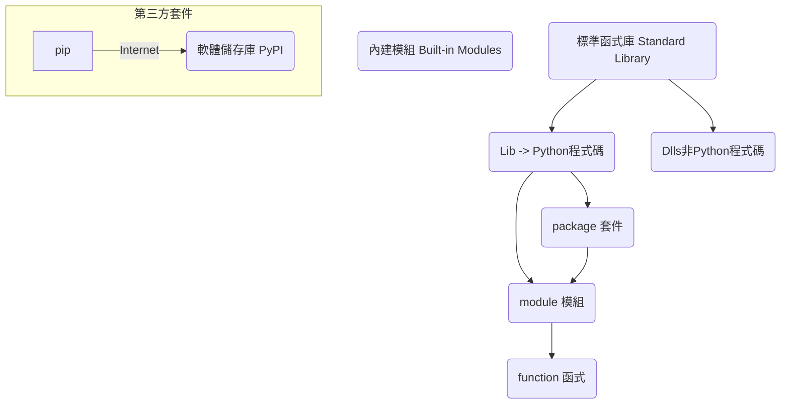

<style>
.highlight {color:red}
.elegant {color:blue}
</style>

## Python安裝與架構介紹
至[官網](https://www.python.org/downloads/)下載對應的OS版本，初學者建議使用版本 3 的版本，但最新的版本在使用套件時，可能會遇到套件尚無法支援的情形，因此若有一定會使用到的套件，建議看一下套件目前支援的Python版本是什麼？


### 安裝過程
1. 安裝 Python 3.x.x (64-bit)

    - 勾選安裝 py.exe 時使用管理者權限 (Use admin privileges when installing py.exe)
    - 勾選將 Python 加入環境變數 PATH (Add Python to PATH)
    - 選擇自訂安裝(Customize installation)

2. 進階選項畫面

    - 勾選安裝 Python 給所有使用者(Install Python 3.xx for all users)
    - 選擇自訂安裝，將 Python 裝在根目錄(C:\Python3xx 或 D:\Python3xx)

3. 安裝成功

    - 若在最後的 Setup was successful 頁面看見上圖的【Disable path length limit】，代表作業系統在安裝了多種軟體之後路徑長度不夠使用了(Windows 作業系統路徑的長度預設為260個字元)，因此請點選以解除路徑長度的限制。
    
4. 測試 python 執行
安裝完畢後，可在命令提示字元中輸入以下命令確認安裝成功
```bash
C:\>python --version
C:\>py --version
C:\>py -V
Python 3.11.4

# 執行含有 Python 原始碼的檔案
C:\>py app.py
# 進入 Python REPL互動模式(可按 Ctrl+Z 離開)
C:\>py
```
> 執行後若看見 ‘python’ 不是內部或外部命令、可執行的程式或批次檔，則代表沒有將 C:\python311 加入環境變數 path，或是電腦路徑的長度已超過260個字元，導致增加路徑失敗，可參考以下文章進行調整：[How to Make Windows 10 Accept File Paths Over 260 Characters](https://www.howtogeek.com/266621/how-to-make-windows-10-accept-file-paths-over-260-characters/)

> 執行後若看見遺失檔案的訊息，最有可能的是缺少了 Visual C++ 的可轉散發套件，因為 Python Windows 版本 是利用 Microsoft Visual C++ 所設計，因此若遇此問題請嘗試到 [Microsoft Visual C++ Redistributable latest supported downloads](https://learn.microsoft.com/zh-tw/cpp/windows/latest-supported-vc-redist?view=msvc-170) 下載 Visual Studio 2015, 2017, 2019, and 2022

5. 測試 pip 套件管理程式
Python 預設使用 pip 指令進行套件的管理，請測試指令如下
```bash
C:\>pip -V                   
pip 23.1.2 from C:\Python311\Lib\site-packages\pip (python 3.11)

C:\>pip list
```
若在已安裝套件下出現如下圖的 notice 提示，代表可進行 pip 指令的版本升級


若要升級 pip 套件版本，請輸入下列指令
```bash
python -m pip install --upgrade pip 
# 上述指令中的 python 可用 py 取代，參數 --upgrade 可用 -U 取代
# 故可簡化為 py -m pip install -U pip
```
:::danger
Windows 7 作業系統無法使用 Python 3.9 以上版本
:::

### Python 執行方式
- 指令互動模式(REPL ; read–eval–print loop)：python
- 視窗互動模式：IDLE、[VScode](https://code.visualstudio.com/download)、PyCharm
- 網頁互動模式：Jupyter Notebook
    - [Google colab](https://colab.research.google.com/)、[Repl.it](https://replit.com/languages/python3)、[TutorialsPoint](https://www.tutorialspoint.com/execute_python3_online.php)

| 開始 》所有應用程式 | Python 3.11目錄 |
| -------- | -------- |
|  |      |

### Python 自帶的函式庫

- 函式(function)：模組內定義的函數
- 模組(module)：就是檔案，每個 py 檔就是一個模組
- 套件(package)：就是目錄，內部有多個檔案

### 套件管理
pip 是 Python 的套件管理器，可下載位於 [PyPI(Python Package Index)](https://pypi.org/) 軟體版本庫中的第三方套件。

#### pip 基本使用
完整的使用方法可下達 pip help 得知，常用的指令如下：
- 查詢目前安裝的套件有哪些
`pip list`
- 查詢哪些套件需要升級
`pip list -o`
- 安裝 A 套件
`pip install A`
- 更新 A 套件 --upgrade 可用 -U 取代
`pip install --upgrade A`
- 查看已安裝的 A 套件資訊
`pip show A`
- 移除 A 套件
`pip uninstall A`
- 檢查套件的相依性
`pip check`
- 將目前使用的套件匯出清單
`pip freeze > requirements.txt`
- 根據套件匯出清單安裝套件
`pip install -r requirements.txt`

:::success
若覺得 pip 移除套件時無法有效處理相依問題，可嘗試改用 [Poetry](https://blog.kyomind.tw/python-poetry/)
:::

#### 套件功能分類
<!--  -->


:::success
更詳細的功能分類說明，請參考：[終於把所有的Python庫，都整理出來啦！](https://allaboutdataanalysis.medium.com/%E7%B5%82%E6%96%BC%E6%8A%8A%E6%89%80%E6%9C%89%E7%9A%84python%E5%BA%AB-%E9%83%BD%E6%95%B4%E7%90%86%E5%87%BA%E4%BE%86%E5%95%A6-4b52a1e51028)
:::