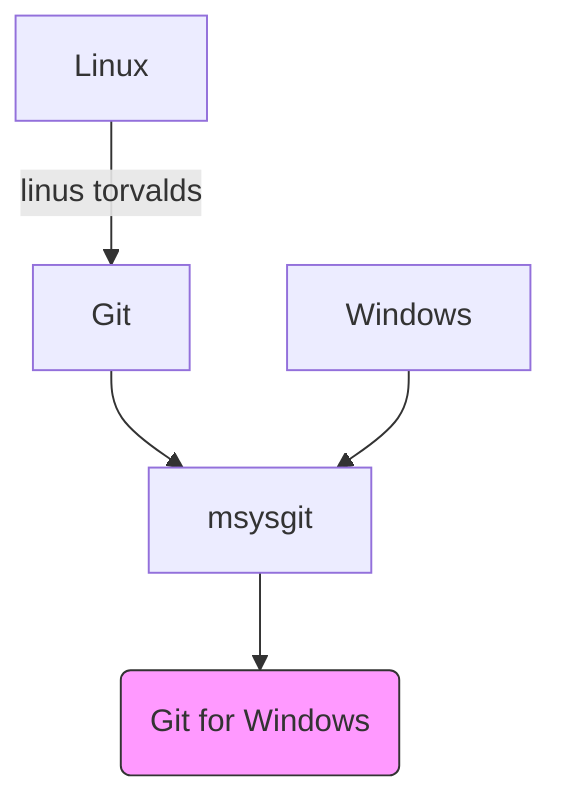
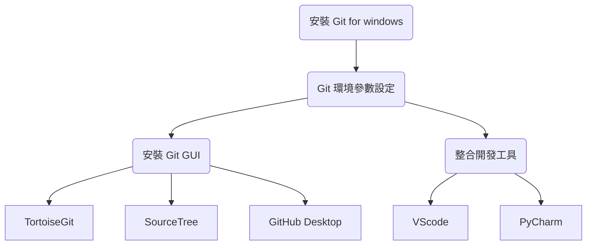
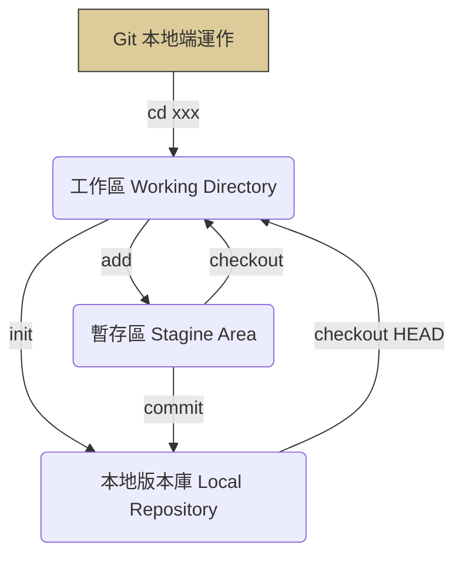

## Git 整體概念
> ~ 人生不能重來，但 Git 可以 ~
> 沒有清楚理解 Git 的運作等於只是做到檔案備份而已，並不能說在版本管控。

Git 版本控制系統，可以記錄每一次版本的存檔內容

### Git 在 Windows 的發展

### Git for windows 的定位

### 安裝與設定
- 先安裝 Git for Windows
- 設定 Git 基本參數
- 安裝想要使用的 Git GUI 程式，例如 Github Desktop
- 若要將檔案推到 remote 版本庫，則要到 Github 去 create new repository

### 後續基本使用
- 在專案目錄使用 git init 進行初始化，建立 .git 目錄
- 初始化後代表建立了 Local Repository(本地端版本庫)，亦即建立了主分支 master
    - Repository 版本庫(儲存庫、倉庫)有 Local 與 Remote 二種。
- 有異動的檔案若要送進本地端版本庫之前，必須先使用 git add 送進暫存區(Staging Area)，將想要進行版控的檔案打包的意思。
- 暫存區的檔案使用 git commit 指令可送進本地端版本庫，且必須寫上此版本的描述。
- 若專案目錄下的檔案想從本地端的版本庫還原，可下達 git checkout 檔案名稱進行。

Git 開始運作時，預設的主分支叫【master】，commit 提交之後，就會在分支上形成節點。

HEAD 是一個分支指標，會指向「目前所在分支」。在 .git 目錄裡有一個檔名為 HEAD 的檔案，記錄著目前 HEAD 在哪一個分支。

checkout 指令有切換分支與還原檔案的功能，後來在 Git 2.23 之後增加了 switch 指令，專門用來切換分支，建議日後 checkout 就拿來還原檔案即可。

某些無需加入版本庫的檔案，可將其名稱放在 .gitignore 檔案中，未來就不會被 Git 納入管理了，但 .gitignore 檔案本身必須被納入版本庫管理。各種語言會用到的 .gitignore，可參考 https://github.com/github/gitignore

:::info
- git init 初始化會建立一個隱藏目錄 .git 用來作為本地端儲存庫，其中名為 index 的索引檔案，作為記錄專案所有檔案的狀態之用。
- GitHub 建議每一個版本庫都應該要有 README.md, LICENSE, 和 .gitignore 這3個檔案。
:::

<!--  -->

:::info
- git config --list 可檢視目前 Git 的全域設定
:::
:::success
:star: 參考資料
- [Git筆記](https://hackmd.io/@hbdoy/By5kZvuzx#Git%E7%AD%86%E8%A8%98)
:::