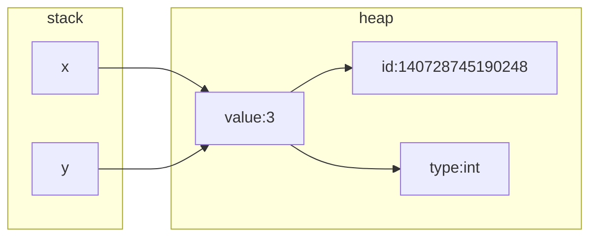
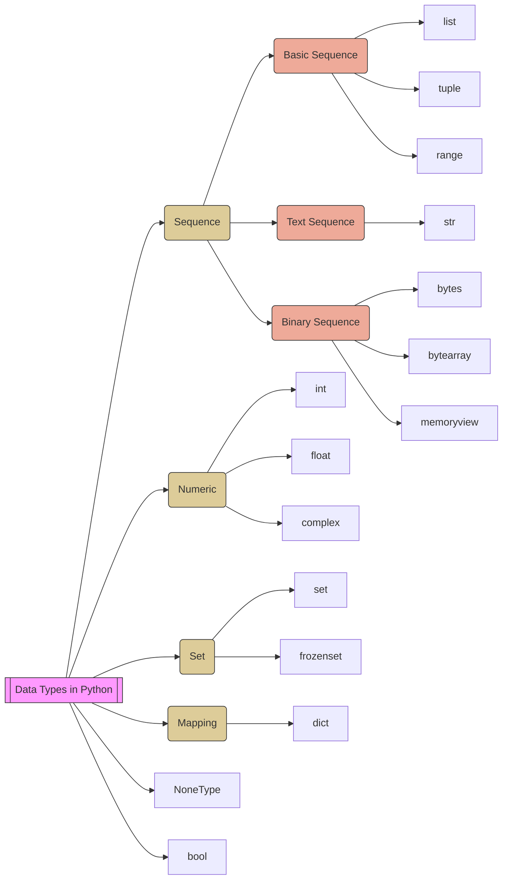

<style>
.highlight {color:red}
.elegant {color:blue}
</style>

# 變數與資料型別(Data Types)

:::warning
就像物理學探討物質構成的最小粒子(原子、電子、夸克、超弦)，程式設計是由演算法 (Algorithms) 與資料結構 (Data Structures) 所組成，而演算法與資料結構的實作，最基本的就是變數和資料型別了。
:::


變數會佔用記憶體，而記憶體佔用的大小跟資料型別有關。記憶體分三個部份儲存這些變數，分別是 global、stack 與 heap。

- global:
用來放全域變數、靜態變數 (static)...等。
- stack:
用來放區域變數、函式的參數、位址與返回值...台灣正體中文稱為【堆疊】，大陸叫做【棧】。因為變數與函數等資訊都在編譯時期已知，所以系統知道怎麼進行配置與回收，由系統自動管理。
- heap:
台灣正體中文稱為【堆積】，大陸叫做【堆】。
用來放動態配置的變數。使用這裡的記憶體主要是用在編譯時期還不知道大小或個數的變數。例如，有個陣列的大小要在執行的時候由使用者的輸入來決定，就只能使用動態配置，將陣列配置在 heap 區。


在 C 語言或一般需要編譯語言的世界中，所有的變數都要事先宣告，作業系統會挖一塊記憶體空間，裡頭放著此變數的資料。宣告完後，程式才能在編譯階段，將此變數link到此記憶體空間，執行階段才能利用此變數。
```python=
x = 3  # 動態型別 (Dynamic Type)
y = 3

print(id(3), id(x), id(y))  # 140728745190248
print(type(3), type(x),
      type(y), sep="\n")    # <class 'int'>

```
**變數的記憶體配置**

## Data Types in Python


- 變數
    - 數值型別(Numeric type) - int, float, bool
    - 字串型別(String type) - str
    - 容器型別(Container type) - list, set, dict, tuple
- 轉型(casting)
- 常數
- 區域變數和全域變數
- 註解
- 串接比較運算子
- 字串型別(String type)
    - 連接(concatenating)
    - 切片(slicing)
    - 內建方法(Built-in function)
        - format()、upper()、lower()、islower()、isupper()、isalpha()、isdigit()、len()、startswith()、endswith()、strip()、lstrip()、rstrip()、center()、ljust()、rjust()、join()、split()、partition()、replace()、index()、find()、count()
        - 更多Python字串方法，可至[官方文件](https://docs.python.org/3/library/stdtypes.html#string-methods)閱讀
- 容器型別(Container type)
    - list(串列)與tuple(序列、元組)
    - dict(字典)
    - set(集合)與frozenset(不可變集合)

```python=
import sys

a = None
b = 100
c = 1.1
d = 45j
e = True
f = ""
g = []
h = ()
i = range(6)
j = {}
k = set([])
m = frozenset([])
n = b"Hello"
o = bytearray(5)
p = memoryview(bytes(5))
q = date.today()

print(f"{a} {type(a)} {sys.getsizeof(a)} bytes, refrence count {sys.getrefcount(a)}")
print(f"{b} {type(b)} {sys.getsizeof(b)} bytes, refrence count {sys.getrefcount(b)}")
print(f"{c} {type(c)} {sys.getsizeof(c)} bytes, refrence count {sys.getrefcount(c)}")
print(f"{d} {type(d)} {sys.getsizeof(d)} bytes, refrence count {sys.getrefcount(d)}")
print(f"{e} {type(e)} {sys.getsizeof(e)} bytes, refrence count {sys.getrefcount(e)}")
print(f"{f} {type(f)} {sys.getsizeof(f)} bytes, refrence count {sys.getrefcount(f)}")
print(f"{g} {type(g)} {sys.getsizeof(g)} bytes, refrence count {sys.getrefcount(g)}")
print(f"{h} {type(h)} {sys.getsizeof(h)} bytes, refrence count {sys.getrefcount(h)}")
print(f"{i} {type(i)} {sys.getsizeof(i)} bytes, refrence count {sys.getrefcount(i)}")
print(f"{j} {type(j)} {sys.getsizeof(j)} bytes, refrence count {sys.getrefcount(j)}")
print(f"{k} {type(k)} {sys.getsizeof(k)} bytes, refrence count {sys.getrefcount(k)}")
print(f"{m} {type(m)} {sys.getsizeof(m)} bytes, refrence count {sys.getrefcount(m)}")
print(f"{n} {type(n)} {sys.getsizeof(n)} bytes, refrence count {sys.getrefcount(n)}")
print(f"{o} {type(o)} {sys.getsizeof(o)} bytes, refrence count {sys.getrefcount(o)}")
print(f"{p} {type(p)} {sys.getsizeof(p)} bytes, refrence count {sys.getrefcount(p)}")
print(f"{q} {type(q)} {sys.getsizeof(q)} bytes, refrence count {sys.getrefcount(q)}")

```
```
None <class 'NoneType'> 16 bytes, refrence count 3895 
100 <class 'int'> 28 bytes, refrence count 1000000005 
1.1 <class 'float'> 24 bytes, refrence count 4        
45j <class 'complex'> 32 bytes, refrence count 4      
True <class 'bool'> 28 bytes, refrence count 65       
 <class 'str'> 49 bytes, refrence count 1000000050    
[] <class 'list'> 56 bytes, refrence count 2
() <class 'tuple'> 40 bytes, refrence count 1000000084
range(0, 6) <class 'range'> 48 bytes, refrence count 2
{} <class 'dict'> 64 bytes, refrence count 2
set() <class 'set'> 216 bytes, refrence count 2       
frozenset() <class 'frozenset'> 216 bytes, refrence count 2
b'Hello' <class 'bytes'> 38 bytes, refrence count 4
bytearray(b'\x00\x00\x00\x00\x00') <class 'bytearray'> 62 bytes, refrence count 2
<memory at 0x0000020A25CE4AC0> <class 'memoryview'> 184 bytes, refrence count 2
2023-09-23 <class 'datetime.date'> 32 bytes, refrence count 2
```

## 學習參考
- [Python 教學](https://docs.python.org/zh-tw/3/tutorial/index.html)
- [Python 3.10 技術手冊](https://openhome.cc/zh-tw/python/)
- https://note.artchiu.org/2015/10/21/%E4%B8%89%E7%A8%AE%E8%A8%98%E6%86%B6%E9%AB%94%E5%8D%80%E9%96%93-global%E3%80%81stack%E3%80%81heap/
- 
- https://ithelp.ithome.com.tw/articles/10192617
- https://ithelp.ithome.com.tw/articles/10192831
- https://towardsdatascience.com/memory-management-and-garbage-collection-in-python-c1cb51d1612c
- https://docs.python.org/3/reference/datamodel.html
- https://docs.python.org/3/library/stdtypes.html
- https://hackmd.io/@meebox/SJGyDkrfN
- https://www.maxlist.xyz/2021/01/26/python-immutable-mutable-objects/
- https://medium.com/starbugs/python-mutable-%E8%88%87-immutable-8ef7804181cd
- https://www.ithome.com.tw/voice/105138
- https://25349023.github.io/articles/2021-03/py-var-ref/
- https://medium.com/@oange6214/python-%E5%9F%BA%E7%A4%8E%E7%AD%86%E8%A8%98-%E5%8F%AF%E8%AE%8A%E5%8B%95%E7%9A%84-mutable-%E8%88%87%E4%B8%8D%E5%8F%AF%E8%AE%8A%E5%8B%95%E7%9A%84-immutble-54f1b7a6899
- https://www.learncodewithmike.com/2019/11/python.html
- https://realpython.com/python-variables/
- https://towardsdatascience.com/memory-management-and-garbage-collection-in-python-c1cb51d1612c
- https://www.honeybadger.io/blog/memory-management-in-python/