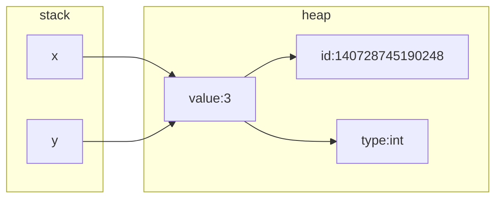
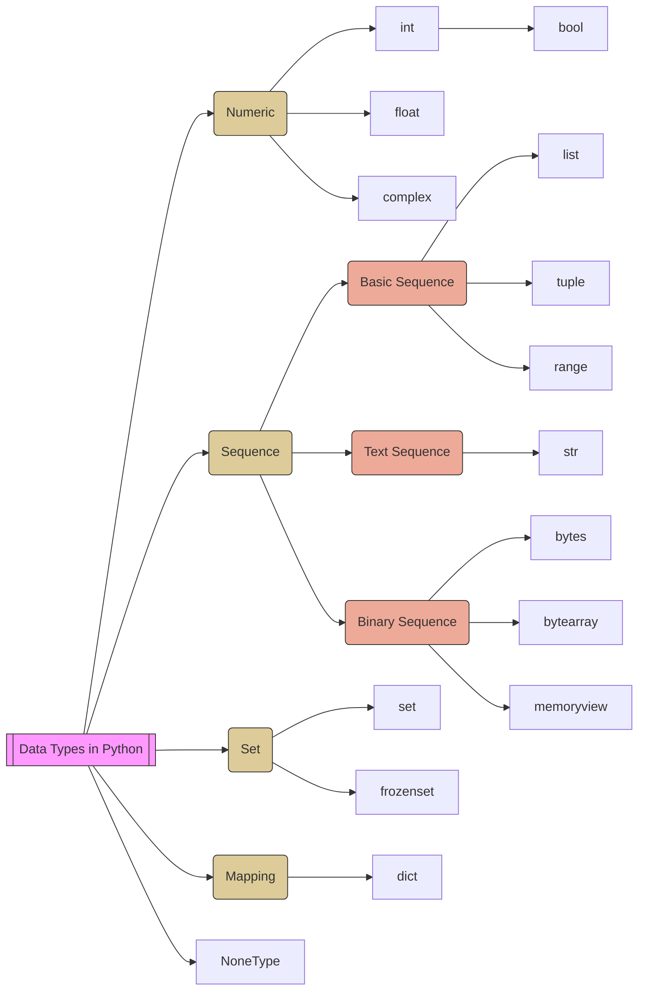

[](https://hackmd.io/mjV1EsfmQMix-gV4EcoNwQ)
<style>
    .emp {color:red}
    .info {color:green}
    details.part {color:#2471A3}
</style>

# 變數與資料型別(Data Types)

:::warning
就像物理學探討物質構成的最小粒子(原子、電子、夸克、超弦)，程式設計是由演算法 (Algorithms) 與資料結構 (Data Structures) 所組成，而演算法與資料結構的實作，最基本的就是變數和資料型別了。
:::

## C 語言的記憶體佈局

| 各區占記憶體位置 | 功能示意圖 |
| -------- | -------- |
| ||

變數會佔用記憶體，而記憶體佔用的大小跟資料型別有關。記憶體分三個部份儲存這些變數，分別是 global、stack 與 heap。

- global：
用來放全域變數、靜態變數 (static)...等。台灣正體中文稱為【全域】，大陸叫做【全局】。
- stack：
用來放區域變數、函式的參數、位址與返回值。台灣正體中文稱為【堆疊】，大陸叫做【棧】。因為變數與函數等資訊都在編譯時期已知，所以系統知道怎麼進行配置與回收，由系統自動管理。
- heap：
用來放動態配置的變數。台灣正體中文稱為【堆積】，大陸叫做【堆】。使用這裡的記憶體主要是用在編譯時期還不知道大小或個數的變數。例如，有個陣列的大小要在執行的時候由使用者的輸入來決定，就只能使用動態配置，將陣列配置在 heap 區。


## Python 一切皆為物件

> Everything in python is object.
Classes, functions, and even simple data types, such as integer and float

在 Python 中，所有的變數都是物件。包括數字、字串、列表、字典等所有內建型別，以及自訂的類別實例。當建立一個變數時，實際上是建立了一個指向物件的引用。

Python 的記憶體管理是由直釋器中的 Python memory manager 自動處理的。物件的實際資料存放在堆積（heap）區，而變數名稱以及對物件的引用存放在堆疊（stack）區域。

```python=
x = 3  # 動態型別 (Dynamic Type)
y = 3

print(id(3), id(x), id(y))  # 140728745190248
print(type(3), type(x),
      type(y), sep="\n")    # <class 'int'>
```
**變數的記憶體配置**


### Python的變數是物件的標籤
Python memory manager 負責 Python 的記憶體自動化管理，這意味著開發者通常無需手動分配或釋放記憶體，程式碼也相對安全。變數名稱作為對物件的引用，而引用計數 (refrence count) 和垃圾回收 (garbage collector) 機制則是管理物件記憶體的方法。


在 C 語言中 `x = 3` 敘述可以將變數喻為【水桶】，但在 Python 語言中，變數是<span class="highlight">【標籤】</span>，x 是一個參照(reference)到 3 這個物件的標籤。 以 C 語言的觀點來看，Python 中的變數名稱 x 存放在 stack 區，而 3 這個物件存放在 heap 區。

## 基礎觀念

### 敘述

Python 的程式敘述是以行為單位，一行就是一個敘述，不需要像其它程式語言用分號作為程式敘述的結束符號。

### 註解


#### 單行註解(Single-line comment)
sharp 字元 `#`，放在敘述前後都可以
```python=
# this is the first comment
spam = 1  # and this is the second comment
          # ... and now a third!
text = "# This is not a comment because it's inside quotes."
```
#### 多行註解(Multi-line comments)
3 個雙引號或 3 個單引號包裹的多行字串

- 若用於函數、模組與類別的開頭定義，稱為文件說明字串(docstring)
- vscode 可安装 autoDocstring 插件，自動產生符合 [PEP 257 規範](https://github.com/qiuxiang/pep/blob/master/peps/257.md)的 docstring 結構
```python=
def kos_root():
    """Return the pathname of the KOS root directory."""
    global _kos_root
    if _kos_root: return _kos_root
    
def which_max(x, y):
    '''回傳最大的數值
    
    Args:
        2個參數都必須是數值或文字數值
    Returns:
        回傳2個參數中較大的數
    '''
    x, y = float(x), float(y)
    if x > y:
        return x
    return y
```
:::success
Docstring 就跟開發文件一樣，自己很懶得寫，但如果想使用別人寫好的程式時，卻希望它們越詳細越好。
畢竟看有描述性的文字，總比看一長串複雜、混亂的程式碼，要簡單且友善得多，因此大家還是盡可能地寫好 docstring 吧。
:::

### 縮排及區塊結構


Python 不用大括號標示程式碼區塊，而是使用縮排，好處是不用再擔心括號配對的問題，也不會出現對縮排結構無視的狂人 ^_^。

```cpp=
/* C 程式碼 */
int n, sum;
n = 10;
sum = 1;
while (n > 0) {
sum += n；        /* 沒有正確縮排也能執行，但影響可讀性 */
n--；
}
```
```python=
# Python 程式碼
n = 10
sum = 0
while n > 0:
    sum = sum + n    # sum += n
    n = n - 1        # n -= 1
```
:::warning
- Tab 與空白字元屬於不同的縮排，需留意混用看不出來的問題。
- PEP 8 中建議縮排使用 4 個空白，VScode 預設會將 Tab 改為 4 個空白，所以在 VScode 可以直接按 Tab 進行縮排。
- 就算是多行說明的 docstrings 也需要配合縮排的規定
:::

### 命名空間與作用範圍
Python 使用命名空間( namespace )管理不同視野( scope )的物件名稱與參照關係，可視為一個對照表。


Python 直譯器執行時，會建立一個名為 **`__builtins__`** 的模組，此模組包含所有的內建函式與內建類別，而記錄這個內建模組內物件的表格，稱之為【內建命名空間】(built-in namespace)。

Python 執行其它模組(檔案)時(例如：交談模式、執行主程式)，也會建立對應的命名空間，這些屬於模組的命名空間稱之為【全域命名空間】(global namespace)，而放在此命名空間的變數稱為全域變數。

呼叫函式時，Python 會為函式建立【區域命名空間】(local namespace)，其中存放了函式的參數與在函式中建立的變數，在此命名空間建立的變數稱之為區域變數，函式結束後，區域命名空間也會隨之刪除。

:::success
除了呼叫函式會建立 local namespace，【建立物件】與【呼叫物件的方法】都會產生對應的 local namespace，直到對應的函式或物件結束後才會刪除。
:::
:::warning
在 Python 中，如果建立了一個與內建函式相同名稱的函式，例如 len()，在其它程式語言中會產生重複定義的錯誤，但 Python 並不會報錯，只是執行不到內建的函式 len() 了，因為根據 scoping rule 會先搜尋到使用者定義的 len() 函式。
:::
:::danger
Python 的全域變數視野(scope)不像 C/C++ 的全域變數會涵蓋全程式甚至跨檔案讀取，因為 Python 的全域視野是以模組(檔案)為單位的，也就是說除了主程式有一個 global namespace，若我們用 import 命令匯入模組，也會產生對應的 global namespace，亦即全域視野不是唯一的。
:::

### 查詢物件的說明與其成員

#### dir()
- 無參數時返回目前範圍的所有物件名稱
- 有參數時返回參數所指物件的全部成員(屬性與方法)，並依字母排序
```python=
dir()     # 回傳目前範圍的所有名稱
yn = True
dir()
dir(yn)   # 回傳物件的成員
dir(bool) # 也可指定物件所屬的類別
```
#### help()
用於查看函式或模組用途的詳細說明，以下來看看 print() 的說明
```
>>> help(print)
Help on built-in function print in module builtins:

print(*args, sep=' ', end='\n', file=None, flush=False)
    Prints the values to a stream, or to sys.stdout by default.

    sep
      string inserted between values, default a space.
    end
      string appended after the last value, default a newline.
    file
      a file-like object (stream); defaults to the current sys.stdout.
    flush
      whether to forcibly flush the stream.
```

## Python 的變數與常數
### 變數

#### 變數的命名規則
Python 的變數有區分大小寫，名稱可包含英文字母、底線、中文及數字，但必須以字母或底線開頭(實務上底線不要用於變數的開頭與結尾)，PEP8建議用小寫，變數中不可有特殊符號，也不可使用以下系統關鍵字(keywords)

```
>>> help('keywords')

Here is a list of the Python keywords.  Enter any keyword to get more help.

False               class               from                or
None                continue            global              pass
True                def                 if                  raise
and                 del                 import              return
as                  elif                in                  try
assert              else                is                  while
async               except              lambda              with
await               finally             nonlocal            yield
break               for                 not
```
#### 變數定義後，可使用 del 刪除
```
>>> myname = "Tom"
>>> id(myname)
1308932140048
>>> del myname
>>> id(myname)
Traceback (most recent call last):
  File "<stdin>", line 1, in <module>
NameError: name 'myname' is not defined
```
#### 變數的多重賦值(multiple assignment)
```
>>> a = b = c = 5
>>> print(a)
5
>>> print(b)
5
>>> print(c)
5
>>> x, y = 1, 2
>>> print(x, y)
1 2
>>> x, y = y, x
>>> print(x, y)
2 1
```
#### 變數即物件，有自身的方法
```
>>> name = " Peter Ju "
>>> name.upper()
' PETER JU '
>>> name.lower()
' peter ju '
>>> name.strip()
'Peter Ju'
```
#### 區域變數與全域變數
變數根據其視野(scope)可分為【區域變數】與【全域變數】，全域變數在函式內只要不被重新定義可直接取用。

- 全域變數(global varaiable)：每一個【模組】就算一個全域，所以多個模組就會有多個全域，與 C 語言只有一個全域的概念不同。
- 區域變數(Local varaiable)：【函式】內部視為區域，內部的變數只要有賦值即成為區域變數，但迴圈敘述(for/while)內使用的變數仍與敘述本體相同，視為同一個 scope。


```python=
def hello():  # 定義 hello 函式
    print(b)  # 讀取全域變數無需宣告
    a = 2     # 與全域變數同名的區域變數
    print(a)  # 2

a = 1         # 定義全域變數 a 等於 1
b = 2         # 定義全域變數 b 為 2
hello()       # 執行 hello 函式
print(a)      # 1
```

如果要在函式裡修改全域變數，要先宣告「global 全域變數」，而且要避免在宣告前就使用了該變數
```python=
def hello():  # 定義 hello 函式
    print(b)  # 讀取全域變數無需宣告
    global a  # 聲明下方的 a 為全域變數
    a = 2     # 修改 a 為 2
    print(a)  # 2

a = 1         # 定義全域變數 a 為 1
b = 2         # 定義全域變數 b 為 2
hello()       # 執行 hello 函式
print(a)      # 2 ( 全域變數 a 在函式中被修改為 2 )
```
for 迴圈的變數不會形成區域變數，與其它敘述屬於相同 scope
```
for i in range(5):
    if i==1:
        my_var=999

print(i, my_var, sep=',')
```

### 常數
Python 沒有自訂常數的方法，所以慣例上會用【全部大寫】的變數當做常數，但系統並不會保護這個常數不被修改，要程式設計師自己留意。
```
MAX_CONNECTIONS = 5000     # 大寫字母的變數，視為常數
```
Python 中有一些內建的常數，這些常數是語言本身提供的，無需額外導入模組或套件就可以使用。以下是一些常見的內建常數：
- True：表示布林值的真（True）。
- False：表示布林值的假（False）。
- None：表示空值或預設值。在函數沒有明確寫出返回值時，通常會返回 None。
- NotImplemented：表示某些操作未實現的情況。
- ...：由三個英文句號表示，通常用於切片操作中，表示省略的元素。

## Python 的資料型別

要知道變數與記憶體之間的關係，例如 `x = 10` 可使用
- id(x)：得知物件的記憶體位址
- type(x)：得知物件的資料型別
- sys.getsizeof(x)：得知物件的大小(byte)
- sys.getrefcount(x)：得知物件被引用的次數

```python=
import sys

a = None
b, c, d = 100, 1.1, 45j # 多重指定(Multiple Assignment) 
e = True
f = "Hello"
g = []
h = ()
i = range(6)
j = {}
k = set([])
m = frozenset([])
n = b"Hello"
o = bytearray(5)
p = memoryview(bytes(5))

print(f"{a} {type(a)} {sys.getsizeof(a)} bytes, refrence count {sys.getrefcount(a)}")
print(f"{b} {type(b)} {sys.getsizeof(b)} bytes, refrence count {sys.getrefcount(b)}")
print(f"{c} {type(c)} {sys.getsizeof(c)} bytes, refrence count {sys.getrefcount(c)}")
print(f"{d} {type(d)} {sys.getsizeof(d)} bytes, refrence count {sys.getrefcount(d)}")
print(f"{e} {type(e)} {sys.getsizeof(e)} bytes, refrence count {sys.getrefcount(e)}")
print(f"{f} {type(f)} {sys.getsizeof(f)} bytes, refrence count {sys.getrefcount(f)}")
print(f"{g} {type(g)} {sys.getsizeof(g)} bytes, refrence count {sys.getrefcount(g)}")
print(f"{h} {type(h)} {sys.getsizeof(h)} bytes, refrence count {sys.getrefcount(h)}")
print(f"{i} {type(i)} {sys.getsizeof(i)} bytes, refrence count {sys.getrefcount(i)}")
print(f"{j} {type(j)} {sys.getsizeof(j)} bytes, refrence count {sys.getrefcount(j)}")
print(f"{k} {type(k)} {sys.getsizeof(k)} bytes, refrence count {sys.getrefcount(k)}")
print(f"{m} {type(m)} {sys.getsizeof(m)} bytes, refrence count {sys.getrefcount(m)}")
print(f"{n} {type(n)} {sys.getsizeof(n)} bytes, refrence count {sys.getrefcount(n)}")
print(f"{o} {type(o)} {sys.getsizeof(o)} bytes, refrence count {sys.getrefcount(o)}")
print(f"{p} {type(p)} {sys.getsizeof(p)} bytes, refrence count {sys.getrefcount(p)}")
print()

print(f"{b + c + e} {type(b + c + e)}") # 整數、浮點數與布林之間會自動隱含轉換

```

執行結果如下：
```
None <class 'NoneType'> 16 bytes, refrence count 3794
100 <class 'int'> 28 bytes, refrence count 1000000005
1.1 <class 'float'> 24 bytes, refrence count 4
45j <class 'complex'> 32 bytes, refrence count 4
True <class 'bool'> 28 bytes, refrence count 53
Hello <class 'str'> 54 bytes, refrence count 5
[] <class 'list'> 56 bytes, refrence count 2
() <class 'tuple'> 40 bytes, refrence count 1000000073
range(0, 6) <class 'range'> 48 bytes, refrence count 2
{} <class 'dict'> 64 bytes, refrence count 2
set() <class 'set'> 216 bytes, refrence count 2
frozenset() <class 'frozenset'> 216 bytes, refrence count 2
b'Hello' <class 'bytes'> 38 bytes, refrence count 4
bytearray(b'\x00\x00\x00\x00\x00') <class 'bytearray'> 62 bytes, refrence count 2
<memory at 0x0000021D38114AC0> <class 'memoryview'> 184 bytes, refrence count 2

102.1 <class 'float'>
```
> 以上所有物件都可以做相等性比較、真假值檢測及被轉換為字串

最常使用的型別有 int, float, bool, str, list, tuple, dict

### 物件值的可變動性
根據物件的值(value)可否被改變，Pythond的資料型別可分為
- 不可變動物件(immutable objects)：int, float, bool, string, tuple
- 可變動物件(mutable objects)：list, dict, set

immutable objects 在讀取和儲存時比較有效率，但要改變值(value)的時候，代價要比 mutable objects 來得多，因為需要重新創造一個 object。


#### mutable objects 可變動物件
```python=
a = [1, 2, 3]
b = a
c = a
b[1] = 6 # 僅改變 b 的 list 第 2 個元素
print(a, b, c)
```
```
# 會發現 a 與 c 物件的值也一起變動了
[1, 6, 3] [1, 6, 3] [1, 6, 3]
```
:::success
練習題：請畫出以上程式碼的變數參照物件示意圖
:::

#### immutable objects 不可變動物件
```python=
a = 1
b = a
c = b
print(a, b, c)

b = 6
print(a, b, c)
```
```
# 會發現只有 b 物件的值更動
1 1 1
1 6 1
```
:::success
練習題：請畫出以上程式碼的變數參照物件示意圖
:::

### 數值
Python 提供了 4 種數值型別：整數(int)、浮點數(float)、複數(complex)與布林值(bool)。


當使用的整數位數太長，可以用底線區隔，讓變數更好閱讀
```
>>> year_salary = 640_000
>>> print(year_salary)
640000
```

布林值只有 True 或 False 兩種值，是整數的次類別(subclass)，所以也可作為數值 1 或 0 計算
```
>>> x, y = 3, True
>>> print(x+y)
4
```
#### 轉型(casting)

float()、str()、int()、bool()
```
>>> x = 5
>>> float(x)
5.0
>>> str(x)
'5'
>>> y = 6.5
>>> int(y)
6
>>> bool(y)
True
>>> bool(0)
False
```
:::success
每個資料型別的功能，可由以下四個面向尋找
1. 物件方法(object method)
2. 內建函式(build-in function)
3. 內建模組(build-in module)
4. 第三方套件(Python Package Index; PyPI)

不一定每個面向都有，功能多少也不同，像數值型別就是內建函式多很多
:::

#### 內建數值函式
常用的有：`abs()、divmod()、bin()、oct()、hex()、max()、min()、pow()、round()`
```
>>> x = 2
>>> y = 3
>>> pow(x,y)
8
```
#### 內建模組 math
使用前要先 import 
```
>>> import math
>>> math.pi
3.141592653589793
>>> math.ceil(9.999)
10
>>> math.floor(9.999)
9
>>> math.factorial(5)
120
```

#### 第三方套件 Numpy
使用前要先 pip install 與 import

```
pip install numpy
```
```
import numpy as np
arr = np.array([1, 2, 3, 4, 5, 4, 4])
x = np.where(arr == 4)
print(x)
```

### 字串
字串(str)在 Python 中屬於序列(sequence)型別，因此可以用【索引】與【切片】取得部分字串，字串可用【雙引號】或【單引號】表示，也可用與 C 語言相同的轉義字元(脫逸序列; Escape sequence)表達特殊字元：

- `\f`：換頁
- `\n`：換行
- `\t`：Tab
- `\\`：一個反斜線
- `\"`：一個雙引號
- `\uxxxx`：Unicode
```
>>> x = "This is a book."
>>> y = 'There is a cat.'
>>> z = "Don't worry \nbe happy"
>>> print(x)
This is a book.
>>> print(y)
There is a cat.
>>> print(z)
Don't worry
be happy
>>> print("\u0041")
A
```
#### 原始字串(raw string)
如果你不希望字元前出現【\】就被當成特殊字元時，可以改使用 raw string，在第一個雙引號前加上【r】
```
>>> print('C:\some\name')   # \n 會被當成換行字元
C:\some
ame
>>> print('C:\\some\\name') # 方法1：使用 \\ 取消轉義功能
C:\some\name
>>> print(r'C:\some\name')  # 方法2：使用原始字串，引號前加上 r
C:\some\name
```
#### 字串的連接(concatenate)
- 使用 + 連接字串文字或字串變數
- 相鄰的字串文字(string literal)會自動連接
```
>>> s1 = "Hello"
>>> s2 = "world!"
>>> s1+" "+s2              # + 可用來連接字串
'Hello world!'

>>> "Hello" " " "world!"
'Hello world!'
```

#### 字串重複
```
>>> "-*" * 10              # * 可用來重複字串
'-*-*-*-*-*-*-*-*-*-*'
```

#### 字串中是否包含
```
>>> "is" in "This"         # in 
True
>>> "in" in "This"
False
>>> "is" not in "This"     # not in 
False
>>> "in" not in "This"
True
```

#### 字串的切片(slicing)
切片即取得部分字串，Python 的序列型別如同一般程式語言的陣列，可用【索引】指定元素的位置(位置從 0 開始)，其切片語法為 `[m:n]` 代表從字串索引第 m 的位置取到 n-1 的位置，我們可以用【有頭無尾】來記憶，但為何切片索引要使用有頭無尾的設計呢？，因為 n - m 剛好就是切片的長度。


```
>>> x = "This is a book."
>>> x[1:3]         # 從索引 1 開始到索引 2 (3-1)
'hi'
>>> x[:3]          # 從索引 0 開始到索引 2
'Thi'
>>> x[1:]          # 從索引 1 開始到索引最後
'his is a book.'
>>> x[-1]          # 取索引 -1
'.'
>>> x[-5:-1]       # 從索引 -5 開始到索引 -2 (-1-1)
'book'
>>> x[-5:]         # 從索引 -5 開始到索引最後
'book.'
```
但因為字串物件的 immutable 特性，每次切片得到的都是新的字串物件
```
>>> x = "This is a book."
>>> id(x)
2768065156144
>>> y=x[1:3]
>>> id(y)
2768064087744
>>> z=x[1:3]
>>> id(z)
2768058486576
```

:::success
每個資料型別的功能，可由以下四個面向尋找
1. 物件方法(object method)
2. 內建函式(build-in function)
3. 內建模組(build-in module)
4. 第三方套件(Python Package Index; PyPI)

不一定每個面向都有，功能多少也不同，像字串型別就是物件方法多很多
:::

#### 字串物件的方法
因為字串的處理實在太常見了，因此 Python 在原生的字串物件中就加上了許多方法可用
- split()：將字串根據指定字元(未指定時預設空白)分割為 list
- join()：將 list 中的每一個元素以 join 指定字元串接成字串
```
>>> x = "Hello everone, we will learning Python"
>>> x.split()
['Hello', 'everone,', 'we', 'will', 'learning', 'Python']
>>> type(x.split())
<class 'list'>
>>> x.split(",")
['Hello everone', ' we will learning Python']
>>> y = ["We", "are", "the", "world"]
>>> " ".join(y)
'We are the world'
>>> type(" ".join(y))
<class 'str'>
```
:::success
練習題：請將 `this is a test` 字串改為 `this-is-a-test`
:::

- lstrip()：刪除字串左邊的空白
- rstrip()：刪除字串右邊邊的空白
- strip()：刪除字串頭尾的空白

> 空白包含了空格、定位、換行與印表機垂直定位、換頁符號
```
>>> x = " Hello, World\n\n"
>>> x.lstrip()
'Hello, World\n\n'
>>> x.rstrip()
' Hello, World'
>>> x.strip()
'Hello, World'
>>> x.strip(" \n,") # 也可以指定要刪除位於頭尾的字元
'Hello, World'
```

- isdigit()：是否由數字組成
- isalpha()：是否由英文字組成
- islower()：是否全部小寫
- isupper()：是否全部大寫
```
>>> x = "Python"
>>> x.isdigit()
False
>>> x.isalpha()
True
>>> x.islower()
False
>>> x.isupper()
False
>>>
>>> y="123xyz"
>>> y.isdigit()
False
>>> y.isalpha()
False
```

#### 內建字串函式(Built-in function)
```
>>> ord("A")           # 根據 Unicode string 傳回 Unicode code
65
>>> chr(65)            # 根據 Unicode code 傳回 Unicode string
'A'
>>> str(59.7)          # 將浮點數 59.7 轉為字串 '59.7'
'59.7'
>>> x = "This is a book."
>>> x[1:3]
'hi'
>>> len(x[1:3])        # 切片[m:n]的長度是 n-m 即 3-1
2
>>> len("課程名稱：Scripting Language") # 返回字串長度
23                     # 中文字元與全型符合都算1個字元
```

#### 內建字串模組(Built-in module)
```python=
>>> import string
>>> print(string.digits)
0123456789i>>> gits)
print(string.hexd
0123456789abcdefABCDEF

>>> s = ' we are    the\t world'
>>> t = string.capwords(s)
>>> t
'We Are The World'
>>> type(t)
<class 'str'>
gits)#### 多行字串
多行字串可用 3 個單引號或 3 個雙引號，而且其中的單引號與雙引號都不需要反斜線
```
>>> x = """Python
... is
... "best"
... programming language
... """
>>> 
>>> print(x)
Python
is
"best"
programming language
```
但多行字串用 3 個引號會破壞區塊縮排並多了換行字元，因此可用【\】連結多個字串
```python=
x = "Python " \
    "is " \
    "\"best\" " \
    "programming language."
print(x)
```
```
Python is "best" programming language.
```
:::warning
【\】之後必須立刻換行，亦即【\】加上換行字元會讓換行字元失效
:::

使用【相鄰的字串文字自動連接】的特性與括號，也可以達到多行字串的功能
```
>>> x = (
...      "Python "
...      "is "
...      "\"best\" "
...      "programming language"
...     )
>>> print(x)
Python is "best" programming language
```
### list 與 tuple


【序列結構】類的型別，元素以【逗點】隔開，索引從 0 開始，每個元素可以是不同的型別，無需宣告佔用空間。
- list(串列)：序列結構，以中括號`[]`包裹，元素可變更(mutable)
- tuple(元組)：序列結構，以小括號`()`包裹，元素不可變更(immutable)，當建立的 tuple 只有一個項目，要記得再後方加上逗號，否則不會建立 tuple。
```
# list 與 tuple 的定義
>>> x = [3, "three", [1, 2, 3]]
>>> y = (True, 6.6, (4, 5, 6))
>>> type(x), type(y)
(<class 'list'>, <class 'tuple'>)

# 僅 1 個元素的情況
>>> x = (3)
>>> y = (3,)
>>> type(x), type(y)
(<class 'int'>, <class 'tuple'>)

# 僅有逗點而沒有小括號時，也代表是 tuple
>>> x = 3
>>> y = 4,
>>> z = 5, 6, 7
>>> type(x), type(y), type(z)
(<class 'int'>, <class 'tuple'>, <class 'tuple'>)
```


```
>>> # 建立
>>> garagelist = ["Benz", "BMW", "Rolls-Royce"]
>>> garagetuple = ("Honda", "Toyota", "Nissan")
>>> garagelist
['Benz', 'BMW', 'Rolls-Royce']
>>> garagetuple
('Honda', 'Toyota', 'Nissan')

>>> # 以索引取用(與字串相同概念)
>>> garagelist[0]
'Benz'
>>> garagetuple[1]
'Toyota'
>>> garagetuple[-1]
'Nissan'
>>> garagetuple[-3]
'Honda'
>>> garagelist[3]                      # 超出索引範圍
Traceback (most recent call last):
  File "<stdin>", line 1, in <module>
IndexError: list index out of range

>>> # 切片取用(與字串相同概念)
>>> garagelist[1:3]                    # 從註標 1 開始取到註標 2
['BMW', 'Rolls-Royce']
>>> garagelist[:2]                     # 從註標 0 開始取到註標 1
['Benz', 'BMW']
>>> garagetuple[-2:]                   # 從註標 -2 開始到最後
('Toyota', 'Nissan')

>>> # 迴圈取用
>>> for eachcar in garagelist:
...     print(eachcar)
...
Benz
BMW
Rolls-Royce
>>> for eachcar in garagetuple:         # 更改換行字元為 >
...     print(eachcar, end=" > ")
...
Honda > Toyota > Nissan > >>>

>>> # 無需迴圈以 > 作為分隔符號
>>> print(*garagetuple, sep=" > ")      # 使用 print() 的 sep 參數
Honda > Toyota > Nissan
>>> print(" > ".join(garagetuple))      # 使用字串的 join 方法
Honda > Toyota > Nissan

>>> # 異動元素
>>> garagelist
['Benz', 'BMW', 'Rolls-Royce']
>>> garagelist[0] = "Lotus"             # 1.索引更改 list 元素值
>>> # index() 方法可返回元素的索引值
>>> garagelist[garagelist.index("Benz")] = "Bentley"
>>> garagelist
['Bentley', 'BMW', 'Rolls-Royce']
>>> garagelist[1:3] = ["Audi", "Lexus"] # 2.切片更改 list 元素值
>>> garagelist
['Bentley', 'Audi', 'Lexus']
>>> garagelist[2] = input("Input new car brand:") # 由使用者輸入指定元素
Input new car brand:Lotus
>>> garagetuple[2]="Mitsubishi"         # 更改 tuple 元素值會失敗
Traceback (most recent call last):
  File "<stdin>", line 1, in <module>
TypeError: 'tuple' object does not support item assignment

>>> # 新增元素
>>> garagelist.append("Porsche")        # 增加 list 元素值
>>> garagelist
['Bentley', 'Audi', 'Lotus', 'Porsche']
>>> garagelist.extend(garagetuple)      # 延伸增加已存在的 list 或 tuple
>>> garagelist
['Bentley', 'Audi', 'Lotus', 'Porsche', 'Honda', 'Toyota', 'Nissan']
>>> garagetuple + garagetuple           # + 號可串聯二個 list 或 tuple
('Honda', 'Toyota', 'Nissan', 'Honda', 'Toyota', 'Nissan')
>>> garagelist.insert(1, "Ferrari")     # 插入 list 元素至指定位置
>>> garagelist
['Bentley', 'Ferrari', 'Audi', 'Lotus', 'Porsche', 'Honda', 'Toyota', 'Nissan']

>>> garagelist.reverse()                # 反轉 list 元素的位置
>>> garagelist
['Nissan', 'Toyota', 'Honda', 'Porsche', 'Lotus', 'Audi', 'Ferrari', 'Bentley']

>>> newlist = garagelist.copy()         # 複製 list
>>> newlist.remove("Ferrari")           # 刪除 list 中某個元素值
>>> newlist
['Nissan', 'Toyota', 'Honda', 'Porsche', 'Lotus', 'Audi', 'Bentley']
>>> newlist.pop()                       # 刪除最後一個元素並回傳
'Bentley'
>>> newlist.pop(1)                      # 根據註標刪除並回傳遭刪除的元素
'Toyota'
>>> newlist
['Nissan', 'Honda', 'Porsche', 'Lotus', 'Audi']

>>> len(garagelist)                     # 取得 list 的元素個數
8
>>> "Toyota" in newlist                 # 測試某個元素是否存在
False
>>> "Honda" in newlist
True

>>> # 排序 list 中所有元素，元素間必須是可比較的型別
>>> newlist.sort()                      # list 遞增排序(預設)
>>> newlist
['Audi', 'Honda', 'Lotus', 'Nissan', 'Porsche']

>>> newlist.sort(reverse=True)          # list 遞減排序
>>> newlist
['Porsche', 'Nissan', 'Lotus', 'Honda', 'Audi']

>>> def cmp_len(item):
...     """自訂排序使用的函式"""
...     return len(item)
...
>>> newlist.sort(key=cmp_len)            # list 自訂排序
>>> newlist
['Audi', 'Lotus', 'Honda', 'Nissan', 'Porsche']

>>> # 沒有 sort 方法的型別物件，只能用 sorted 函式
>>> sorted(garagetuple)                  # 回傳排序後的新 list
['Honda', 'Nissan', 'Toyota']
>>> garagetuple
('Honda', 'Toyota', 'Nissan')

>>> del sortedList, newlist, garagelist  # 刪除 list 變數
```

:::warning
如何將 list 分解為單獨的變數
```
>>> data = [ 'ACME', 50, 91.1, (2012, 12, 21) ]
>>> name, shares, price, (year, mon, day) = data
>>> name, shares, price, year, mon, day
('ACME', 50, 91.1, 2012, 12, 21)
```
因切片賦值無需對稱個數的特性，可以做到新增、插入、修改與刪除元素
```
x = [3, "three", [1, 2, 3]]
>>> x[0:2] = [1, 2]
>>> x
[1, 2, [1, 2, 3]]
>>> x[0:2] = [3]
>>> x
[3, [1, 2, 3]]
>>> x[0:1] = [4, 5, 6]
>>> x
[4, 5, 6, [1, 2, 3]]
```
:::
:::success
練習題：請將 `x = [1, 2, 3, 4, 5, 6, 7, 8, 9, 10]` 的最後3個元素按原順序移動到開頭處。
:::

### dict(字典)

dict 的使用與 list 類似，但使用情境大不相同，list 適合以註標位置取值，dict 適合以鍵(文字索引)取值


```python=
# 定義空字典 empty dict
student = {}
student = dict()

# 建立使用大括弧，每個元素以【鍵:值】方式以逗號隔開
student = {'sid': '9A136740', 'sname': 'Peter', 'age': 20}
# 以鍵取值
print(student["sid"])  # 若不存在會出現 KeyError 的錯誤
print(student.get("sid", 999))

# 以鍵取值，但鍵不存在，則立刻新增相關鍵值：setdefault()
print(student.setdefault("sid", "9A543328"))  # 已有 sid 欄位，因此不會新增
print(student.setdefault("sex", 1))

# 取得所有的鍵值，傳回 dict_keys 物件
print(student.keys(), type(student.keys()))
key_list = list(student.keys())  # 強制轉為 list 物件
# 取得所有的值，傳回 dict_values 物件
print(student.values(), type(student.values()))
# 取得所有的鍵值組合，傳回 dict_items 物件
print(student.items(), type(student.items()))

# 以迴圈取用所有鍵值
for key, value in student.items():  # 方法1
    print(key, value, sep=": ")
for key in student:  # 方法2
    print('{}: {}'.format(key, student[key]))

# 判斷是否有指定鍵值
if "sid" in student:
    print(student["sid"])

# 取得 dict 元素數量
print(len(student))

# 複製整個 dict
studentdict = student.copy()

# 增加 dict 元素
student["phone"] = "0936-279195"
# 修改 dict 指定元素
student["phone"] = "0901-179195"  # 若不存在，會變成新增
student.update({"sname": "Tom", 'age': 30})

# 刪除 dict 指定元素
del student["phone"]  # 若不存在會出現 KeyError 的錯誤
# student.pop("phone")

student.clear()  # 清空 dict 所有元素
del student  # 刪除整個 dict
```
:::info
字典的 setdefault 方法使用範例
```python=
msg="This is a book."
countdict={}
for ch in msg:
    countdict.setdefault(ch, 0)       # 將首次找到的key，其 value 設為 0
    print(countdict)
    input()
    countdict[ch]=countdict[ch]+1
    print(countdict)
```
:::

:::warning
如何判斷字典變數是否定義與是否為空值
```python=
if not 'student' in dir():
    print('變數未定義')
else:
    if not student:
        print('變數為空值')
    else:
        print('\n'.join(['%s: %s' % (key, value) for (key, value) in student.items()]))
```
:::

#### 雙層dict
dict可以像list一樣有多維，只是要藉由鍵值而非數字註標。


```python=
# 直接定義
students = {
    "John": {"math": 89, "english": 78, "science": 92},
    "Emily": {"math": 92, "english": 90, "science": 95},
    "Tom": {"math": 80, "english": 85, "science": 88},
    "Alice": {"math": 78, "english": 88, "science": 90},
}

# 若要以指令建立
students = {}
students['John']={}
students['John']['math']=89
students['John']['english']=78
students['John']['science']=92
students['Emily']={}
students['Emily']['math']=92
students['Emily']['english']=90
students['Emily']['science']=95
students['Tom']={}
students['Tom']['math']=80
students['Tom']['english']=85
students['Tom']['science']=88
students['Alice']={}
students['Alice']['math']=78
students['Alice']['english']=88
students['Alice']['science']=90

# 雙層 for 迴圈取出內容
## 範例1：
for name, scores in students.items():
    print(name, end=' ')
    for key, value in scores.items():
        print(key, value, end=' ')
    print()
## 範例2：
print('Name', 'Math', 'English', 'Science', sep='\t')
for name, scores in students.items():
    outStr='\t'
    for key, value in scores.items():
        outStr += str(value)+'\t'
    print(name, outStr)
```

### set(集合)
set 物件建立時與 dict 一樣使用大括弧，具有下列特性
1. 每個元素都是唯一的(沒有重複)。
2. 可以增加或刪除集合中的項目。
3. 集合可用來執行數學集合的操作，如交集、聯集及差集等。


#### set 的建立
```
>>> s1 = set()           # 建立空的 set
>>> d1 = {}              # 建立空的 dict
>>> type(s1), type(d1)
(<class 'set'>, <class 'dict'>)

>>> s2 = {5, 3, 4, 1, 2} # set
>>> s3 = {1, 1, 2, 3, 3} # set
>>> s2, s3, type(s2), type(s3)
({1, 2, 3, 4, 5}, {1, 2, 3}, <class 'set'>, <class 'set'>)

>>> t1 = (2, 2, 3, 1, 1) # tuple
>>> s4 = set(t1)         # 轉為 set 可去除 tuple 重複資料
>>> l1 = list(s4)        # 可再轉為 list 進行操作
>>> type(t1), type(s4), type(l1)
(<class 'tuple'>, <class 'set'>, <class 'list'>)
```

#### set 的增加、刪除與判斷存在與否
```
>>> s = {5, 3, 4, 1, 2}
>>> s.add(7)
>>> s
{1, 2, 3, 4, 5, 7}
>>> s.add(5)
>>> s
{1, 2, 3, 4, 5, 7}        # 集合不會將重複的元素加入
>>> s.add('x')
>>> s
{1, 2, 3, 4, 5, 7, 'x'}

>>> if 'x' in s: s.remove('x')
...
>>> s
{1, 2, 3, 4, 5, 7}
```

#### set 的交集、聯集、差集、對稱差集
```
f1 = {'apple','banana','orange','lemon'}
f2 = {'tomato','apple','banana'}

>>> # 集合的交集運算
>>> f1 = {'apple','banana','orange','lemon'}
>>> f2 = {'tomato','apple','banana'}
>>> f1 & f2                         # 使用 & 符號取交集
{'apple', 'banana'}
>>> f2.intersection(f1)             # 使用集合的intersection方法取交集
{'apple', 'banana'}

>>> # 集合的聯集運算
>>> f2 | f1                         # 使用 & 符號取聯集
{'orange', 'apple', 'banana', 'lemon', 'tomato'}
>>> f1.union(f2)                    # 使用集合的union方法取聯集
{'orange', 'apple', 'banana', 'lemon', 'tomato'}

>>> # 集合的差集運算(請留意集合前後的位置)
>>> f1 - f2                         # 使用 - 符號取差集
>>> {'orange', 'lemon'}
>>> f1.difference(f2)               # 使用集合的difference方法取差集
{'orange', 'lemon'}
>>> f2 - f1                         # 使用 - 符號取差集
>>> {'tomato'}
>>> f2.difference(f1)               # 使用集合的difference方法取差集
{'tomato'}

# 集合的對稱差集運算(取出2集合不重複的元素)
>>> f2 ^ f1                         # 使用 ^ 符號取對稱差集
{'orange', 'lemon', 'tomato'}
>>> f1.symmetric_difference(f2)     # 使用集合的symmetric_difference方法取對稱差集
{'orange', 'lemon', 'tomato'}
```

### NoneType
- 沒有傳回值的函數，預設會傳回 None
- None 可用來表示空值(類似其它語言的 null )
- 使用`is None`判斷是 None、使用`is not None`判斷不是 None
- None 可作為佔位符號(place holder)，用來標明某變數尚未有具體的值

```python=
def has_no_return():
    pass

has_no_return()
print(has_no_return())
print("-----")

x = None
if x:
    print("x is True")
if x is None:
    print("x is None")
else:
    print("x is not None")
print("-----")

if not x:
    print("x is not True")
if x is not None:
    print("x is not None")
else:
    print("x is None")
```

## 運算式(Expression)
一個運算式是由運算元(Operant)和運算子(Operator)共同組成。
- 運算式中做為【運算的資料】稱為運算元，運算元可以是常數、變數、函數或運算
式。
- 介於運算元間的【運算符號】稱為運算子，如「+」、「-」、「*」、「/」是最典型的運算子。
- 運算子根據其所需運算元的多寡可分為「二元運算子」和「一元運算子」

### 算術運算
Python 的算術運算優先規則與數學四則運算(先乘除後加減)一致，不確定優先順序的話，可用括號標示。

整數相除就算整除仍會傳回浮點數，若希望只傳回整數部分可用2個除號
```
>>> 4/2     # 一般除法
2.0
>>> 4//2    # 整數除法
2

>>> 2**3    # 2的3次方
8
```
### 指派運算


### 比較運算
Python 有8種比較運算子，它們的優先性相同

| 運算子 | 意義 |
| -------- | -------- | 
| <     | 小於   |
| <=    | 小於等於   |
| >     | 大於   |
| >=     | 大於等於   |
| ==     | 等於   |
| !=     | 不等於   |
| is     | 對象身份   |
| is not | 否定對象身份   |

#### 串接比較運算子(Chained comparison operators)
一般的程式語言在運算式中，幾乎都只有一個運算子，但 Python 可以有許多運算子，省去不少邏輯運算子的使用，非常方便。

例如：將 `x < y and y <= z` 改用 `x < Y <= z`，但需留意【短路求值】的影響。
```python=
iNum = 3
if 4 > iNum > 2:     # 傳統寫法：if iNum < 4 and iNum > 2:
    print("串接比較運算子超屌! \n" * 3)
```
:::success
短路求值 (Short-circuit evaluation) 是一種邏輯運算子的求值策略。只有當第一個運算元的值無法確定邏輯運算的結果時，才會對第二個運算元進行求值，是一種「效率優化」的機制。
:::

### 真假值檢測
任何物件都可以進行檢測以判斷其真假，以便在 if 或 while 條件中使用，在預設情况下，一個物件會被視為【真】，但以下情況物件會被視為【假】
- None 與 False
- 任何數值型別的零：0、0.0、0j、Decimal(0)、Fraction(0, 1)
- 空的序列和集合：''、()、[]、{}、set()、range(0)

## 參考連結
- [Python 教學](https://docs.python.org/zh-tw/3/tutorial/index.html)
- [Python 3.10 技術手冊](https://openhome.cc/zh-tw/python/)
- [三種記憶體區間: global、stack、heap](https://note.artchiu.org/2015/10/21/%E4%B8%89%E7%A8%AE%E8%A8%98%E6%86%B6%E9%AB%94%E5%8D%80%E9%96%93-global%E3%80%81stack%E3%80%81heap/)
- [深入理解 Python 的对象拷贝和内存布局](https://www.cnblogs.com/Chang-LeHung/p/16988279.html)
- [30天python雜談 系列](https://ithelp.ithome.com.tw/users/20107274/ironman/1578)
- [Python 中的資料–物件 (object) 與內建函式 (builtin functions)](https://hackmd.io/@meebox/SJGyDkrfN)
- [Python 基礎筆記：可變動的(mutable)與不可變動的(immutable)](https://medium.com/@oange6214/python-%E5%9F%BA%E7%A4%8E%E7%AD%86%E8%A8%98-%E5%8F%AF%E8%AE%8A%E5%8B%95%E7%9A%84-mutable-%E8%88%87%E4%B8%8D%E5%8F%AF%E8%AE%8A%E5%8B%95%E7%9A%84-immutble-54f1b7a6899)
- [什麼是 Immutable & Mutable objects](https://www.maxlist.xyz/2021/01/26/python-immutable-mutable-objects/)
- [Python — Mutable vs Immutable](https://medium.com/starbugs/python-mutable-%E8%88%87-immutable-8ef7804181cd)
- [Python的群集與ABC](https://www.ithome.com.tw/voice/105138)
- [[Python] 關於變數與參考的二三事](https://25349023.github.io/articles/2021-03/py-var-ref/)
- [Memory Management in Python](https://www.honeybadger.io/blog/memory-management-in-python/)
- [Memory Management And Garbage Collection In Python](https://towardsdatascience.com/memory-management-and-garbage-collection-in-python-c1cb51d1612c)