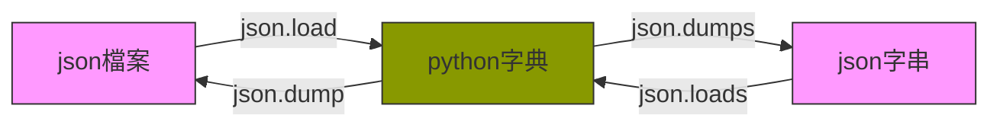

<style>
    .emp {color:red}
    .info {color:green}
    details.part {color:#2471A3}
</style>

# 07.檔案與 json


## 檔案處理
- 檔案開啟 open() 後必須記得關閉 close()
- 檔案開啟常用的模式有
    - 【r】：唯讀模式
    - 【w】：覆寫模式
    - 【a】：增加模式
- 若有讀寫中文的需求，需指定編碼 `encoding="UTF-8"`
```
# 取得 ascii 檔案編碼的文字檔的檔案控制物件，作用為讀取
f = open('log.txt', 'r')
for line in f:
    print(line.strip(), end="")
f.close()

# 取得 UTF-8 檔案編碼的文字檔的檔案控制物件，作用為寫入
f = open('log.txt', 'w', encoding='UTF-8')
f.write("寫入測試\n")
f.close()
```

### 自動呼叫 close()
使用 with open() 開檔，縮排區塊結束後會自動呼叫 close()
```
with open('log.txt','r', encoding='UTF-8') as f:
    for line in f:
        print(line.strip())
```

### 列表生成式
以列表生成式讀入檔案內容，每一列成為一個元素
```
lines = [line.strip() for line in open('log.txt','r', encoding='UTF-8')]
```

<!-- ## 目錄處理
###
 -->

## json處理

### json字串
JSON(JavaScript Object Notation)是一種輕量級的資料交換格式，用來傳輸由屬性值或者序列性的值組成的資料物件。陣列(array)用中括號 [ ]、物件(object)用大括號 { }。範例如下：

**pi.json**
```json=
{
    "name": "王大明",
    "sex": "M",
    "age": 18,
    "phone": [
        {
            "kind": "home",
            "number": "07-1234567"
        },
        {
            "kind": "office",
            "number": "07-7654321"
        }
    ]
}
```
> 注意！標準 JSON 必須使用雙引號 ( " ) 而不能使用單引號 ( ' )，否則在轉換成 dict 型別時會發生錯誤。
> 

### json 套件
json 的處理通常使用 json 套件，以下列出 json 套件常用的方法

| 方法 | 參數 | 說明 |
| -------- | -------- | -------- |
| load() | fp | 讀取本機 JSON 檔案，並轉換為 Python 的字典 dict 型別。 |
| loads() | s | 將 JSON 格式的資料，轉換為 Python 的字典 dict 型別。 |
| dump() | obj, fp | 將字典 dict 型別的資料，寫入本機 JSON 檔案。 |
| dumps() | obj | 將字典 dict 型別的資料轉換為 JSON 格式的資料。 |
| JSONDecoder() |  | 將 JSON 格式的資料，轉換為 Python 的字典 dict 型別。 |
| JSONEncoder() |  | 將字典 dict 型別的資料轉換為 JSON 格式的資料。 |



#### load() 與 dump()

建立 app.py 檔案如下：
```python=
import json
from pprint import PrettyPrinter

with open('pi.json', 'r', encoding='UTF-8') as f:
    # json.load() 讀取 JSON 檔案，轉換為 Python 的 dict
    pi_dict = json.load(f)

print(type(pi_dict), "\n")
pp = PrettyPrinter(indent=4, width=20)
pp.pprint(pi_dict)

pi_dict["birth"] = "1980-06-15"
with open('dump.json', 'w', encoding="utf-8") as f:
    # json.dump() 將 dict 轉成 JSON 格式，寫入 JSON 檔案
    json.dump(pi_dict, f, ensure_ascii=False, indent=4)
```

執行結果如下：
```
<class 'dict'> 

{   'age': 18,
    'name': '王大明',
    'phone': [   {   'kind': 'home',
                     'number': '07-1234567'},
                 {   'kind': 'office',
                     'number': '07-7654321'}],
    'sex': 'M'}
```
#### 轉換原則
load() 針對 json 檔案、loads() 針對 json 字串，轉為 Python 物件，其轉換原則如下：

| json | python |
| -------- | -------- |
| object | dict |
| array |  list |
| string |  str |
| number:int |  int |
| number:real |  float |
| true | True |
| false | False |
| null |  None |


dump() 可將 Python 物件轉為 json 檔案、dumps() 可將 Python 物轉為 json 字串，其轉換原則如下：

| python | json |
| -------- | -------- |
| dict | object |
| list / tuple | array |
| str | string |
| int | number:int |
| float | number:real |
| True | true |
| False | false |
| None | null |
> - 若遇到中文字可加上 ensure_ascii = False
> - 若要呈現縮排可加上 indent = 4

#### loads() 與 dumps()

建立 app.py 檔案如下：
```python=
import json
from pprint import PrettyPrinter

pi_str = '{"name": "Tom", "age": 30, "city": "台中市", "birth": "1988-10-29"}'
pi_dict = json.loads(pi_str)
print(type(pi_dict), "\n")
pp = PrettyPrinter(indent=4, width=20)
pp.pprint(pi_dict)

print("-" * 30)

pi_dict["phone"] = "0912345678"
new_pi_str = json.dumps(pi_dict, ensure_ascii=False, indent=4)
print(new_pi_str)
```

執行結果如下：
```
<class 'dict'> 

{   'age': 30,
    'birth': '1988-10-29',
    'city': '台中市',
    'name': 'Tom'}
------------------------------
{
    "name": "Tom",
    "age": 30,
    "city": "台中市",
    "birth": "1988-10-29",
    "phone": "0912345678"
}
```
