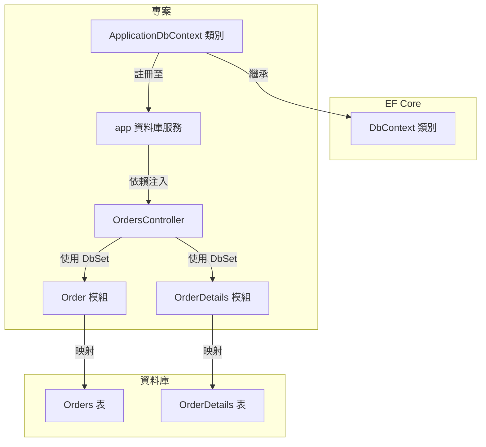

# ASP.NET Core Web 應用程式筆記
使用 ASP.NET Core 開發 Web 應用程式，執行效能可提升不少。


整個 ASP.NET Core 架構的組成有三
1. Platform
2. Application Frameworks
3. Utility Frameworks


要使用 ASP.NET Core 開發 Web 應用程式，目前有四種方式
1. 使用 Razor Pages
頁面導向的開發模式，適合簡化的 Web 應用程式。主要針對以表單、資料展示為主的應用程式，強調 UI 的簡單性與快速開發。
2. 使用 MVC
傳統的 ASP.NET 開發模式，適合需要分離資料模型、視圖和控制邏輯的大型 Web 應用程式。強調分離關注點 (Separation of Concerns)，以便更好的維護與擴展。
3. 使用 Blazor
基於 C# 的單頁應用程式框架，用於建構互動性強的 Web 應用程式，允許使用 C# 取代 JavaScript 來編寫客戶端邏輯。
4. 使用 Web API
專門用來建構 RESTful API，供前端應用、行動應用或第三方服務使用。主要用來處理後端邏輯與資料交換，沒有 UI 呈現。

目前校務組採用的是 MVC 與 Web API 的開發方式，以下我們以 MVC 的專案了解一下其檔案與目錄的作用。

## Visual Studio 2022 專案的檔案與目錄功能

建立專案後，出現如上圖的專案結構，其功能說明如下：
- Connected Services: 用來管理專案與外部服務整合的入口，例如 Azure 與其他外部 API 服務（如 REST API）。
- Properties:
    - launchSettings.json: 包含專案的啟動設定，例如伺服器 URL、啟動環境（開發、測試、正式環境）、環境變數等。供本地開發與測試時使用。
- wwwroot:應用程式唯一公開的靜態內容目錄，任何放在這裡的檔案都可以通過 URL 直接存取（例如 /css/style.css）。
    - css, js, lib: 存放靜態檔案，如 CSS 樣式、JavaScript 程式碼和第三方庫（例如 jQuery 或 Bootstrap）。
    - favicon.ico: 網站的小圖標，顯示在瀏覽器的標籤頁上。
- Controllers:
    - HomeController.cs: 控制器類別，用來處理用戶端發出的 HTTP 請求並傳回相應的視圖或資料。HomeController 通常負責應用的首頁和基本邏輯。
- Models:
    - ErrorViewModel.cs: 資料模型，用來定義錯誤處理頁面所需的資料結構。ASP.NET Core MVC 中，Model 負責處理與資料有關的邏輯。
- Views:
    - Home: 包含與 HomeController 對應的視圖檔案。例如 Index.cshtml 是 HomeController 的 Index 方法的視圖。
    - Shared: 共用的視圖檔案，通常包含所有頁面會使用的部分視圖（例如頁首、頁尾）。
        - _ViewImports.cshtml: 定義共享的命名空間或標籤輔助程式，這些設定會在所有視圖中使用。
        - _ViewStart.cshtml: 定義所有視圖的起始配置，例如使用的 Layout。每次載入視圖時會先執行此檔案。
- appsettings.json:包含應用程式的設定資訊，如資料庫連線字串、應用程式的設定參數。這是 ASP.NET Core 預設的設定檔。
    - appsettings.Development.json: 用來存放開發環境的設定，通常會覆寫 appsettings.json 中的設定。根據環境變數 ASPNETCORE_ENVIRONMENT 來選擇還可以有 appsettings.Production.json 與 appsettings.Staging.json。
- Program.cs:
這是應用程式的進入點。包含建立和設定 Web 主機的邏輯，定義應用程式的啟動方式。其中的app.UseRouting() 是 ASP.NET Core 應用的核心，它允許應用決定如何根據 HTTP 請求找到合適的控制器及其方法。

:::info
:star: ASPNETCORE_ENVIRONMENT
ASPNETCORE_ENVIRONMENT 這個環境變數用於指定 ASP.NET Core 應用程式所運行的環境（例如 Development、Staging 或 Production）。這個變數影響應用程式的配置、行為以及載入的設定檔。
- 開發環境：
環境變數通常定義在 Properties/launchSettings.json 檔案中。在這個檔案中，你可以找到 ASPNETCORE_ENVIRONMENT 的設置，通常設定為 Development。
- 部署環境
你可以直接在作業系統的環境變數中定義 ASPNETCORE_ENVIRONMENT。這允許你在不同的伺服器上為應用程式設定不同的環境，例如在生產環境中設定為 Production。
- Docker 容器:
可以在 Dockerfile 或 docker-compose.yml 中設定環境變數，以便在容器內部使用。
:::

### 設定啟動啟動專案
在方案總管的方案上按右鍵，點選屬性，左側確定在【起始專案】上，右側【單一起始專案】選擇要使用的專案。


### xxxxxx.sln 方案檔內容
- Project 區塊定義了專案的名稱、檔案位置及其唯一識別碼。
- Global 區塊包含全域方案設定，包含方案的建構配置、專案的建構設定、方案屬性及其他擴展資訊。
- 各個區塊有明確的開始和結束標記，用來劃分不同的方案設定。
```csharp=
// 定義 Visual Studio 方案檔的格式版本（12.00 對應於 Visual Studio 2012 及更新版本）
Microsoft Visual Studio Solution File, Format Version 12.00

// 標註使用的 Visual Studio 版本 (版本 17 對應於 Visual Studio 2022)
# Visual Studio Version 17

// 定義使用 Visual Studio 版本的具體細節（這裡指的是 Visual Studio 2022, 17.11.35222.181）
VisualStudioVersion = 17.11.35222.181

// 定義可用於打開此方案的最小 Visual Studio 版本 (這裡是 10.0.40219.1，對應於 Visual Studio 2010)
MinimumVisualStudioVersion = 10.0.40219.1

// 定義方案中的專案。這行表示方案中的一個 C# 專案：
// {FAE04EC0-301F-11D3-BF4B-00C04F79EFBC} 是 C# 專案的 GUID 標識符。
// "MyAbpApp" 是專案名稱。
// "MyAbpApp\MyAbpApp.csproj" 是專案檔案的位置。
// {4C6B9001-4BAF-4529-94FF-FC5A59418A05} 是此專案的唯一識別碼。
Project("{FAE04EC0-301F-11D3-BF4B-00C04F79EFBC}") = "MyAbpApp", "MyAbpApp\MyAbpApp.csproj", "{4C6B9001-4BAF-4529-94FF-FC5A59418A05}"
EndProject // 結束專案定義的區塊。

// 這裡開始定義全域的方案設定。
Global
    
    // 設定方案的建構配置（如 Debug 和 Release）及平台（如 Any CPU）。
    GlobalSection(SolutionConfigurationPlatforms) = preSolution
        // 定義方案中 Debug 配置下使用的 "Any CPU" 平台。
        Debug|Any CPU = Debug|Any CPU
        // 定義方案中 Release 配置下使用的 "Any CPU" 平台。
        Release|Any CPU = Release|Any CPU
    EndGlobalSection  // 結束方案配置平台區段。

    // 定義專案的建構配置與平台，在方案載入後設定。        
    GlobalSection(ProjectConfigurationPlatforms) = postSolution
        // 定義專案在 Debug 配置下使用 "Any CPU" 平台，ActiveCfg 表示目前使用的配置。
        {4C6B9001-4BAF-4529-94FF-FC5A59418A05}.Debug|Any CPU.ActiveCfg = Debug|Any CPU
        // 定義專案在 Debug 配置下進行建構時使用 "Any CPU" 平台。
        {4C6B9001-4BAF-4529-94FF-FC5A59418A05}.Debug|Any CPU.Build.0 = Debug|Any CPU
        // 定義專案在 Release 配置下使用 "Any CPU" 平台，ActiveCfg 表示目前使用的配置。
        {4C6B9001-4BAF-4529-94FF-FC5A59418A05}.Release|Any CPU.ActiveCfg = Release|Any CPU
        // 定義專案在 Release 配置下進行建構時使用 "Any CPU" 平台。
        {4C6B9001-4BAF-4529-94FF-FC5A59418A05}.Release|Any CPU.Build.0 = Release|Any CPU
    EndGlobalSection   // 結束專案配置平台區段

    // 定義方案的屬性
    GlobalSection(SolutionProperties) = preSolution	
        // 設定是否隱藏方案節點，FALSE 表示顯示方案節點
        HideSolutionNode = FALSE
    EndGlobalSection // 結束方案屬性區段
    
    // 定義方案的全域擴展屬性
    GlobalSection(ExtensibilityGlobals) = postSolution
        // 方案的唯一識別碼（GUID），用來標識此方案
        SolutionGuid = {693D1F44-93CA-4048-9C6A-D50AF3FE260F}
    EndGlobalSection // 結束方案的全域擴展屬性區段

EndGlobal   // 結束全域方案設定區塊
```

### xxxxxx.csproj 專案檔內容
這是 ASP.NET Core MVC 專案的 .csproj 檔案，用來定義專案的設定和依賴項。以下是逐行註解
```csharp=
//  定義專案使用的 SDK 為 Microsoft.NET.Sdk.Web，適用於開發 ASP.NET Core Web 應用
<Project Sdk="Microsoft.NET.Sdk.Web">

  <PropertyGroup>
    // 設定專案的目標框架為 .NET 8.0
    <TargetFramework>net8.0</TargetFramework>
    // 啟用 nullable 參考類型的支援，用來檢測可能的 null 問題
    <Nullable>enable</Nullable>
    // 啟用隱式 using 指令，常見的命名空間會自動導入
    <ImplicitUsings>enable</ImplicitUsings>
  </PropertyGroup>

  <ItemGroup>
    // 引入 ABP 框架的 ASP.NET Core MVC 支援，版本 8.3.1
    <PackageReference Include="Volo.Abp.AspNetCore.Mvc" Version="8.3.1" />
    // 引入 ABP 框架的 ASP.NET Core MVC UI 支援，版本 8.3.1
    <PackageReference Include="Volo.Abp.AspNetCore.Mvc.UI" Version="8.3.1" />
    // 引入 ABP 框架對 Entity Framework Core 的支援，版本 8.3.1
    <PackageReference Include="Volo.Abp.EntityFrameworkCore" Version="8.3.1" />
    // 引入 ABP 框架中對 SQL Server 的支援，使用 Entity Framework Core 來操作 SQL Server 資料庫，版本 8.3.1
    <PackageReference Include="Volo.Abp.EntityFrameworkCore.SqlServer" Version="8.3.1" />
  </ItemGroup>

</Project>
```
#### Visual Studio 快速鍵速查表


### Program.cs 檔案內容
Program.cs 檔案是 ASP.NET Core 應用程式的入口點，用來配置 Web 應用程式的行為和 HTTP 請求管線，其程式碼的作用請參考以下註解：
```csharp=
// 建立 Web 應用程式的建構器，並接受命令列參數進行初始化
var builder = WebApplication.CreateBuilder(args);

// 將 MVC 服務（包括控制器和視圖）加入到服務容器中
builder.Services.AddControllersWithViews();

// 建立一個 WebApplication 實例，包含了應用程式的所有配置和中介軟體（middleware）
var app = builder.Build();

// 以下開始配置 HTTP 請求管線

// 如果不是開發環境，使用例外處理來處理未處理的錯誤
if (!app.Environment.IsDevelopment())
{
    // 設定一個預設的錯誤處理器，在非開發環境中，當發生未處理的例外時，會將使用者導向 /Home/Error 頁面
    app.UseExceptionHandler("/Home/Error");
    // 啟用 HSTS（HTTP 嚴格傳輸安全）機制，預設持續時間為 30 天
    app.UseHsts();
}

// 將 HTTP 請求重新導向至 HTTPS
app.UseHttpsRedirection();
// 啟用提供靜態檔案的功能（例如 HTML、CSS、JavaScript、圖片等），並將專案中的 wwwroot 資料夾設為靜態檔案的根目錄
app.UseStaticFiles();

// 啟用路由功能，讓應用程式可以根據定義的路由來處理請求
app.UseRouting();

// 啟用授權機制，確保使用者具有適當的權限來執行操作
app.UseAuthorization();

// 定義預設的控制器路由規則
// 當使用者訪問網站的根路徑（如 https://example.com/）時，會自動導航到 HomeController 中的 Index 動作方法。如果 URL 中有其他控制器或動作名稱，則會根據這些名稱來路由請求。
app.MapControllerRoute(
    name: "default", // 指定路由名稱
    pattern: "{controller=Home}/{action=Index}/{id?}"); // 預設路由模式：{控制器}/{動作}/{可選的id}

// 啟動應用程式，開始接收和處理 HTTP 請求
app.Run();
```

### appsettings.json 檔案內容
是 ASP.NET Core 專案中的設定檔，可根據不同環境（例如開發、測試、正式）快速切換設定，主要用來儲存應用程式的配置，將設定與程式邏輯分開管理。常見的配置包括：
- Logging：定義日誌記錄的層級，用來控制哪些級別的日誌會被記錄。
- AllowedHosts：指定允許的主機名，常用來控制應用程式的網路訪問限制。
- ConnectionStrings：儲存資料庫連接字串，定義應用程式如何連接資料庫。
```json=
{
  "Logging": {
    "LogLevel": {
      "Default": "Information", // 預設的日誌記錄級別為 Information，代表記錄所有信息層級以上的日誌（如警告、錯誤）
      "Microsoft.AspNetCore": "Warning" // ASP.NET Core 相關的日誌記錄級別為 Warning，僅記錄警告和錯誤級別的日誌
    }
  },
  "AllowedHosts": "*", // 允許的主機名。使用 "*" 表示允許所有主機，沒有限制
  "ConnectionStrings": {
    "DefaultConnection": "Server=(localdb)\\mssqllocaldb;Database=StudentDb;Trusted_Connection=True;" 
    // 定義名為 DefaultConnection 的資料庫連接字串
    // 使用本機的 SQL Server LocalDB，連接 StudentDb 資料庫，使用受信任的連接（Windows 身份驗證）
  }
}
```

## Visual Studio 2022 專案執行方式
在 Visual Studio 2022 中，有多種專案執行方式，適合不同的開發與測試需求。
- HTTP: 使用本地 HTTP 伺服器，適合進行無加密的快速本地開發與測試。
- HTTPS: 使用本地端 HTTPS 協定運行應用程式，支援加密連線，適合測試 SSL/TLS 和安全性相關功能，模擬生產環境中的安全性需求。
- IIS Express: 模擬正式生產環境的 IIS 設定，適合測試與 IIS 相關的功能，如身份驗證和錯誤處理。
- WSL: 在 Windows 上運行 Linux 子系統，適合跨平台應用程式的開發與測試，尤其是最終部署在 Linux 上的專案。

### launchSettings.json 檔案內容
這個設定主要是定義應用程式在本地開發時的啟動設定。
```json=
{
  "profiles": {
    "http": {
      "commandName": "Project", // 表示此配置是直接運行專案
      "launchBrowser": true, // 啟動應用時自動打開瀏覽器
      "environmentVariables": {
        "ASPNETCORE_ENVIRONMENT": "Development" // 設定環境變數，指定為開發環境
      },
      "dotnetRunMessages": true, // 顯示 .NET 執行訊息
      "applicationUrl": "http://localhost:5066" // 應用程式的 HTTP 端點
    },
    "https": {
      "commandName": "Project", // 直接運行專案
      "launchBrowser": true, // 啟動應用時自動打開瀏覽器
      "environmentVariables": {
        "ASPNETCORE_ENVIRONMENT": "Development" // 設定為開發環境
      },
      "dotnetRunMessages": true, // 顯示 .NET 執行訊息
      "applicationUrl": "https://localhost:7175;http://localhost:5066" // HTTPS 和 HTTP 端點
    },
    "IIS Express": {
      "commandName": "IISExpress", // 使用 IIS Express 執行
      "launchBrowser": true, // 啟動應用時自動打開瀏覽器
      "environmentVariables": {
        "ASPNETCORE_ENVIRONMENT": "Development" // 設定為開發環境
      }
    },
    "WSL": {
      "commandName": "WSL2", // 使用 WSL2 執行專案
      "launchBrowser": true, // 啟動時自動打開瀏覽器
      "launchUrl": "https://localhost:7175", // WSL 中的啟動 URL
      "environmentVariables": {
        "ASPNETCORE_ENVIRONMENT": "Development", // 設定為開發環境
        "ASPNETCORE_URLS": "https://localhost:7175;http://localhost:5066" // 應用程式的 URL，支援 HTTP 和 HTTPS
      },
      "distributionName": "" // 留空，使用預設的 WSL 發行版
    }
  },
  "$schema": "http://json.schemastore.org/launchsettings.json", // JSON 結構模式 URL
  "iisSettings": {
    "windowsAuthentication": false, // 關閉 Windows 身份驗證
    "anonymousAuthentication": true, // 開啟匿名身份驗證
    "iisExpress": {
      "applicationUrl": "http://localhost:44208", // 指定 IIS Express 執行應用的 HTTP URL
      "sslPort": 44336 // 指定 IIS Express 使用的 SSL 埠號
    }
  }
}
```

## 控制器(Controller)
### View() 方法
### 回傳 IActionResult 型別
IActionResult 是 ASP.NET Core MVC 控制器方法的回傳型別，它支援多種回應結果，提供了彈性來返回不同的 HTTP 回應。return View() 是 IActionResult 的一種具體實現，用來呈現 Razor 視圖。
```csharp=
public IActionResult Create()
{
    return View(); // 返回一個空的表單檢視
}
```
View() 方法返回 ViewResult 物件，這是一種實作 IActionResult 的型別。它會呈現名稱對應的 .cshtml 視圖檔，並可接受參數來傳遞模型資料至前端。

### 回傳 `Task<IActionResult>` 型別
`Task<IActionResult>` 是在控制器方法中用來處理非同步操作的回傳型別。允許方法以非同步方式等待資料庫查詢完成，避免執行緒阻塞，提高效能。非同步操作常用於 I/O 密集操作，例如讀取或更新資料庫。
```csharp=
public async Task<IActionResult> Index()
{
    return View(await _context.Orders.Include(o => o.OrderDetails).ToListAsync());
}
```
這裡的 await 語法等待 `_context.Orders.Include(...).ToListAsync()` 完成資料讀取後，再回傳結果。因為此方法是非同步的，因此回傳型別為 `Task<IActionResult>`，而非單純的 IActionResult。

### 控制器繼承的父類別方法
專案中的控制器能夠直接呼叫 NotFound()、Ok()、Forbid()、Redirect()等方法，是因為 ASP.NET Core 的所有控制器都繼承了 ControllerBase，而 ControllerBase 類別中定義了這些方法。這些方法可以讓開發者可以快速返回不同的 HTTP 回應結果，而不需自行建立每一個結果物件，常用的包括：
1. BadRequest(): 回傳 400 錯誤，表示請求無效。
2. Created() 和 CreatedAtAction(): 回傳 201 建立成功，通常用於建立新資源。
3. NoContent(): 回傳 204，表示成功但無回應內容，適用於更新或刪除操作。
4. Unauthorized(): 回傳 401，表示授權失敗。
5. Forbid(): 回傳 403，表示禁止訪問。
6. Redirect(): 用於重導向到指定的 URL。

#### 1. BadRequest()
用於處理無效請求，若使用者輸入資料有錯，可使用
```csharp=
if (!ModelState.IsValid) return BadRequest(ModelState);
```

#### 2. CreatedAtAction()
在建立資源時返回 201 狀態碼和新資源位置
```csharp=
return CreatedAtAction(nameof(GetItem), new { id = item.Id }, item);
```

#### 3. NoContent()
更新成功但無返回內容時使用
```csharp=
return NoContent();
```

#### 4. Unauthorized()
返回 401 未授權狀態碼，通常用於無效或過期的認證
```csharp=
if (!User.Identity.IsAuthenticated) return Unauthorized();
```

#### 5. Forbid()
返回 403 禁止訪問狀態碼，用於授權不足的情境
```csharp=
if (!User.IsInRole("Admin")) return Forbid();
```

#### 6. Redirect()
用於導向其他 URL，返回 302 重定向
```csharp=
return Redirect("/Home/Index");
```

### ModelState 物件
ModelState 是一個用於管理模型驗證狀態的物件，主要在控制器中使用。它用來追蹤從表單提交的資料是否有效，並儲存與模型屬性相關的錯誤訊息。當使用者提交表單時，ModelState 自動更新其狀態，以便開發者能夠輕鬆檢查驗證結果並相應地處理錯誤。
- 常用屬性
    - IsValid：指示模型狀態是否有效，若無錯誤則為 true。
    - Errors：包含所有與模型屬性相關的錯誤資訊。
- 常用方法
    - AddModelError(string key, string errorMessage)：用於新增錯誤訊息。
    - Clear()：清除所有的錯誤狀態。
    - Remove(string key)：移除特定屬性的錯誤。

下面這個範例中，ModelState.IsValid 用於檢查模型是否有效，若不合格，則使用 ModelState.AddModelError 新增錯誤，並返回表單以顯示錯誤訊息。
```csharp=
[HttpPost]
public async Task<IActionResult> Create(Order order, List<OrderDetail> orderDetails)
{
    if (ModelState.IsValid)
    {
        if (orderDetails == null || orderDetails.Count == 0)
        {
            ModelState.AddModelError("", "請至少輸入一項訂購明細");
            return View(order);  // 返回表單，顯示錯誤
        }

        order.OrderDetails = orderDetails; 
        _context.Add(order); 
        await _context.SaveChangesAsync(); 
        return RedirectToAction(nameof(Index)); 
    }

    return View(order);  // 如果模型無效，返回表單顯示錯誤
}
```

## 資料庫上下文 DbContext 類別
在 ASP.NET Core 中，要使用 Entity Framework Core 的 ORM 功能，首先需要建立對應資料表的模型，並定義資料庫上下文類別（例如 ApplicationDbContext），該類別需繼承自基礎的 DbContext 類別。DbContext 實現了 ORM 的概念，能夠將程式中的物件映射到資料庫表格，並管理資料庫連線、物件追蹤、查詢、資料儲存等操作。

### 架構圖
以下是 ASP.NET Core MVC 使用 Entity Framework Core 的架構，展示各類別與資料庫之間的關聯：


### 註冊資料庫上下文服務
在 ASP.NET Core 專案的 Program.cs 中，使用以下程式碼註冊資料庫上下文服務
```csharp=
builder.Services.AddDbContext<ApplicationDbContext>(options =>
    options.UseSqlServer(builder.Configuration.GetConnectionString("DefaultConnection")));
```
options 物件允許我們設定資料庫連線字串，並且在此範例中透過 Configuration.GetConnectionString("DefaultConnection") 讀取設定檔中定義的連線字串。

### 使用步驟
在專案中，讓控制器使用物件方式存取資料庫的步驟如下：
1. 建立模型 (Model)：首先，為資料表設計對應的模型類別，這些模型用於映射資料庫中的資料表。
2. 自訂資料庫上下文 (ApplicationDbContext)：繼承 DbContext 類別並加入 DbSet 屬性，以建立模型與資料表的關聯。
3. 註冊至服務容器：在 Program.cs 中，使用 AddDbContext 將 ApplicationDbContext 註冊至服務容器
4. 依賴注入至控制器：控制器便可透過依賴注入取得此上下文來使用資料庫操作方法，例如 Add、SaveChangesAsync 等，以進行 CRUD 操作。

### 常用屬性
`DbSet<TEntity>`：表示資料庫中的一張資料表，例如：
- `DbSet<Order> Orders` 表示訂單資料表。
- `DbSet<OrderDetail> OrderDetails` 表示訂單明細表。
```csharp=
public class ApplicationDbContext : DbContext
{
    public ApplicationDbContext(DbContextOptions<ApplicationDbContext> options)
        : base(options)
    {
    }
    public DbSet<Order> Orders { get; set; }
    public DbSet<OrderDetail> OrderDetails { get; set; }
}
```
### 常用方法
1. Add / AddAsync
將實體新增至資料庫的追蹤範圍中，以便稍後透過 SaveChanges() 儲存到資料庫。
```csharp=
var order = new Order { CustomerName = "John" };
_context.Orders.Add(order);
await _context.SaveChangesAsync();
```
2. Find
根據主鍵查詢資料
```csharp=
var order = await _context.Orders.FindAsync(orderId);
```
3. Update
更新資料表中的實體
```csharp=
order.CustomerName = "Updated Name";
_context.Orders.Update(order);
await _context.SaveChangesAsync();
```
4. Remove
從資料庫中刪除實體
```csharp=
_context.Orders.Remove(order);
await _context.SaveChangesAsync();
```
5. SaveChanges / SaveChangesAsync
儲存所有實體的變更至資料庫
```csharp=
await _context.SaveChangesAsync();
```

## 路由（Routing）規則


路由（Routing）是用來定義 URL 和控制器動作方法之間的映射關係。當用戶請求某個 URL 時，路由系統會將該 URL 分析並匹配到相應的控制器和動作，進行處理和回應。

路由是 MVC 框架中一個核心功能，它允許你控制 URL 結構，定義參數的傳遞方式，並建構語義化、易讀的 URL。

ASP.NET Core MVC 中有兩種定義路由的方式：
1. 傳統路由（Convention-based Routing）： 利用預設的路由規則，根據控制器名稱和動作方法來匹配路徑。
2. 屬性路由（Attribute Routing）： 直接在控制器或動作方法上使用屬性來定義特定的路由規則。


屬性路由的優先級高於傳統路由，因為屬性路由是在方法或控制器上直接定義的，而傳統路由依賴於全局路由規則，其餘會根據定義的先後順序來匹配路由。

#### 1. 傳統路由（Convention-based Routing）
傳統路由在 ASP.NET Core 中是透過 Startup.cs 或 Program.cs 中的路由配置來定義的，通常是根據特定模式（例如 {controller}/{action}/{id?}）來匹配 URL。

在 Program.cs 中可以看到以下的預設路由配置
```csharp=
app.MapControllerRoute(
    name: "default",
    pattern: "{controller=Home}/{action=Index}/{id?}");
```
路由說明：
- 當請求的 URL 符合 {controller}/{action}/{id} 格式時，會路由到相應的控制器和動作方法。
- controller 是控制器名稱，action 是動作方法，id 是可選參數。
- 如果 URL 沒有指定控制器和動作，會使用預設的 Home 控制器和 Index 動作方法。

若增加一個控制器：HelloWorldController
```csharp=
public class HelloWorldController : Controller
{
    // GET: /HelloWorld/
    public IActionResult Index()
    {
        return View();
    }

    // GET: /HelloWorld/Welcome/
    public string Welcome(string name, int numTimes = 1)
    {
        return HtmlEncoder.Default.Encode($"Hello {name}, NumTimes is: {numTimes}");
    }
}
```
路由說明：
- 請求 /HelloWorld 會路由到 HelloWorldController 的 Index 動作方法。
- 請求 /HelloWorld/Welcome?name=John&numTimes=5 會路由到 Welcome 方法，並將參數 name 和 numTimes 傳遞給它。

#### 2. 屬性路由（Attribute Routing）
屬性路由提供了一種更精細、更靈活的方式來定義 URL 與控制器動作之間的映射關係。相較於傳統路由，屬性路由直接將路由規則寫在控制器或動作方法上，讓您能更精確地控制 URL 的樣式。其分類有：
1. 基本路由屬性： [Route]、[RouteTemplate]
2. HTTP 方法屬性： [HttpGet]、[HttpPost]、[HttpPut]、[HttpDelete]
3. 其他屬性： [ActionName]、[Area]

**2.1 基本路由屬性**
基本的路由屬性用來定義路由規則，讓控制器或方法能夠匹配指定的 URL。
```csharp=
[Route("HelloWorld")]
public class HelloWorldController : Controller
{
    [Route("")]
    [Route("Index")]
    public IActionResult Index()
    {
        return View();
    }

    [Route("Welcome/{name?}/{numTimes?}")]
    public string Welcome(string name = "Guest", int numTimes = 1)
    {
        return HtmlEncoder.Default.Encode($"Hello {name}, NumTimes is: {numTimes}");
    }
}
```
說明：
- /HelloWorld 或 /HelloWorld/Index 對應到 Index 方法。
- /HelloWorld/Welcome/John/5 對應到 Welcome 方法，name 是 "John"，numTimes 是 5。
- /HelloWorld/Welcome 則使用預設參數，name 是 "Guest"，numTimes 是 1。

若路由要使用路徑傳遞參數，稱之為【參數路由】
```csharp=
[Route("HelloWorld/Welcome/{name}/{numTimes}")]
public string Welcome(string name, int numTimes)
{
    return HtmlEncoder.Default.Encode($"Hello {name}, NumTimes is: {numTimes}");
}
```
說明：
-  URL 中的 {name} 和 {numTimes} 會直接從路徑中傳入，比如 /HelloWorld/Welcome/Alice/3 會傳遞 "Alice" 作為 name，3 作為 numTimes。

我們還可以使用 ? 來定義【可選參數】：
```csharp=
[Route("HelloWorld/Welcome/{name?}/{numTimes?}")]
public string Welcome(string name = "Guest", int numTimes = 1)
{
    return HtmlEncoder.Default.Encode($"Hello {name}, NumTimes is: {numTimes}");
}
```
說明：
- 如果 URL 沒有路徑(提供參數)，會使用參數的預設值。

通常路由的路徑代表的都是字串，如果想要限制傳遞的資料格式可以進行【路由約束】。例如，要求 id 必須是整數
```csharp=
[Route("HelloWorld/Welcome/{name}/{id:int}")]
public string Welcome(string name, int id)
{
    return HtmlEncoder.Default.Encode($"Hello {name}, ID is: {id}");
}
```
說明：
- 如果傳入的 id 不是整數，則該路由不會匹配。

通常控制器就是一個路由的進入點，如果我們想要定義【多個路由】，允許多個 URL 匹配同一個動作方法：
```csharp=
[Route("HelloWorld")]
[Route("Hello")]
public IActionResult Index()
{
    return View();
}
```
說明：
- 這表示 /HelloWorld 和 /Hello 都會路由到 Index 方法。

**2.2 HTTP 方法屬性**
HTTP 方法屬性（[HttpGet], [HttpPost], [HttpPut], [HttpDelete], [HttpPatch]）是屬性路由的一部分，確保只有對應的 HTTP 方法才能呼叫該動作方法。
```csharp=
[Route("HelloWorld")]
public class HelloWorldController : Controller
{
    [HttpGet]
    [Route("Index")]
    public IActionResult Index()
    {
        return View();
    }

    [HttpPost("Submit")]
    public IActionResult Submit(string data)
    {
        // 處理 POST 請求
        return Content($"Data received: {data}");
    }
}
```
說明：
- [HttpGet]：指定該方法僅處理 GET 請求。此方法會處理對 /HelloWorld/Index 和 /HelloWorld/Welcome 的 GET 請求。
- [HttpPost]：指定該方法僅處理 POST 請求。此方法會處理對 /HelloWorld/Submit 的 POST 請求。


我們可以在 HttpGet 屬性中定義一個自定義的路由模式。這樣，除了指定方法只能處理 GET 請求外，還能直接在屬性中設置具體的路由規則。
```csharp=
[HttpGet("HelloWorld/Welcome/{name}/{numTimes}")]
public string Welcome(string name, int numTimes)
{
    return HtmlEncoder.Default.Encode($"Hello {name}, NumTimes is: {numTimes}");
}
```
說明：
- 這個方法只能處理 HTTP GET 請求。
- 只有當 URL 符合 /HelloWorld/Welcome/{name}/{numTimes} 這個模式時，請求才會路由到這個方法。
- URL 中的 {name} 和 {numTimes} 是路由參數，它們會自動傳遞給 Welcome 方法中的參數 name 和 numTimes，例如，請求 /HelloWorld/Welcome/John/5 會傳遞 "John" 給 name，並將 5 傳遞給 numTimes。

我們一樣可以使用 ? 來定義可選參數，這表示這些參數是可選的。如果不提供，則會使用方法定義的預設值。

```csharp=
[HttpGet("HelloWorld/Welcome/{name?}/{numTimes?}")]
public string Welcome(string name = "Guest", int numTimes = 1)
{
    return HtmlEncoder.Default.Encode($"Hello {name}, NumTimes is: {numTimes}");
}
```
說明：
- /HelloWorld/Welcome 會匹配到這個方法，並使用預設值 "Guest" 作為 name，1 作為 numTimes。
- /HelloWorld/Welcome/Alice 會匹配到這個方法，並將 "Alice" 傳遞給 name，numTimes 使用預設值 1。

**2.3 其他屬性**
[ActionName] 屬性用於修改動作方法的名稱，使得 URL 不必與方法名稱一致：
```csharp=
[ActionName("Begin")]
public IActionResult Start()
{
    return View();
}
```
說明：
- /Begin 將匹配 Start 方法。

[Area] 屬性用於將控制器分類到特定的區域（Area）中，通常用於大型應用程式的模組化：
```csharp=
[Area("Admin")]
[Route("Admin/[controller]/[action]")]
public class HomeController : Controller
{
    public IActionResult Index()
    {
        return View();
    }
}
```
說明：
- /Admin/Home/Index 將匹配此方法。

**控制器中的路由函數沒有多載**
在 ASP.NET Core MVC 的控制器中，方法（即動作）是由 URL 路由來呼叫的，而不像在 C# 的一般方法那樣可以依賴多載（overloading）來區分不同的簽章。

因此，控制器內的動作方法無法直接使用多載。原因在於路由系統無法根據方法的參數來區分它們，只會根據 URL 和路由規則來匹配動作。
```csharp=
[HttpGet("HelloWorld/Welcome")]
public string Welcome()
{
    return "This is the default Welcome action method.";
}

[HttpGet("HelloWorld/Welcome/{name}/{numTimes}")]
public string Welcome(string name, int numTimes)
{
    return HtmlEncoder.Default.Encode($"Hello {name}, NumTimes is: {numTimes}");
}
```
說明：
- /HelloWorld/Welcome 會匹配第一個 Welcome 方法。
- /HelloWorld/Welcome/Alice/3 會匹配第二個方法，並將 "Alice" 和 3 傳遞給對應的參數。

## Razor樣板引擎
Razor 主要負責將伺服器端的 C# 程式碼與 HTML 結合，產生動態的 HTML 頁面。它的運作方式與其他樣板引擎類似，允許開發者在靜態的 HTML 中嵌入動態邏輯，並在渲染時將這些程式碼轉換為完整的 HTML 結果。

### 1. @ 符號
在 Razor 頁面中，只要有對應的模型或資料來源，就可以直接使用 @ 來插入或顯示資料。例如，假設控制器將一個模型傳遞到視圖，模型包含屬性 UserName，那麼可以直接使用。

這種方式是透過模型（Model）進行資料綁定的，模型是控制器傳遞給視圖的一個強類型物件。這是最推薦的方式，因為它能夠保持型別安全，還有 intellisense 支持。

在控制器中，可以使用 `View(model)` 方法將模型傳遞到視圖。例如：
```csharp=
public IActionResult Index()
{
    var model = new UserModel { UserName = "John" };
    return View(model);
}
```
然後在 Razor 視圖中，就可以使用 @Model 來存取模型中的資料屬性。
```html=
<h1>Hello, @Model.UserName</h1>
```

Razor 完整支援 C#，這意味著開發者可以使用 C# 的控制流（如 if、for 等）和其他語法特性。
```html=
@if (Model.IsLoggedIn) 
{
    <p>Welcome back!</p>
}
```

### 2. ViewData 和 ViewBag
ViewData 與 ViewBag 是 ASP.NET Core MVC 中用於將後端資料傳遞至前端的兩種方式。它們的主要差異在於存取方式：
- ViewData 使用字典樣式，透過鍵值對存取
- ViewBag 則是動態物件，使用點語法存取資料，使用上更為簡便

這兩者都是一次性使用，僅在當前 HTTP 請求有效，無法在多個請求或頁面之間共享資料。通常建議將複雜資料存放於 Model 中，以提高型別安全性和維護性。

#### ViewData
ViewData 是一個字典容器（ViewDataDictionary），用於在控制器和視圖之間以 key-value 形式傳遞資料，並且是一次性的，資料僅在當前請求中有效。

Layout 頁面（例如 _Layout.cshtml）中，使用 @ViewData 來接收資料
```csharp=
<title>@ViewData["Title"] - MyApp</title>
```

在視圖中，例如 Index.cshtml，可設定 ViewData["Title"] 來定義頁面標題
```html=
@{
    ViewData["Title"] = "首頁";
}
```
這樣 Index.cshtml 視圖會將 ViewData["Title"] 傳遞給 _Layout.cshtml，然後渲染標題為「首頁 - MyApp」。這樣做可以實現一個統一的版面設計，同時允許每個子頁面自訂內容。

#### ViewBag
ViewBag 是一個動態物件，用於在控制器和視圖之間傳遞資料。它基於 ViewData，但使用點語法來存取資料，不需要使用索引器或顯式轉型，使用上更加簡便。

在控制器中，可以這樣設定：
```csharp=
public IActionResult Index()
{
    ViewBag.Title = "首頁";
    ViewBag.Message = "歡迎來到我們的網站";
    return View();
}

```
在視圖中使用：
```html=
<h1>@ViewBag.Title</h1>
<p>@ViewBag.Message</p>
```

### 3. 佈局頁面(Layout)
在大型應用程式中，許多頁面具有相同的頁面結構（如標頭、側邊欄、頁尾等）。為了避免重複這些結構，Razor 提供了 Layout 概念，讓開發者能夠建立一個共享的佈局頁面，並讓其他頁面繼承這個佈局。

1. 建立 Layout 頁面
佈局頁面通常位於 Views\Shared\_Layout.cshtml，包含應用程式的標頭和頁腳
```html=
<!-- _Layout.cshtml -->
<!DOCTYPE html>
<html>
<head>
    <title>@ViewData["Title"] - My Application</title>
</head>
<body>
    <header>
        <h1>My Application</h1>
    </header>

    <div class="content">
        @RenderBody() <!-- 子視圖內容將插入到這裡 -->
    </div>

    <footer>
        <p>&copy; 2024 - My Application</p>
    </footer>
</body>
</html>
```
在佈局頁面中，@RenderBody() 用來渲染子視圖的主要內容，所有子視圖的內容都會插入此位置。

2. 使用 _ViewStart.cshtml 指定共用佈局
在 Views\_ViewStart.cshtml 檔案中，指定所有視圖共用的佈局
```html=
@{
    Layout = "_Layout";  // 指定使用 _Layout 佈局
}
```
這樣，每個視圖將自動使用 _Layout.cshtml，無需在每個視圖中單獨指定。

3. 個別視圖範例
```html=
<!-- Index.cshtml -->
<h2>Welcome to the homepage!</h2>
<p>This is the content of the homepage.</p>
```
在此範例中，Index.cshtml 中的 `<h2>` 和 `<p>` 將在 _Layout.cshtml 的 @RenderBody() 位置渲染。

#### RenderSection
若需要在某些頁面中插入額外的區段，可以使用 @RenderSection。

RenderSection 允許在佈局中定義區塊（如樣式或腳本），讓特定頁面根據需要填充這些區塊。

1. 在 Layout 中使用 @RenderSection 定義可選區段：
```html=
<head>
    @RenderSection("Styles", required: false)
</head>
```
如果某些頁面不需要定義此區段，它們可以忽略 @section 的定義，並且設定 required: false 參數就可以防止發生錯誤。

2. 在具體頁面中使用 @section 填充該區段：
```html=
@section Styles {
    <link rel="stylesheet" href="~/AccountManagement.styles.css" asp-append-version="true" asp-fallback-href="~/fallback.css" />
}
<h2>Page Content Here</h2>
```

#### 靜態資源管理與版本控制
ASP.NET Core 提供了 asp-append-version 屬性來確保瀏覽器始終加載最新版本的靜態資源。當靜態資源發生變更時，ASP.NET Core 會自動附加一個版本查詢字串，確保瀏覽器不會使用舊版的緩存。
```html=
<link rel="stylesheet" href="~/AccountManagment.styles.css" asp-append-version="true" asp-fallback-href="" />
```
這樣可以確保當 site.css 被修改後，瀏覽器會載入最新版本而不是舊的緩存版本。

而`asp-fallback-href` 屬性提供了在資源加載失敗時的備用 URL。例如，如果主 CSS 無法載入，瀏覽器將自動嘗試載入 `asp-fallback-href` 中指定的資源。這在確保網站在資源無法正常加載時依然能保持一定的樣式是一個實用的功能。

### 4. 內建 Helper
ASP.NET Core 提供了許多內建的 HTML Helper 方法，這些 Helper 可以幫助開發者輕鬆產生複雜的 HTML 標籤和表單元素，特別是與資料綁定、表單和驗證相關的操作，並與後端模型資料進行綁定。這些 Helper 的程式碼以 C#靜態方法的形式存在，能直接在 Razor 視圖中使用，這些方法使用時需要傳遞參數，並且返回的是 HTML 字串。
    
#### 常見的內建 Helper
1.Html.ActionLink
用來產生指向特定控制器動作的超連結。可以根據控制器名稱與動作名稱產生正確的路由 URL。
```html=
@Html.ActionLink("Home", "Index", "Home")
```
上述範例會產生一個超連結 <a href="/">Home</a>，指向 Home 控制器的 Index 動作。

2.Html.AntiForgeryToken
用來產生一個隱藏的防偽驗證標記，用於防止跨站請求偽造（CSRF）攻擊。
```html=
@Html.AntiForgeryToken()
```
它會在表單中產生一個隱藏的 input 標籤，包含防偽標記。
    
3.Html.DisplayFor
用來產生與模型屬性綁定的輸入表單元素，會根據模型屬性類型自動決定使用的表單控件。
```html=
@Html.EditorFor(model => model.UserName)
```
    
4.HtmHtml.EditorFor
用來產生與模型屬性綁定的輸入表單元素，會根據模型屬性類型自動決定使用的表單控件。
```html=
@Html.EditorFor(model => model.UserName)
```
    
5.Html.ValidationMessage
用來顯示特定屬性的驗證訊息，通常用於表單提交時，提供使用者錯誤的提示。
```html=
@Html.ValidationMessage("UserName")
```

6.其他常用的 Helper
    - Html.HiddenFor：產生隱藏的 input 元素。
    - Html.LabelFor：產生標籤（label）元素，並與模型屬性綁定。
    - Html.PasswordFor：產生密碼輸入欄位。
    - Html.TextAreaFor：產生多行輸入框。

7.表單的範例
以下範例會產生一個包含防偽標記的登入表單，並提供輸入驗證訊息。
```html=
<form method="post" action="/Account/Login">
    @Html.AntiForgeryToken()
    <div>
        @Html.LabelFor(model => model.UserName)
        @Html.EditorFor(model => model.UserName)
        @Html.ValidationMessage("UserName")
    </div>
    <div>
        @Html.LabelFor(model => model.Password)
        @Html.PasswordFor(model => model.Password)
        @Html.ValidationMessage("Password")
    </div>
    <button type="submit">Login</button>
</form>
```

### 5. Tag Helpers
Tag Helpers 使用屬性語法來產生或修改 HTML 標籤，減少了手動撰寫繁瑣的 HTML 內容，適合處理與表單、資源、路由等相關的操作，用的時候像是普通的 HTML 標籤，僅僅多了一些 asp- 前綴的屬性。這種語法風格更接近前端開發的標準，對於開發者來說具有較高的可讀性。

#### 常見的 Tag Helpers
1.asp-for
asp-for 常用於表單輸入控件，它會將 HTML 元素與模型屬性綁定，並根據屬性的類型生成對應的輸入控件。
```html=
<input asp-for="UserName" />
```

2.asp-validation-for
asp-validation-for 用來生成與模型屬性綁定的驗證訊息，並自動根據驗證結果顯示錯誤訊息。
```html=
<span asp-validation-for="UserName"></span>
```

3.asp-route
asp-route 用來設定連結的路由參數，能夠根據指定的參數生成動態的 URL。
```html=
<a asp-controller="Home" asp-action="Index" asp-route-id="123">View Details</a>
```

4.EnvironmentTagHelper
EnvironmentTagHelper 用來在特定環境中渲染資源或內容，通常用來區分開發環境與生產環境中的資源加載。
```html=
<environment include="Development">
    <script src="~/lib/jquery/jquery.js"></script>
</environment>
<environment exclude="Development">
    <script src="https://cdn.jsdelivr.net/jquery/3.6.0/jquery.min.js"></script>
</environment>
```

5.其他常用的 Tag Helpers
    - asp-action：指定要呼叫的控制器動作。
    - asp-controller：指定控制器名稱。
    - asp-fallback-src：為資源加載提供備援 URL。
    
6. 表單的範例
產生一個與模型綁定的表單，並自動顯示輸入的驗證錯誤訊息。
```html=
<form asp-controller="Account" asp-action="Login" method="post">
    <div>
        <label asp-for="UserName"></label>
        <input asp-for="UserName" />
        <span asp-validation-for="UserName"></span>
    </div>
    <div>
        <label asp-for="Password"></label>
        <input asp-for="Password" type="password" />
        <span asp-validation-for="Password"></span>
    </div>
    <button type="submit">Login</button>
</form>
```

:::info
:star: Helper 和 Tag Helpers 的使用時機
| 特色 | 內建 Helper| Tag Helpers|
| -------- | -------- | -------- |
| 語法  | C# 方法呼叫，返回 HTML 字串 | HTML 標籤屬性驅動，語法直觀 |
| 可讀性 | 對於熟悉 C# 的開發者更熟悉 | 更接近 HTML 標籤，容易理解 |
| 與 HTML 的整合度 |與 HTML 無直接結合，多用於生成複雜 HTML | 與 HTML 標籤直接結合，更具視覺一致性 |
| 客製化能力 | 靈活度高，適合複雜的邏輯和資料生成 | 適合簡化標籤操作，適合簡單邏輯 |
| 學習成本 | 需要熟悉 C# 和 Razor 的語法 | 語法接近 HTML，學習曲線較平緩 |
| 維護與擴展性 | 需要切換 C# 和 HTML 間維護 |直接操作 HTML，維護擴展更簡單 |
:::

## Views 資料夾結構
```css
Views
├── _ViewImports.cshtml            (定義共享的命名空間與標籤輔助)
├── _ViewStart.cshtml              (設定所有視圖共用的佈局)
├── Shared                         (共用的視圖資源)
│   ├── _Layout.cshtml             (全站的佈局文件)
│   ├── Error.cshtml               (錯誤頁面)
│   └── _ValidationScriptsPartial.cshtml (表單驗證腳本)
└── [其他視圖文件夾]                 (如 Orders 等，每個 Controller 相關的視圖)
    └── [視圖文件]                  (例如 Index.cshtml、Details.cshtml)
```
### Views 資料夾下重要檔案作用
1. `Views\_ViewImports.cshtml`
定義所有視圖共享的命名空間與標籤輔助方法。
```html=
@using OrderApp
@using OrderApp.Models
/* 使用標籤輔助來產生 HTML */
@addTagHelper *, Microsoft.AspNetCore.Mvc.TagHelpers
```
- @using 用於導入常用命名空間。
- @addTagHelper 允許使用標籤輔助產生 HTML。

2. `Views\_ViewStart.cshtml`:
定義所有視圖共用的基底佈局，可快速為每個視圖提供統一外觀。
```html=
@{
    Layout = "_Layout";
}
```

3. `Views\Shared\Error.cshtml`:
處理錯誤顯示頁面，顯示錯誤訊息及相關錯誤資訊。
```html=
@model ErrorViewModel
@{
    ViewData["Title"] = "Error";
}

<h1 class="text-danger">Error.</h1>
<h2 class="text-danger">An error occurred while processing your request.</h2>

@if (Model.ShowRequestId)
{
    <p>
        <strong>Request ID:</strong> <code>@Model.RequestId</code>
    </p>
}

<h3>Development Mode</h3>
<p>
    Swapping to <strong>Development</strong> environment will display more detailed information about the error that occurred.
</p>
<p>
    <strong>The Development environment shouldn't be enabled for deployed applications.</strong>
    It can result in displaying sensitive information from exceptions to end users.
    For local debugging, enable the <strong>Development</strong> environment by setting the <strong>ASPNETCORE_ENVIRONMENT</strong> environment variable to <strong>Development</strong>
    and restarting the app.
</p>
```
- 當應用程式發生錯誤時，Program.cs 中的 app.UseExceptionHandler("/Home/Error") 指定了應該呼叫 HomeController 中的 Error 方法。這個方法會尋找名為 Error 的視圖，首先會在 Views\Home\ 資料夾中查找，若找不到則會在 Views\Shared\ 資料夾中尋找 Error.cshtml 視圖，這是 ASP.NET Core 的視圖尋找邏輯。這樣的設計使得錯誤處理變得更一致且可重用。

4. Views\Shared\_Layout.cshtml:
主要佈局文件，定義了網站的標頭、導航列、主要內容區域及頁尾。
```html=
<!DOCTYPE html>
<html lang="en">
<head>
    <meta charset="utf-8" />
    <meta name="viewport" content="width=device-width, initial-scale=1.0" />
    <title>@ViewData["Title"] - OrderApp</title>
    <link rel="stylesheet" href="~/lib/bootstrap/dist/css/bootstrap.min.css" />
    <link rel="stylesheet" href="~/css/site.css" asp-append-version="true" />
    <link rel="stylesheet" href="~/OrderApp.styles.css" asp-append-version="true" />
</head>
<body>
    <header>
        <nav class="navbar navbar-expand-sm navbar-toggleable-sm navbar-light bg-white border-bottom box-shadow mb-3">
            <div class="container-fluid">
                <a class="navbar-brand" asp-area="" asp-controller="Home" asp-action="Index">OrderApp</a>
                <button class="navbar-toggler" type="button" data-bs-toggle="collapse" data-bs-target=".navbar-collapse" aria-controls="navbarSupportedContent"
                        aria-expanded="false" aria-label="Toggle navigation">
                    <span class="navbar-toggler-icon"></span>
                </button>
                <div class="navbar-collapse collapse d-sm-inline-flex justify-content-between">
                    <ul class="navbar-nav flex-grow-1">
                        <li class="nav-item">
                            <a class="nav-link text-dark" asp-area="" asp-controller="Home" asp-action="Index">Home</a>
                        </li>
                        <li class="nav-item">
                            <a class="nav-link text-dark" asp-area="" asp-controller="Home" asp-action="Privacy">Privacy</a>
                        </li>
                    </ul>
                </div>
            </div>
        </nav>
    </header>
    <div class="container">
        <main role="main" class="pb-3">
            @RenderBody()
        </main>
    </div>

    <footer class="border-top footer text-muted">
        <div class="container">
            &copy; 2024 - OrderApp - <a asp-area="" asp-controller="Home" asp-action="Privacy">Privacy</a>
        </div>
    </footer>
    <script src="~/lib/jquery/dist/jquery.min.js"></script>
    <script src="~/lib/bootstrap/dist/js/bootstrap.bundle.min.js"></script>
    <script src="~/js/site.js" asp-append-version="true"></script>
    @await RenderSectionAsync("Scripts", required: false)
</body>
</html>
```
- @RenderBody() 用來插入子視圖的具體內容。
- @ViewData["Title"] 是用來接收子網頁傳過來的字典資料，用以定義標題，ViewData 用於視圖之間以 key-value 形式傳遞資料，並且是一次性的，僅在當前請求中有效。

5. Views\Shared_ValidationScriptsPartial.cshtml:
包含驗證腳本（如 jQuery 驗證），用來支援前端表單驗證。
```html=
<script src="~/lib/jquery-validation/dist/jquery.validate.min.js"></script>
<script src="~/lib/jquery-validation-unobtrusive/jquery.validate.unobtrusive.min.js"></script>
```
- ~ 符號代表應用程式的根目錄路徑，當你在 ASP.NET Core 中使用 ~ 時，它會解析為網站的根 URL。對於靜態資源來說，這個根目錄對應的是 wwwroot 資料夾，而不是專案的根目錄。例如，~/lib 會映射到 wwwroot/lib，這樣用戶可以透過 URL 存取 wwwroot 下的靜態檔案，這是一種靜態檔案隔離機制，用來提升安全性。

## 組態管理
組態管理主要用來管理應用程式的不同編譯方式，最常見的組態是 Debug 和 Release。在 Visual Studio 中，還可以透過【組態管理員】自訂不同組態，以適應不同的需求。


### Debug 組態
適用於程式的測試和除錯階段。此組態包含完整的除錯資訊，可以讓開發者檢視變數值或在程式碼中進行逐步執行。由於未進行編譯優化，執行速度較慢，且檔案較大，但對於除錯來說非常有用。
### Release 組態
當程式準備好進行發佈時使用。此組態啟用了程式碼優化，讓應用程式能以最高效能執行。雖然除錯資訊被移除，無法逐步除錯，但執行速度較快，且檔案體積較小，適合在正式環境中使用。

## 發佈至 IIS
當我們開發 ASP.NET 應用程式時，通常需要將程式碼發佈到不同的環境，例如「測試環境」和「正式環境」。而每個環境的伺服器 IP 和資料庫設定可能不同，因此我們需要使用「發佈」功能來管理這些環境的設定。

但因為 ASP.NET Core (.net 5 之後)引入了 Kestrel 這個內建的應用程式伺服器，IIS 的作用降為反向代理，因此專案的配置與 .Net Framework 4.8 之前不同。以下我們用 Visual Studio 2022 舉例，在專案按右鍵，選擇【發佈(B)...】


### .Net Framework 4.8 專案
在 .NET Framework 中，IIS 是應用程式的主要伺服器，因此應用程式的主要配置檔案是 Web.config，它儲存了應用程式的設定（如連接字串、認證模式等）。而 Web.Debug.config 和 Web.Release.config 是用在發佈不同環境時用來覆寫配置的文件。
- Web.config：本地端開發的基礎配置文件，包含所有環境共用的設定。
- Web.Debug.config：設定用於發佈測試機時參考的配置，發佈時會將此文件內的設定覆寫或新增 Web.config 中的設定。
- Web.Release.config：設定用於發佈正式機時參考的配置，發佈時會將此文件內的設定覆寫或新增 Web.config 中的設定

當我們在 Visual Studio 中建立發佈設定檔時，根據選擇 Debug(測試環境) 或 Release(正式環境) 組態進行編譯時，也會對應抓取 Web.Debug.config 或 Web.Release.config 中的的連接字串設定，自動覆寫 Web.config 其中的連接字串設定。

#### Web.config
Web.config 中的 connectionStrings 使用以下的基礎配置，提供本地端開發時連線到開發資料庫。
```xml=
<connectionStrings>
  <add name="sportsEntities"
    connectionString="metadata=res://*/Models.Sports.csdl|res://*/Models.Sports.ssdl|res://*/Models.Sports.msl;provider=System.Data.SqlClient;provider connection string=&quot;data source=開發資料庫IP;initial catalog=sports;user id=帳號;password=密碼;MultipleActiveResultSets=True;App=EntityFramework&quot;"
    providerName="System.Data.EntityClient"/>
</connectionStrings>
```
#### Web.Debug.config
這是用於【部署到測試環境】時參考的組態，通常是改變 connectionString 中的 source 值，指定測試資料庫的 IP。

xdt:Transform 和 xdt:Locator 是 XML 文件轉換的工具，目的是指定要替換的部分，xdt:Locator="Match(name)" 用來匹配 name="sportsEntities" 的元素。
```xml=
<connectionStrings>
<add name="sportsEntities"
  connectionString="metadata=res://*/Models.Sports.csdl|res://*/Models.Sports.ssdl|res://*/Models.Sports.msl;provider=System.Data.SqlClient;provider connection string=&quot;data source=測試資料庫IP;initial catalog=sports;user id=帳號;password=密碼;MultipleActiveResultSets=True;App=EntityFramework&quot;"
  xdt:Transform="SetAttributes" xdt:Locator="Match(name)" />
</connectionStrings>
```

#### Web.Release.config
這是用於【部署到正式環境】時參考的組態，通常是改變 connectionString 中的 source 值，指定正式資料庫的 IP。

同樣使用 xdt:Transform 和 xdt:Locator 來替換 name="sportsEntities" 的元素。
```xml=
<connectionStrings>
<add name="sportsEntities"
  connectionString="metadata=res://*/Models.Sports.csdl|res://*/Models.Sports.ssdl|res://*/Models.Sports.msl;provider=System.Data.SqlClient;provider connection string=&quot;data source=正式資料庫IP;initial catalog=sports;user id=帳號;password=密碼;MultipleActiveResultSets=True;App=EntityFramework&quot;"
  xdt:Transform="SetAttributes" xdt:Locator="Match(name)" />
</connectionStrings>
```

### .Net 8.0 專案
在 .NET 8.0（ASP.NET Core）中，Kestrel 是內建的應用伺服器，IIS 只是作為反向代理，轉發請求給 Kestrel。因此，ASP.NET Core 不再依賴 web.config，而是使用 appsettings.json 來管理應用配置。

啟動時，應用程式首先載入 appsettings.json，然後根據環境變數 ASPNETCORE_ENVIRONMENT 載入對應的 appsettings.{Environment}.json（如 appsettings.Development.json），後者覆寫前者的相同配置。這使得基礎設定可以根據不同環境（如測試或正式環境）進行調整，例如資料庫連接字串。

發佈時，appsettings.json 與 appsettings.{Environment}.json 會一起部署，應用程式根據運行環境自動合併這些配置檔案，而不是直接覆蓋。這種方式讓 ASP.NET Core 的配置更靈活，也分離了應用邏輯與伺服器配置，後者主要由 web.config 控制 IIS 的行為。

#### appsettings.json
```jsonld=
// appsettings.json (通用配置)
{
  "ConnectionStrings": {
    "DefaultConnection": "Server=開發資料庫IP;Database=sports;User Id=帳號;Password=密碼;"
  }
}
```

#### appsettings.Development.json
```jsonld=
// appsettings.Development.json (開發或測試環境專用配置)
{
  "ConnectionStrings": {
    "DefaultConnection": "Server=測試機IP;Database=sports;User Id=帳號;Password=密碼;"
  }
}
```

#### appsettings.Production.json
```jsonld=
// appsettings.Production.json (正式環境專用配置)
{
  "ConnectionStrings": {
    "DefaultConnection": "Server=正式機IP;Database=sports;User Id=帳號;Password=密碼;"
  }
}
```

### IIS 伺服器設定
#### 發佈前準備
- 安裝 Web Deploy：用來遠端發佈應用程式。
- 安裝 URL Rewrite：如果應用程式需要 URL 重寫功能。
- 安裝 IIS Crypto：用來管理伺服器的 SSL/TLS 加密設定（選擇性）。

#### 正式發佈
若要發佈到 IIS 上，IIS 也需要根據應用程式是 .Net Framework 4.8 專案還是.Net 8.0 專案而進行不同的準備

1. .Net Framework 4.8 專案
    1.1 準備環境
    確保伺服器已安裝 IIS，並啟用了 ASP.NET 4.8 的支援。這可以透過控制台的「啟用或關閉 Windows 功能」來完成。
    1.2 部署到 IIS
        - 使用 Visual Studio 進行發佈。右鍵專案 > 發佈 > 選擇 資料夾 或 IIS。
        - 如果選擇資料夾，發佈後將產生的檔案手動複製到 IIS 指定的網站目錄。
    1.3 設定應用程式集區
        - 在 IIS 管理員中，為應用程式建立一個新的應用程式集區，並確保使用 .NET CLR 版本。
        - 選擇適合應用程式的 版本號 (4.0)。
        - 如果發佈後需要修改權限，需要將網站目錄賦予「IIS_IUSRS」組讀寫權限。
    1.4 設定網站
        - 在 IIS 中右鍵 網站，選擇 新增網站，並配置應用程式指向發佈的資料夾。
        - 在網站的綁定中指定合適的 IP、主機名稱和埠（通常是 80 或 443）。
        -  SSL/TLS 的處理

2. Net 8.0 專案
    2.1 準備環境
    安裝 ASP.NET Core Hosting Bundle：這可以從 Microsoft 官方網站 下載，以確保 IIS 支援 .NET 8.0 應用程式。
    2.2 部署到 IIS
        - 使用 Visual Studio 進行發佈。右鍵專案 > 發佈 > 選擇 資料夾 或 IIS。
        - 如果選擇資料夾，發佈後將產生的檔案手動複製到 IIS 指定的網站目錄。
    2.3 設定應用程式集區
    為你的網站建立新的應用程式集區，選擇【無管理程式碼（No Managed Code）】，因為 .NET Core 應用程式不需要 IIS 管理 CLR。
    2.4 設定網站
        - 在 IIS 中右鍵 網站，選擇 新增網站，並配置應用程式指向發佈的資料夾。
        - 在網站的綁定中指定合適的 IP、主機名稱和埠（通常是 80 或 443）。
        - SSL/TLS 的處理
    2.5 設定環境變數
    根據應用程式不同的運行模式（例如：開發模式、正式模式）可以在 IIS 中的網站屬性裡新增環境變數 `ASPNETCORE_ENVIRONMENT`，讓應用程式知道它運行的是開發還是正式環境

:::info
反向代理伺服器的作用
- 處理大量的並發請求，或進行負載平衡處理
- 處理靜態資源（例如圖片、CSS、JavaScript 文件）的緩存
- 管理 TLS/SSL 加密
:::

## 參考網頁
[使用 ASP.NET Core 和 Azure 架構現代化 Web 應用程式](https://learn.microsoft.com/zh-tw/dotnet/architecture/modern-web-apps-azure/)