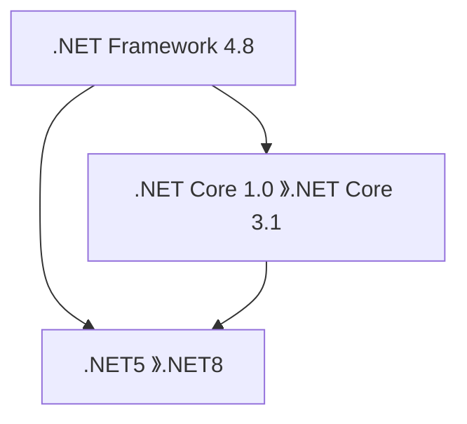

# C# 基礎語法與特性

## 1. C# 和 .NET 平台簡介

### 1.1 C# 語言歷史與特點
C# 是由 Microsoft 於 2000 年發布的一種現代、通用、物件導向式的程式語言。C# 是一種【強型別】語言，這意味著每個變數和表達式都有一個明確的型別，並且型別檢查在編譯時進行。C# 也是一種編譯型語言，源代碼首先被編譯成中間語言（IL），然後在執行時由 CLR（Common Language Runtime）進一步編譯成機器碼。

強型別語言優點如下：
1. 提早發現錯誤：編譯器可以在程式執行前捕獲許多型別相關的錯誤。
2. 提高程式可讀性：明確的型別聲明使程式碼更容易理解。
3. 優化性能：編譯器可以基於明確的型別訊息進行優化。
```csharp=
int number = 5;
// number = "Hello";  // 這行會導致編譯錯誤
```

相比之下，在弱型別語言（如 JavaScript）中：
```javascript
let number = 5;
number = "Hello";  // 這在 JavaScript 中是允許的
```

C# 提供了多種機制來確保代碼的安全性：
1. 型別安全：強型別系統防止了許多常見的程式錯誤。
2. 記憶體管理：自動垃圾回收機制幫助防止記憶體洩漏。
3. 例外處理：提供了結構化的錯誤處理機制。
```csharp=
try
{
    int result = 10 / 0;  // 這會拋出一個 DivideByZeroException
}
catch (DivideByZeroException e)
{
    Console.WriteLine("發生除以零的錯誤：" + e.Message);
}
```

C# 與 Python、JavaScript 的 Hello World 對比
**C#:**
```csharp=
using System;           // 引入 System 命名空間

// C# 程式至少包含一個類別
class Program
{
    // Main 方法是程式的入口點
    static void Main(string[] args) // args 字串，用來接收從命令列傳入的參數
    {
        Console.WriteLine("Hello, World!");
    }
}
```

**Python:**
```python=
print("Hello, World!")
```

**JavaScript:**
```javascript=
console.log("Hello, World!");
```

:::warning
C# 執行免安裝工具：[RoslynPad](https://github.com/roslynpad/roslynpad) 
:::
### 1.2 .NET 平台概述
.NET 是一個免費、跨平台的開發平台，用於建構各種類型的應用程序。其主要組成分為 2 部分：
1. CLR（Common Language Runtime）：執行環境，負責記憶體管理、安全性等。
2. BCL（Base Class Library）：提供了豐富的標準類別庫，如檔案操作、資料庫連接等。

**.NET 平台發展**


.NET 每年 11 月份發佈新版本，其奇數版本(Standard Term Support; STS)支援期是 18 個月，偶數版本(Long Term Support; LTS)支援期是 36 個月。


.NET（特別是 .NET Core 和之後的版本）支持跨平台開發和部署。其主要特點如下：
1. 一次編寫，多處運行：同一套代碼可以在 Windows、macOS 和 Linux 上運行。
2. 跨平台 CLI：提供了跨平台的命令行界面，方便開發和部署。
3. 跨平台 UI 框架：如 Xamarin 用於移動開發，MAUI 用於跨平台桌面和移動開發。


### 1.3 最上層陳述式（Top-level statements）
在傳統 C# 程式中，入口點是 Main 方法，例如：
```csharp=
using System;

namespace MyApp
{
    internal class Program
    {
        static void Main(string[] args)
        {
            Console.WriteLine("Hello World!");
        }
    }
}
```

最上層陳述式是在 .NET5 和 C#9 引入的語法改進，讓開發人員可以省略 Program 類別和 Main 方法的「外殼」，直接在程式的最上方撰寫程式碼。這樣做的目的是簡化程式入口點的程式碼，使程式的結構更為簡潔。使用最上層陳述式後，C# 編譯器會自動判斷 Main 方法的入口，特別適合小型應用程式或範例程式。

在有了最上層陳述式之後，你可以直接撰寫程式碼，而不需要 Main 方法，編譯器會自動將這些程式轉換為包含 Main 方法的形式。以下使用 .NET CLI 建立和執行一個跨平台的控制台應用：
```bash=
C:\MyApp> dotnet new console -n MyApp
C:\MyApp> cd MyApp
```
產生的專案目錄如下


執行與觀看主程式範例：
```bash=
C:\MyApp> dotnet run
Hello, World!

C:\MyApp> type Program.cs
// 無需顯式定義 Main 方法
Console.WriteLine("Hello, World!");
```
專案中只能有一個檔案使用最上層陳述式，否則會導致編譯錯誤。這是因為最上層陳述式會隱含地產生 Main 方法，而編譯器無法處理多個入口點。

> 更多的說明請參考：https://aka.ms/new-console-template

### 1.4 隱含全域引用(implicit global using)
從 .NET 6 開始(C#10)，預設會自動引入常用的命名空間，這個功能叫做 implicit global using。這樣做的目的是簡化程式碼，特別是對於簡單的應用程式來說。

在 .NET 6 及以上版本的專案中，可以在 專案.csproj 檔案中找到 ImplicitUsings 屬性，該屬性通常設定為 enable


這樣就會自動隱含地引入下面這些常用命名空間
```
- Microsoft.AspNetCore.Builder
- Microsoft.AspNetCore.Hosting
- Microsoft.AspNetCore.Http
- Microsoft.AspNetCore.Routing
- Microsoft.Extensions.Configuration
- Microsoft.Extensions.DependencyInjection
- Microsoft.Extensions.Hosting
- Microsoft.Extensions.Logging
- System
- System.Collections.Generic
- System.IO
- System.Linq
- System.Net.Http
- System.Net.Http.Json
- System.Threading
- System.Threading.Tasks
```

## 2. 資料型別與基本語法

### 2.1 變數與資料型別
C# 是一種靜態型別語言，這意味著在使用變數之前必須宣告其型別。C# 中的資料型別分為【實質型別】和【參考型別】，它們在記憶體中的儲存方式和使用方式有所不同。理解這些型別的差異對於有效地編寫和維護 C# 程式碼非常重要。

#### 2.1.1 實值型別 (Value Types)
- 定義：實值型別的變數在記憶體中直接儲存其實際的值。
- 記憶體儲存：資料通常儲存在堆疊（stack）中。
- 例子：int, float, double, bool, char, struct 等。
```csharp=
int age = 25;            // 實值型別
double salary = 5000.50; // 實值型別
```
:::info
在 C# 中，實值型別（Value Type） 和 結構（struct） 之間的關係密切。
- 實值型別是一個概念，表示該類型的變數直接儲存數值，而不是參考記憶體中的物件。
- struct 是用來定義實值型別的一種語法結構，詳情請參考 [2.1.7 小節](https://hackmd.io/xj_rmvq1QaKtB_779pWc8g#217-%E7%B5%90%E6%A7%8B%EF%BC%88struct%EF%BC%89)。
:::

#### 2.1.2 參考型別 (Reference Type)：
- 定義：參考型別的變數在記憶體中儲存的是值的記憶體位置（即參考），而不是值本身。
- 記憶體儲存：資料儲存在堆積（heap）中。
- 例子：class, interface, delegate, string 等。
```csharp=
public class Person
{
    public string Name { get; set; } // 參考型別
    public int Age { get; set; }     // 實值型別
}
```    

#### 2.1.3 可空型別 (Nullable Types)
- 定義：可空型別是實值型別的一種擴展，它允許基本實值型別（如 int, double）能夠接受 null 值。
- 宣告方式：在實值型別後面加上 ?，例如 int? 表示可空的 int。

可空型別 (Nullable Types)是在基本實值型別的基礎上進行擴展，使得它們能夠接受 null 值。因此，它們實際上是實值型別的一部分
```csharp=
int? nullableInt = null; // 可空型別
int nonNullableInt = nullableInt ?? 0; // 若 nullableInt 為 null，則使用 0 作為預設值
```

#### 2.1.4 匿名型別 (Anonymous Types)
- 定義：匿名型別是一種參考型別，允許開發者在不明確定義類別的情況下，建立包含命名屬性的一個物件。這些型別特別適合於臨時使用，例如在 LINQ 查詢中。
- 特性：
    1. 自動判斷型別：C# 編譯器會根據賦予的值自動判斷屬性的型別。
    2. 唯讀屬性：匿名型別的屬性是不可修改的，屬性一旦賦值就不能再更改。
    3. 自動實現 Equals() 和 GetHashCode()：這使得匿名型別可以安全地用於集合操作。

```csharp=
var person = new { Name = "John", Age = 30 };

// person 是匿名型別，它包含兩個屬性 Name 和 Age。
// C# 編譯器會自動判斷屬性的型別，且這些屬性是唯讀的。
Console.WriteLine(person.Name);  // 輸出: John
Console.WriteLine(person.Age);   // 輸出: 30

// LINQ 查詢範例
var query = from n in numbers
            where n % 2 == 0
            select n;
```
**使用場景：**
- 用於查詢語法（LINQ）中的臨時結果集合。
- 在不需要定義專門類別的情況下，快速封裝一些資料以供短期使用。

#### 2.1.5 隱含型別區域變數(Implicitly Typed Variables)
- 定義：隱含型別變數是 C# 中的語法糖 (syntactic sugar)，透過 var 關鍵字來讓編譯器根據賦值自動判斷變數的型別。但重要的是，var 仍然是靜態型別，不是動態型別。也就是說，編譯器在編譯時就會決定變數的具體型別，並且一旦型別確定，就無法改變，且變數值可修改。
- 注意事項：
    - 只能用於區域變數的宣告（函式內部）。
    - 不能用於全域變數、函式參數或類別成員變數。
    - 必須在宣告時立即初始化，否則無法判斷型別，但不能初始化為 null。
```csharp=
var number = 10;                          // 判斷為 int
var name = "Alice";                       // 判斷為 string
var numbers = new List<int> { 1, 2, 3 };  // 判斷為 List<int>

// 複雜泛型類別
var dictionary = new Dictionary<string, List<CustomClass>>();
```
:::success
C# 的 var 不是動態型別，它仍然是靜態型別，因為 var 變數其實是靜態繫結的變數，亦即編譯時期就已經決定變數型別了。那麼編譯器如何決定型別？透過你指定給變數的初始值來推測。因此，使用 var 變數有個基本前提：一定要給初始值。

當型別名稱很長或明顯時，可以簡化代碼，常用於複雜的泛型類別、匿名類別與 LINQ。
:::

#### 2.1.6 列舉 (enumeration type)
定義：列舉用來定義一組命名的常數。它讓代碼更加易讀，並用來表示一組相關的值。

根據預設，列舉成員的相關聯常數值屬於 int 類型，其從零開始，並依定義文字順序加一。
```csharp=
public enum Season
{
    Spring,
    Summer,
    Autumn,
    Winter
}

public class EnumConversionExample
{
    public static void Main()
    {
        Season a = Season.Autumn;
        Console.WriteLine($"{a} 的整數值為 {(int)a}");  // 輸出: Autumn 的整數值為 2

        var b = (Season)1;
        Console.WriteLine(b);  // 輸出: Summer

        var c = (Season)4;
        Console.WriteLine(c);  // 輸出: 4
    }
}
```
針對任何列舉類型，列舉類型與其基礎整數類型之間存在明確的轉換。 如果您將列舉值轉換成其基礎類型，結果就是列舉成員的相關聯整數值。

#### 2.1.7 結構（struct）
struct 是定義實值型別的語法，可以用來封裝多個欄位和方法，並提供類似於類別的功能，但它本身是實值型別。

**struct 的特性：**
1. 預設為值型別：
struct 是實值型別，因此分配給變數時會進行值的複製，而不是參考的共享。
2. 不支援繼承：
struct 無法繼承其他類別或 struct，但可以實作介面。
3. 無隱含的無參數建構函式：
struct 的每個欄位都必須在使用時被初始化，且不能定義無參數的建構函式（預設建構函式是隱含的）。
4. 通常用於小型資料結構：
struct 通常用於封裝小型的、輕量級的資料，例如座標、時間點等。
5. 沒有多型

```csharp=
// 定義一個 Point 結構，代表 2D 平面上的一個點
public struct Point
{
    public int X { get; set; }
    public int Y { get; set; }

    // 建構函式
    public Point(int x, int y)
    {
        X = x;
        Y = y;
    }

    // 顯示點的位置
    public void Display()
    {
        Console.WriteLine($"({X}, {Y})");
    }
}

class Program
{
    static void Main(string[] args)
    {
        Point p1 = new Point(3, 4);  // 建立實值型別 Point 的實例
        p1.Display();                // 輸出: (3, 4)

        // 複製值給另一個變數
        // 當 p1 被賦值給 p2 時，p2 是 p1 的值的複製，因此修改 p2 不會影響 p1。
        Point p2 = p1;
        p2.X = 10;

        // 顯示兩個變數的值
        p1.Display(); // 輸出: (3, 4)  - 原本的值不變
        p2.Display(); // 輸出: (10, 4) - 複製後的值已修改
    }
}
```
#### 2.1.8 複合格式字串與字串插補
1. 複合格式字串（Composite Formatting）
複合格式字串使用 string.Format 方法，結合格式項目 {index} 來插入變數值，並可以使用格式規範符來格式化數值或日期。
**語法**
> string.Format("字串 {index}", 變數)

> string.Format("字串 {index:format}", 變數)
```csharp=
string[] orders = { "1001", "1002", "1003" };
double[] amounts = { 5000.50, 3000.30, 7000.70 };
string csvHeader = "OrderID,Amount";

Console.WriteLine(csvHeader);
for (int i = 0; i < orders.Length; i++)
{
    string csvLine = string.Format("{0},{1:F2}", orders[i], amounts[i]);
    Console.WriteLine(csvLine);
}
```
:::success
常用格式
1. 貨幣格式 (C)：{0:C} → $1,234.00
2. 整數格式 (D)：{0:C} → {0:D5} → 00123
3. 固定小數格式 (F)：{0:F2} → 123.46
4. 百分比格式 (P)：{0:P} → 12.34%
5. 日期格式 (yyyy-MM-dd)：{0:yyyy-MM-dd} → 2024-12-01
:::
2. 字串插補（String Interpolation）
字串插補在 C# 6.0 引入，使用 $ 符號和大括號 {} 來插入變數或表達式。這種方式更直觀、可讀性更高，適合較為複雜的字串處理。
**語法**
> $"字串 {變數}"

> $"字串 {變數:format}"
```csharp=
string[] orders = { "1001", "1002", "1003" };
double[] amounts = { 5000.50, 3000.30, 7000.70 };
string csvHeader = "OrderID,Amount";

Console.WriteLine(csvHeader);
for (int i = 0; i < orders.Length; i++)
{
    string csvLine = $"{orders[i]},{amounts[i]:F2}";
    Console.WriteLine(csvLine);
}
```

### 2.2 條件語句與迴圈

**條件語句範例：**

```csharp=
int score = 85;

if (score >= 90)
{
    Console.WriteLine("優秀");
}
else if (score >= 80)
{
    Console.WriteLine("良好");
}
else
{
    Console.WriteLine("繼續努力");
}

// 輸出: 良好
```

#### 三元運算子
三元運算子是 if-else 語句的簡短形式，適用於簡單的條件判斷。

> 語法：`(條件) ? 成立時執行的敘述 : 不成立時執行的敘述`

```csharp=
int age = 20;
string status = (age >= 18) ? "成年" : "未成年";
Console.WriteLine(status);  // 輸出: 成年
```
這段程式碼的作用是根據 age 判斷是否滿 18 歲，並將結果賦值給變數 status。

等價的 if-else 語句如下：
```
string status2;
if (age >= 18)
    status2 = "成年";
else
    status2 = "未成年";
```

#### switch 條件語句
switch 語句是用來對變數的值進行多重分支選擇，類似於多個 if-else，但讓程式碼更加具結構性與可讀性。
```csharp=
// 簡單的計算機範例，根據使用者輸入的運算符號來執行相應的計算
using System;

class Program
{
    static void Main(string[] args)
    {
        Console.Write("請輸入第一個數字: ");
        double num1 = Convert.ToDouble(Console.ReadLine());

        Console.Write("請輸入運算符號 (+, -, *, /): ");
        char operation = Console.ReadLine()[0];

        Console.Write("請輸入第二個數字: ");
        double num2 = Convert.ToDouble(Console.ReadLine());

        double result = 0;

        switch (operation)
        {
            case '+':
                result = num1 + num2;
                break;
            case '-':
                result = num1 - num2;
                break;
            case '*':
                result = num1 * num2;
                break;
            case '/':
                result = num1 / num2;
                break;
            default:  // 處理不符合任何 case 的情況
                Console.WriteLine("無效的運算符號");
                return;
        }

        Console.WriteLine($"結果是: {result}");
    }
}
```
**說明：**
1. switch 語句使用 case 關鍵字來判斷不同的條件。
2. 每個 case 結尾必須用 break 結束，否則會繼續執行下一個 case。
3. default 用來處理不符合任何條件的情況。

#### switch 表達式（C# 8.0+）
C# 8.0 引入了**switch 表達式**，讓多重條件判斷變得更加簡潔，支援模式匹配、條件判斷，並以表達式的形式直接回傳值。

**語法：**
```
var result = expression switch
{
    pattern1 => result1,
    pattern2 => result2,
    _        => defaultResult // _ 代表其他未匹配的情況
};
```
**範例1：**
判斷數字是否為正、負或零
```csharp=
int number = -5;

string result = number switch
{
    > 0 => "正數",
    < 0 => "負數",
    0   => "零",
    _   => "未知" // _ 為預設情況
};

Console.WriteLine(result); // 輸出：負數

```

**範例2：**
請與 switch 條件語句的簡單的計算機進行比較
```csharp=
using System;

class Program
{
    static void Main(string[] args)
    {
        Console.Write("請輸入第一個數字: ");
        double num1 = Convert.ToDouble(Console.ReadLine());

        Console.Write("請輸入運算符號 (+, -, *, /): ");
        char operation = Console.ReadLine()[0];

        Console.Write("請輸入第二個數字: ");
        double num2 = Convert.ToDouble(Console.ReadLine());

        double result = operation switch
        {
            '+' => num1 + num2,
            '-' => num1 - num2,
            '*' => num1 * num2,
            '/' => num2 != 0 ? num1 / num2 : throw new DivideByZeroException(),
            _ => throw new InvalidOperationException("無效的運算符號")
        };

        Console.WriteLine($"結果是: {result}");
    }
}
```

**範例3：**
```csharp
// 使用 System 命名空間來引用 DayOfWeek 枚舉
using System;

class Program
{
    static void Main(string[] args)
    {
        // 呼叫 GetDayType 函式並輸出結果
        Console.WriteLine(GetDayType(DayOfWeek.Monday));    // 輸出: 工作日
        Console.WriteLine(GetDayType(DayOfWeek.Saturday));  // 輸出: 假日
    }

    // GetDayType 函式使用 switch 表達式根據 DayOfWeek 枚舉回傳對應的字串
    static string GetDayType(DayOfWeek day) => day switch
    {
        DayOfWeek.Saturday or DayOfWeek.Sunday => "假日",
        _ => "工作日"
    }; // 大括號 {} 是屬於 day switch 表達式的，而不是函式的
}
```
說明：
1. day switch 根據 day 的值選擇對應的條件並回傳結果。
2. 使用 or 關鍵字來匹配多個條件。
3. _ 代表預設情況，類似於傳統 switch 語句的 default。
4. 上述函式是【運算式主體成員】的語法，等效的完整函式寫法為
```
static string GetDayType(DayOfWeek day)
{
    return day switch
    {
        DayOfWeek.Saturday or DayOfWeek.Sunday => "假日",
        _ => "工作日"
    };
}
```

:::success
DayOfWeek 是 C# 中的內建列舉型別 (enum)，它屬於 System 命名空間，因此需要引用 using System; 才能使用。它表示一週中的每一天，範圍為：
- DayOfWeek.Sunday（值為 0）
- DayOfWeek.Monday（值為 1）
- DayOfWeek.Tuesday（值為 2）
- DayOfWeek.Wednesday（值為 3）
- DayOfWeek.Thursday（值為 4）
- DayOfWeek.Friday（值為 5）
- DayOfWeek.Saturday（值為 6）
:::

#### 迴圈
- for 迴圈：當需要使用索引或重複執行固定次數時。
- while 迴圈：當條件可能會改變，且不確定執行次數時。
- do-while 迴圈：當希望至少執行一次迴圈時。
- foreach 迴圈：當需要遍歷集合中的所有元素時。
```csharp=
// for 迴圈
int[] numbers = { 1, 2, 3, 4, 5 };
int sum = 0;
for (int i = 0; i < numbers.Length; i++)
{
    sum += numbers[i];
}
Console.WriteLine($"總和是: {sum}");

// while 迴圈
int[] numbers = { 1, 2, 3, 4, 5 };
int sum = 0;
int i = 0;
while (i < numbers.Length)
{
    sum += numbers[i];
    i++;
}
Console.WriteLine($"總和是: {sum}");

// do-while 迴圈
int[] numbers = { 1, 2, 3, 4, 5 };
int sum = 0;
int i = 0;
do
{
    sum += numbers[i];
    i++;
} while (i < numbers.Length);
Console.WriteLine($"總和是: {sum}");

// foreach 迴圈
int[] numbers = { 1, 2, 3, 4, 5 };
int sum = 0;
foreach (int number in numbers)
{
    sum += number;
}
Console.WriteLine($"總和是: {sum}");
```

### 2.3 資料型別轉換
資料型別轉換是 C# 中非常常見的操作，尤其在處理不同型別的變數時。有兩種主要的轉換方式：隱式轉換和顯式轉換。此外，裝箱和拆箱是實值型別和參考型別之間的特殊轉換過程。

#### 2.3.1 隱含轉換 (Implicit Conversion)
隱含轉換是由編譯器自動進行的轉換，不需要特殊的語法。通常發生在不會遺失任何資料的情況下，例如從較小範圍的型別轉換到較大範圍的型別。
```csharp=
int intValue = 100;
double doubleValue = intValue;  // 隱含轉換，從 int 到 double
```

#### 2.3.2 明確轉換 (Explicit Conversion)
明確轉換又稱強制轉型，必須使用強制轉型運算式來進行。強制轉型 (cast) 是一種明確通知編譯器您打算進行轉換，而且您知道資料可能會遺失，或強制轉型可能會在執行階段失敗的方式。

**2.3.2.1 顯式轉換操作符（Casting）**
使用轉換操作符 (type)，在要轉換的值或變數前面的括弧中指定要強制轉型成為的型別，但這種轉換可能會導致精度喪失，例如從 double 轉換為 int。
```csharp=
double doubleValue = 123.45;
int intValue = (int)doubleValue;  // 明確轉換，從 double 到 int
```

**2.3.2.2 轉換方法**
C# 提供多種轉換方法，如 Parse()、TryParse() 和 Convert 類別，這些方法提供了更多控制和錯誤處理機制：
- Parse()方法：會拋出例外，若轉換失敗（例如字串無法被轉換成數字）。
- TryParse()方法：轉換失敗時，不會拋出例外，而是返回 false，並且結果會設置為預設值。
- Convert 類別：提供更多類型的轉換支援，可以處理 null 值，轉換失敗時也會拋出例外。
```csharp=
string str = "123";
int num1 = int.Parse(str);           // 使用 Parse 方法

int num2;
if (int.TryParse(str, out num2))     // 使用 TryParse 方法
{
    Console.WriteLine($"轉換成功：{num2}");
}
else
{
    Console.WriteLine("轉換失敗");
}

double d = Convert.ToDouble(str);    // 使用 Convert 類別
var newValue = Convert.ToInt16(str); // 將指定之數字的字串表示轉換為相等的 16 位元帶正負號的整數。
```

#### 2.3.3 裝箱 (Boxing)
Boxing 是將實值型別（如 int, double）或是由這個實值型別實作之任何介面類型轉換為 object 型別的程序。這會在堆積（heap）中為實值型別分配空間，並將其封裝為參考型別。Boxing 是隱含處理。
```csharp=
int intValue = 123;
object obj = intValue;  // 裝箱，將 int 轉換為 object

public interface IDisplay
{
    void Display();
}

public struct MyStruct : IDisplay
{
    public int Value;
    public void Display() => Console.WriteLine(Value);
}

MyStruct myStruct = new MyStruct { Value = 10 };
IDisplay display = myStruct;  // 這裡發生裝箱，myStruct 被轉換為介面型別 IDisplay
display.Display();
```


#### 2.3.4 拆箱 (Unboxing)
Unboxing 是將 object 類型明確轉換為實值型別，或將介面類型明確轉換為實作介面之實值型別的程序。unboxing 是明確轉換，並且拆箱的物件必須與原始實值型別相同，否則會拋出 InvalidCastException。
```csharp=
object obj = 123;         // 裝箱
int intValue = (int)obj;  // 拆箱，將 object 轉換回 int
```
:::success
裝箱和拆箱是需要理解的概念，但應避免頻繁使用。隨著泛型的普及，裝箱和拆箱的需求顯著減少，這有助於避免不必要的性能開銷。
:::

## 3. 命名空間 (Namespace)
命名空間就像程式碼的分類系統，用來組織和管理類別、介面等，並防止命名衝突。當不同程式庫中有相同名稱的類別時，可以透過命名空間來區分它們。

**語法：**
```
namespace 命名空間名稱
{
    // 類別、介面、結構等
    class ClassName
    {
        // 類別內的成員
    }
}
```

```csharp
// 定義一個命名空間
namespace MyLibrary
{
    public class Book
    {
        public string Title { get; set; }
    }
}

// 使用命名空間中的類別
class Program
{
    static void Main()
    {
        MyLibrary.Book myBook = new MyLibrary.Book();
        myBook.Title = "C# 學習指南";
    }
}
```

### using 指示詞
using 用來引入命名空間，讓程式碼更簡潔，無需每次都寫完整的類別名稱。

```csharp
using MyLibrary;  // 引入 MyLibrary 命名空間

class Program
{
    static void Main()
    {
        Book myBook = new Book();
        // 當類別的名稱位於不同的命名空間中時，使用 using 可以避免每次都要寫完整名稱。// 不需要每次都寫 MyLibrary.Book
        myBook.Title = "C# 學習指南";
    }
}
```

### 檔案範圍的命名空間宣告(File Scoped namespaces)
自 C# 10 開始，如果一個檔案只包含一個命名空間，可以使用檔案範圍的命名空間，不需要大括弧。
```csharp=
namespace MyNamespace;

class MyClass
{
    public void Display() => Console.WriteLine("Hello from MyNamespace!");
}
```

若檔案中有多個命名空間，則仍需使用大括弧：
```csharp=
namespace MyApp.Models
{
    public class Order { }
}

namespace MyApp.Services
{
    public class OrderService { }
}
```

## 4. 物件導向程式設計 (OOP)
物件導向程式設計（Object-Oriented Programming，OOP）是一種程式設計典範，它使用"物件"來設計應用程式和程式。在 C# 中，OOP 是核心概念之一。本章節將詳細介紹 C# 中的 OOP 概念和實現。

### 4.1 類別與物件
類別是 OOP 的基本單位，它的成員通常包括了一組屬性(Properties)和方法(Methods)。而物件則是類別的實例。

#### 4.1.1 欄位(Fields)與屬性(Properties)
欄位(Fields)是類別中的變數，通常應該保持私有 (private) 以保護資料。屬性(Properties)則是用來對這些欄位進行讀取或寫入操作的公開介面。

在 C# 中，Properties 是一種成員，允許您讀取或寫入私有 Field 的值。Properties 通常是藉由 get 和 set 存取子來控制對 Field 的訪問。這有助於封裝欄位，並且可以在存取 Properties 時進行額外的邏輯處理，例如資料驗證或觸發事件。
```csharp=
using System;

public class Person
{
    // 欄位(Fields)
    private string _name=default!;
    private int _age;

    // 屬性(Properties)：用來包裝私有欄位
    public string Name
    {
        get { return name; }
        set { _name = value; }
    }

    public int Age
    {
        get { return age; }
        set { 
            //  if (value < 0)
            //    throw new ArgumentException("年齡不能是負數");
                _age = value > 0 ? value : 0; 
            }
    }

    // 建構函數
    public Person(string name, int age)
    {
        this.Name = name;
        this.Age = age;
    }

    // 方法
    public void Introduce()
    {
        Console.WriteLine($"Hello, I'm {Name} and I'm {Age} years old.");
    }
}

class Program
{
    static void Main()
    {
        Person person = new Person("Alice", 30);
        person.Introduce();  // 輸出: Hello, I'm Alice and I'm 30 years old.
    }
}
```

#### 4.1.2 自動實作屬性 (Auto-Implemented Properties)
如果屬性不需要進行額外進行邏輯處理，C# 提供了自動實作屬性，這樣可以省略私有欄位的宣告，它會自動產生一個隱含的欄位來儲存屬性值。

當需要自定義邏輯或唯讀屬性時，則仍需要手動定義欄位並實作 get 和 set 存取子。
```csharp=
using System;

public class Person
{
    // 自動實作屬性，不需要額外定義欄位，自動產生隱含的欄位
    public string Name { get; set; }
    public int Age { get; set; }

    // 建構函數
    public Person(string name, int age)
    {
        Name = name;
        Age = age;
    }

    // 方法
    public void Introduce()
    {
        Console.WriteLine($"Hello, I'm {Name} and I'm {Age} years old.");
    }
}

class Program
{
    static void Main()
    {
        Person person = new Person("Alice", 30);
        person.Introduce();  // 輸出: Hello, I'm Alice and I'm 30 years old.
    }
}
```
#### 4.1.3 Default 與 !
C# 可在屬性定義時設置預設值 default，稱為「屬性初始化器」（property initializer）。這可以用來在定義屬性時，給屬性一個初始值。
- 對於實值型別（例如 int, bool），預設值是該型別的初始值，像是 0 或 false。
- 對於參考型別（例如 string, object），預設值是 null。

!（null-forgiving operator）驚歎號是 null 忽略運算符，! 運算符告訴編譯器「我知道這個值可能是 null，但我保證它會在未來某個時間點被正確賦值，因此請不要對此發出警告」。這個運算符讓編譯器忽略可空值的警告。
```csharp=
class Person
{
    // 使用自動實作屬性並設置預設值
    public string Name { get; set; } = default!;
    public int Age { get; set; } = 18;
    
    public Person(string name)
    {
        Name = name; // 在建構函數中賦值
    }
}

class Program
{
    static void Main()
    {
        Person person = new Person("Peter");
        Console.WriteLine($"Name: {person.Name}, Age: {person.Age}");
        // 輸出: Name: 未命名, Age: 18
    }
}
```
上述程式碼中，Name 一開始會被設置為 null（因為 default! 等同於 null），但是由於加上了 !，編譯器不會對此發出警告。在建構函數中會賦值一個實際的值給 Name，所以這樣可以放心地在初始化時暫時使用 null，避免編譯器提出警告。

#### 4.1.4 屬性（Attributes）
C# 的 Attributes 是一種程式中用於修飾程式元素的中繼資料（Metadata），它們由中括號包裹，用來附加額外的元資料到類別、方法、屬性、欄位上，這些元資料可以在執行期間透過反射來讀取。雖然 Attributes 本身不直接改變程式行為，但它們可以影響其他系統或框架的行為，例如序列化、驗證或是版本管理。

```csharp=
[HttpPost]
[ValidateAntiForgeryToken]
public async Task<IActionResult> Create([Bind("Name,Age,Grade")] Student student)
{
    // 方法的邏輯
}
```
[HttpPost] 和 [ValidateAntiForgeryToken] 來自 ASP.NET Core MVC 框架，用來控制方法的行為，讓框架知道如何處理這些方法。
- [HttpPost]：告訴 ASP.NET Core，這個方法只處理 HTTP POST 請求。
- [ValidateAntiForgeryToken]：要求 ASP.NET Core 驗證防偽標記，保護應用程式免受 CSRF 攻擊。

可以把 Attributes 想像成「標籤」，它們附加在程式的各個部分，提供了一種靈活的方式來向程式添加行為，並在執行時進行相應的處理。

**資料註解屬性（Data Annotation Attributes）**
資料註解屬性是 C# 屬性的一種具體實現，主要用於資料模型的驗證和描述。這些屬性在 ASP.NET Core MVC 和 Entity Framework 等框架中十分常見，經常用於限制資料庫欄位、進行表單驗證，並提供使用者友好的錯誤訊息。藉由這些屬性，開發者可以對模型屬性進行簡單的約束，無需手動撰寫驗證邏輯。

範例：
```csharp=
// 模型
public class Student
{
    [Required(ErrorMessage = "學生姓名是必填的"), StringLength(20, ErrorMessage = "名稱最多 20 個字")]
    public string StuName { get; set; }

    [Range(1, 120, ErrorMessage = "年齡必須介於 1 到 120 之間")]
    public int StuAge { get; set; }
}
```
用到的資料註解屬性說明：
- [Required]：此屬性表示該欄位必須填寫，並可以自訂錯誤訊息。應用於例如必填的欄位，如姓名、郵件等。
- [StringLength]：用來限制字串的最大或最小長度，在表單驗證時防止輸入過長或過短的值。
- [Range]：用於限制數字或日期範圍，例如年齡、價格等範圍的輸入。

**Razor 視圖中的標籤輔助（Tag Helpers）**
標籤輔助（Tag Helpers）是 ASP.NET Core 中的一項功能，用來將伺服器端程式碼（如模型屬性）與 HTML 標籤結合，簡化 Razor 視圖中的 HTML 標籤產生。標籤輔助透過了解模型的【資料註解屬性】來自動產生適當的 HTML 屬性，例如 required、maxlength、min 和 max，以提供前端驗證支持。
```html=
<!-- Create.cshtml -->
@model YourApp.Models.Student

<form asp-action="Create" method="post">
    <div class="form-group">
        <label asp-for="StuName" class="control-label"></label>
        <input asp-for="StuName" class="form-control" />
        <span asp-validation-for="StuName" class="text-danger"></span>
    </div>

    <div class="form-group">
        <label asp-for="StuAge" class="control-label"></label>
        <input asp-for="StuAge" class="form-control" />
        <span asp-validation-for="StuAge" class="text-danger"></span>
    </div>

    <button type="submit" class="btn btn-primary">送出</button>
</form>
```
標籤輔助說明：
- asp-for：標籤輔助自動將 Razor 模型屬性綁定到對應的 HTML 標籤。例如，asp-for="StuName" 會根據 StuName 屬性產生對應的 input 標籤，並自動附加 required 和 maxlength 屬性（依據模型中定義的 Required 和 StringLength 屬性）。
- asp-validation-for：顯示模型驗證錯誤訊息。如果使用者未正確填寫表單，該標籤輔助會自動顯示由模型定義的錯誤訊息。

透過上述範例，表單提交時產生的 HTML 如下：
```html=
<form method="post" action="/Create">
    <div class="form-group">
        <label for="StuName">姓名</label>
        <input type="text" id="StuName" name="StuName" required="required" maxlength="20" />
    </div>

    <div class="form-group">
        <label for="StuAge">年齡</label>
        <input type="number" id="StuAge" name="StuAge" min="1" max="120" />
    </div>
    <button type="submit" class="btn btn-primary">送出</button>
</form>
```
在此範例中，透過資料註解屬性 [Required] 及 [StringLength]，StuName 欄位自動添加了 required="required" 和 maxlength="20"。而 StuAge 欄位則根據 [Range] 屬性添加了 min="1" 和 max="120"。

:::success
C# 的 Attributes 概念上與 Python 的裝飾器（Decorators）雷同。
:::

### 4.2 方法
方法(Methods)定義了物件的行為。是一組具有特定功能的程式碼區塊，可以在不同的地方重複使用，實現程式的模組化與可重用性。

C# 的方法通常包括以下幾個部分：
1. 存取修飾符 (Access Modifier)：例如 public、private 等，指定方法的存取權限。
2. 回傳型別 (Return Type)：方法的回傳實值型別，若無回傳值則使用 void。
3. 方法名稱 (Method Name)：描述方法功能的名稱，應遵循 Pascal 命名規則。
4. 參數列表 (Parameter List)：方法接受的參數，列在圓括號內(定義時稱為形式參數，呼叫時稱為實際參數)。
5. 方法主體 (Method Body)：一組執行的程式碼，用大括號括起來。

```csharp=
class Calculator
{    
    public void Greet(string name)            // 存取修飾符 + 回傳型別 + 方法名稱 + 參數列表
    {
        Console.WriteLine($"Hello, {name}!"); // 方法主體:無回傳值
    }
    
    public int Add(int x, int y)              // 存取修飾符 + 回傳型別 + 方法名稱 + 參數列表
    {
        return x + y;                         // 方法主體:有回傳值
    }
}

class Program
{
    static void Main()
    {
        Calculator calc = new Calculator();
        int result = calc.Add(5, 3);
        Console.WriteLine($"5 + 3 = {result}");  // 輸出: 5 + 3 = 8
    }
}
```

#### 4.2.1 預設參數值 (Optional Parameters)
C# 支援方法參數設定預設值，這樣呼叫方法時可以選擇省略部分參數。
```csharp=
public void DisplayInfo(string name, int age = 18)
{
    Console.WriteLine($"{name} is {age} years old.");
}
```
當呼叫 DisplayInfo("Alice") 時，若不提供年齡，age 將使用預設值 18。

#### 4.2.2 方法多載(overloading)
方法多載允許在同一個類別中定義多個同名但參數不同的方法。
```csharp=
public class Calculator
{
    public int Add(int a, int b)
    {
        return a + b;
    }

    public double Add(double a, double b)
    {
        return a + b;
    }

    public int Add(int a, int b, int c)
    {
        return a + b + c;
    }
}

class Program
{
    static void Main()
    {
        Calculator calc = new Calculator();
        Console.WriteLine(calc.Add(5, 3));       // 呼叫 int 版本
        Console.WriteLine(calc.Add(5.5, 3.2));   // 呼叫 double 版本
    }
}
```

#### 4.2.3 參數傳遞方式
C# 提供了多種參數傳遞方式，每種方式都有其特定用途。

**1. 傳值呼叫（Call By Value）**
傳遞參數的副本，也是預設的傳遞方式，不影響原始參數。
```csharp
class Program
{        
    private static int addMoney(int amount)
    {
        amount = amount * 2;
        return amount;
    }
    
    static void Main(string[] args)
    { 
        int money = 1000;
        int newAmount = addMoney(money); //呼叫addMoney的方法並賦值給newAmount
        
        Console.WriteLine(money);        //amount的值不會改變
        Console.WriteLine(newAmount);
    }
}
```

**2. 傳參考呼叫（Call By Reference）**
傳遞參數的引用，原始參數會被修改。
```csharp
class Program
{        
    private static int addMoney(ref int amount) // 加上ref
    {
        amount = amount * 2;
        return amount;
    }

    static void Main(string[] args)
    { 
        int money =1000;
        int newAmount = addMoney(ref money);   // 加上ref
        
        Console.WriteLine(money);              // 輸出:20000
        Console.WriteLine(newAmount);          // 輸出:20000
    }
}
```

**3. 輸出參數（Out Parameter）**
用於從方法返回多個值。方法必須為實際參數及形式參數前方加上 out。
```csharp
class Program
{        
    public static void GetValues(out int x, out int y)
    {
        x = 10;
        y = 20;
    }
    
    static void Main(string[] args)
    { 
        int a, b;
        GetValues(out a, out b);
        Console.WriteLine($"a = {a}, b = {b}");  // 輸出: a = 10, b = 20
    }
}
```

當作 out 引數傳遞的變數不必先初始化，就能在方法呼叫中傳遞。 但在被呼叫的方法中，就必須指派值之後才能傳回。
```csharp
class Program
{  
	static bool TryParse1(string s, out int result)
	{
	    if (int.TryParse(s, out result))
	    {
	        return true;
	    }
	    result = 0;
	    return false;
	}

    static void Main(string[] args)
    { 
		string input = "123";
		if (TryParse1(input, out int number))
		{
		    Console.WriteLine($"解析成功：{number}");
		}
    }
}
```

**4. 傳入參數 ( In parameter )**
in 參數用於將參數以唯讀的引用方式傳遞至方法中。這樣做的好處是：
1. 避免不必要的複製，尤其是當傳遞大型結構時，可以提高效能。
2. 保護傳入的參數值，因為在方法內無法修改 in 參數的值，確保其不會被意外變更。

在方法的定義中必須使用 in 修飾符，但在呼叫該方法時，可以選擇是否使用 in 修飾符，C# 會自動判斷。
```csharp=
using System;
using System.Numerics; // Vector3 所在的命名空間

class Program
{
    // 方法接收一個以唯讀方式傳入的 Vector3 結構
    static void PrintVector(in Vector3 vector)
    {
        // vector = new Vector3();  // 錯誤！不能修改 in 參數
        Console.WriteLine($"({vector.X}, {vector.Y}, {vector.Z})");
    }

    static void Main(string[] args)
    {
        Vector3 v = new Vector3(1, 2, 3);  // 建立一個 Vector3 物件
        PrintVector(v);  // 呼叫方法時，in 是可選的。 回傳：(1, 2, 3)

    }
}
```
當傳遞的是大型結構類型（例如 Matrix4x4）時，使用 in 參數特別有用，因為它能避免不必要的記憶體分配與複製操作。因此 in 相當於是傳參考但不允許修改的概念。

#### 4.2.4 建構函式（Constructor）
建構函式又稱建構子，是一種特殊的方法，用於在物件建立時初始化物件的狀態。在類別中，建構函式的名稱必須與類別名稱相同，並且不會有任何回傳值（甚至沒有 void）。建構函式會在建立物件時自動執行，因此無需手動呼叫。

建構函式的特點：
1. 沒有回傳型別。
2. 名稱必須與類別相同。
3. 主要用途是初始化物件，可以用來設定屬性或進行初始邏輯操作。

當一個類別繼承自另一個類別時，衍生類別也可以透過 base() 呼叫父類別的建構函式，來確保父類別的屬性或狀態也能正確初始化。

建構函式重載允許類別定義多個建構函式，以支援不同的初始化需求。這為建立物件提供了更大的彈性。
```csharp=
using System;

// 父類別：Person
public class Person
{
    public string Name;

    // 父類別的建構函式
    public Person(string name)
    {
        Name = name;
        Console.WriteLine($"Person constructor: Name = {name}");
    }
}

// 衍生類別：Employee
public class Employee : Person
{
    public string JobTitle;

    // 衍生類別的單參數建構函式使用 base() 呼叫父類別的建構函式
    public Employee(string name) : base(name)
    {
        JobTitle = "新人";
        Console.WriteLine($"Employee constructor: JobTitle = {JobTitle}");
    }
    // 衍生類別的雙參數建構函式使用 base() 呼叫父類別的建構函式
    public Employee(string name, string jobTitle) : base(name)
    {
        JobTitle = jobTitle;
        Console.WriteLine($"Employee constructor: JobTitle = {JobTitle}");
    }

    public void DisplayInfo()
    {
        Console.WriteLine($"Name: {Name}, JobTitle: {JobTitle}");
    }
}

class Program
{
    static void Main()
    {
        // 建立 Employee 物件，會同時呼叫 Person 和 Employee 的建構函式
        Employee employee1 = new Employee("Alice", "Software Developer");
        employee1.DisplayInfo();
        Employee employee2 = new Employee("Alice");
        employee2.DisplayInfo();
    }
}
```
執行後結果
```
Person constructor: Name = Alice
Employee constructor: JobTitle = Software Developer
Name: Alice, JobTitle: Software Developer
Person constructor: Name = Alice
Employee constructor: JobTitle = 新人
Name: Alice, JobTitle: 新人
```

**隱含建構函式**
若類別中沒有定義任何建構函式，C# 會自動產生一個隱含的「無參數建構函式」（稱為預設建構函式）。這個建構函式會執行以下操作：
1. 分配記憶體給物件。
2. 初始化類別的欄位為其預設值（例如 int 為 0，string 為 null，bool 為 false）。
3. 它的存在允許開發者直接使用物件初始化語法來設定屬性值。
```csharp=
public class Person
{
    public string FirstName { get; set; }
    public string LastName { get; set; }
}

// 使用隱含建構函式
class Program
{
    static void Main()
    {
        // 呼叫隱含的無參數建構函式，並使用物件初始化語法設定屬性
        Person person = new Person { FirstName = "John", LastName = "Doe" };

        Console.WriteLine($"Full Name: {person.FirstName} {person.LastName}");
    }
}
// Full Name: John Doe
```
**物件初始化語法**
```csharp=
Person person = new Person { FirstName = "John", LastName = "Doe" };
// 等價於
Person person = new Person();
person.FirstName = "John";
person.LastName = "Doe";
```


#### 4.2.5 擴展方法（Extension Methods）
擴展方法允許您向現有類別添加方法，而無需修改原始類別或建立新的衍生類別。


以下程式展示了 C# 擴充方法 (Extension Method) 的用法，將 WordCount() 方法擴充到 string 類別上，使 string 物件可以像內建方法一樣直接使用 WordCount() 來計算字數。
```csharp=
using System;

public static class StringExtensions
{
    public static int WordCount(this string str)
    {
        return str.Split(new char[] { ' ', '.', '?', '!', ',', ';', ':' }, StringSplitOptions.RemoveEmptyEntries)
.Length;
		
    }
}

class Program
{    
    static void Main(string[] args)
    { 
        string sentence = "Hello, how are you today?";
        int count = sentence.WordCount();
        Console.WriteLine($"Word count: {count}");  // 輸出: Word count: 5
    }
}
```
說明：
- 擴充方法 (Extension Method) 是用來為現有的類別新增方法，而不需要繼承或修改原始類別。
- WordCount 方法為 string 類別新增了一個方法，計算字串中的單字數量。
- this string str：
    - this 關鍵字表示這是擴充方法。
    - 這個方法會被附加到 string 類別，因此可以像內建方法一樣呼叫它。

方法實作細節：
- str.Split(...)：將字串拆分為單字陣列，拆分符號為空格 (' ')、句點 ('.')、問號 ('?') ... 冒號 (':')等。
- StringSplitOptions.RemoveEmptyEntries：確保不會將空白字串視為單字。
- Length：回傳拆分後的陣列長度，也就是單字的數量。

**擴展方法的應用場景**
1. 增強現有類別的功能
2. LINQ 查詢操作
3. 實現流式接口（Fluent Interface）

範例：實現簡單的流式接口
```csharp=
using System;

public static class IntExtensions
{
    public static int Add(this int number, int value)
    {
        return number + value;
    }

    public static int Subtract(this int number, int value)
    {
        return number - value;
    }
}

class Program
{    
    static void Main(string[] args)
    { 
        int result = 10.Add(5).Subtract(3).Add(2); // 方法鏈（Method Chaining）呼叫
        Console.WriteLine(result);  // 輸出: 14
    }
}
```
:::info
**方法鏈（Method Chaining）**
允許在同一行代碼中連續呼叫多個方法。每個方法都返回當前物件，這樣你可以直接呼叫下一個方法。方法鏈的主要目的是使代碼更加簡潔和易讀。

**流式接口（Fluent Interface）**
旨在使代碼更具表達性和可讀性。流式接口通常使用方法鏈來實現，但它不僅僅局限於此。流式接口的目標是建立一種語法，讓代碼看起來像自然語言一樣流暢。這種模式經常用於配置類別、測試框架等場景。
:::

:::danger
**注意事項**
- 擴展方法不能訪問擴展類別的私有成員
- 如果擴展方法與類別原有方法衝突，原有方法優先
- 過度使用擴展方法可能導致代碼難以理解和維護
:::


### 4.3 封裝
封裝是隱藏物件內部細節並僅暴露必要介面的機制。

C# 提供了多種存取修飾詞來控制類別成員的可見性：
- `public`: 可以被任何程式碼存取。
- `private`: 只能被同一類別內的程式碼存取。
- `protected`: 可以被同一類別和衍生類別存取。
- `internal`: 可以被同一組件（assembly）內的任何程式碼存取。
- `protected internal`: `protected` 或 `internal` 的組合。

```csharp=
using System;

public class BankAccount
{
    private decimal balance;  // 私有欄位，只能在類別內存取

    public decimal Balance
    {
        get { return balance; }
        private set { balance = value; }  // 私有設置器，只有類別內部可以設置
    }

    public BankAccount(decimal initialBalance)
    {
        Balance = initialBalance;
    }

    public void Deposit(decimal amount)
    {
        if (amount > 0)
        {
            Balance += amount;
            Console.WriteLine($"Deposited: {amount}, New Balance: {Balance}");
        }
    }

    public void Withdraw(decimal amount)
    {
        if (amount > 0 && amount <= Balance)
        {
            Balance -= amount;
            Console.WriteLine($"Withdrew: {amount}, New Balance: {Balance}");
        }
    }
}

class Program
{
    static void Main()
    {
        BankAccount account = new BankAccount(1000);
        account.Deposit(500);    // 輸出：Deposited: 500, New Balance: 1500
        account.Withdraw(200);   // 輸出：Withdrew: 200, New Balance: 1300
        // account.Balance = 0;  // 錯誤：Balance 的設置器是私有的
    }
}
```

### 4.4 繼承
繼承允許建立一個基於現有類別的新類別。在子類別後加上冒號父類別名稱即可。

子類別的方法名稱不可與父類別相同，除非父類別的方法標識了 virtual 才能被覆寫(可參考 [4.5.1 小節](https://hackmd.io/xj_rmvq1QaKtB_779pWc8g?both#451-%E6%96%B9%E6%B3%95%E8%A6%86%E5%AF%AB%EF%BC%88Method-Overriding%EF%BC%89))。
```csharp=
using System;

public class Animal
{
    public string? Name { get; set; }

    public void Eat()
    {
        Console.WriteLine($"{Name} is eating.");
    }
}

public class Dog : Animal
{
    public void Bark()
    {
        Console.WriteLine($"{Name} is barking.");
    }
}

class Program
{
    static void Main()
    {
        Dog dog = new Dog();
        dog.Name = "Buddy";
        dog.Eat();   // 輸出：Buddy is eating.
        dog.Bark();  // 輸出：Buddy is barking.
    }
}
```
#### sealed (密封) 關鍵字
sealed 關鍵字用來防止類別或方法被繼承或覆寫。當一個類被宣告為 sealed，其他類無法從這個類繼承。而當一個方法被宣告為 sealed，繼承它的類不能再覆寫該方法。

使用場景：
- 適用於當你不希望某個類別被其他類別繼承時。
- 可以用於防止關鍵代碼被修改，以增強系統的穩定性與安全性。

1. 密封類別
```csharp=
using System;

public sealed class Car
{
    public string Model { get; set; }

    public void Drive()
    {
        Console.WriteLine("Driving the car...");
    }
}

// 嘗試繼承 Car 類將會導致編譯錯誤
public class SportsCar : Car
{
    // 編譯錯誤：無法從密封類 Car 繼承
}

class Program
{
    static void Main()
    {
        Car myCar = new Car { Model = "Toyota" };
        myCar.Drive();
    }
}
```

2. 密封方法
```csharp=
using System;

public class Animal
{
    public virtual void Speak()
    {
        Console.WriteLine("Animal is making a sound.");
    }
}

public class Dog : Animal
{
    public sealed override void Speak()
    {
        Console.WriteLine("Dog barks.");
    }
}

public class GermanShepherd : Dog
{
    // 下面這個方法會導致編譯錯誤，因為 Dog 的 Speak 方法已被密封，無法覆寫
    public override void Speak()
    {
        Console.WriteLine("German Shepherd barks loudly.");
    }
}

class Program
{
    static void Main()
    {
        Animal myDog = new Dog();
        myDog.Speak(); // 輸出: Dog barks.

        GermanShepherd myGS = new GermanShepherd();
        myGS.Speak();
    }
}
```

### 4.5 多型(Polymorphism)
多型允許使用統一的介面來操作不同類型的物件。

#### 4.5.1 方法覆寫（Method Overriding）
當一個類別【繼承】自另一個類別時，該類別可以重寫其父類別的方法。這種行為稱為「覆寫」
- virtual 關鍵字：在父類別中，方法必須用 virtual 關鍵字，表示該方法可以被子類別覆寫。
- override 關鍵字：在子類別中，使用 override 關鍵字來重寫父類別的方法。
- base 關鍵字：當子類別覆寫父類別的方法時，需要在覆寫的方法內呼叫父類別的原始方法時使用。
```csharp=
using System;

public class Animal
{
    public virtual void MakeSound()
    {
        Console.WriteLine("The animal makes a sound.");
    }
}

public class Dog : Animal
{
    public override void MakeSound()
    {
        base.MakeSound();                    // 呼叫父類別的 MakeSound 方法
        Console.WriteLine("The dog barks."); // 子類別的自訂行為
    }
}

public class Cat : Animal
{
    public override void MakeSound()
    {
        Console.WriteLine("The cat meows.");
    }
}

class Program
{
    static void Main()
    {
        Animal myDog = new Dog();
        Animal myCat = new Cat();

        myDog.MakeSound();
        myCat.MakeSound();
    }
}
// The animal makes a sound.
// The dog barks. 
// The cat meows.
```
在 Main 方法中，儘管 myDog 和 myCat 的類型是 Animal，但它們實際上指向的是 Dog 和 Cat 的實例。方法覆寫是 **運行時多型（Runtime Polymorphism）** 的一種形式，因為它在執行階段才確定要呼叫的方法。因此當呼叫 MakeSound 方法時，會根據實際的物件類型來執行對應的覆寫方法（這種行為稱為"晚期綁定"或"動態繫結"）。

晚期綁定（Late Binding） 是指在執行階段才確定要呼叫的方法，這意味著當程式執行到 MakeSound 方法時，根據物件實際的型別（Dog 或 Cat）來決定要執行哪個版本的 MakeSound 方法。而這個動作是在程式運行過程中才發生的，這使得方法覆寫成為了多型（Polymorphism）的一種表現。

#### 4.5.2 方法重載（Method Overloading）
方法重載是指在同一個類別中定義多個名稱相同但參數列表(方法簽名)不同的方法。這些方法可以根據不同的參數來執行不同的操作。方法重載是 **編譯時多型（Compile-Time Polymorphism）** 的一種形式，因為它在編譯階段就確定了要呼叫的方法版本。
```csharp=
using System;

public class Calculator
{
    // 方法重載：加法
    public int Add(int a, int b)
    {
        return a + b;
    }

    public double Add(double a, double b)
    {
        return a + b;
    }

    public int Add(int a, int b, int c)
    {
        return a + b + c;
    }
}

class Program
{
    static void Main()
    {
        Calculator calc = new Calculator();

        Console.WriteLine(calc.Add(3, 5));         // 8
        Console.WriteLine(calc.Add(3.5, 2.5));     // 6
        Console.WriteLine(calc.Add(1, 2, 3));      // 6
    }
}
```
#### 4.5.3 介面（Interface）
在 C# 中，介面（Interface） 是一種定義行為契約的機制，獨立存在且不依賴具體類別。它只描述方法、屬性與事件的簽名，並不提供具體的實作。**類別透過實作介面來遵循介面所定義的契約**，使得介面可以在不同類別之間共享行為。

**介面的特性**
1. 成員皆為 Public
介面中所有方法、屬性與事件，預設皆為 public，且無需加上修飾詞。
2. 不允許定義欄位與建構函式
介面僅能定義成員簽名，無法包含欄位或建構函式。
3. 介面可以定義預設實作
自 C# 8.0 開始，介面可以定義【預設實作】，使類別可選擇是否覆寫該方法。
4. 支援多重實作
一個類別可以實作多個介面，這為類別引入多重行為提供了靈活性，彌補了 C# 不支援多重繼承的限制。在設計需要具備多角色或多行為的物件時，應優先考慮使用介面來達成這樣的需求。
```csharp=
using System;

// 定義第一個介面：IMovable
public interface IMovable
{
    void Move(); // 移動行為
    void Stop()  // 預設停止行為
    {
        Console.WriteLine("停止移動。");
    }
}

// 定義第二個介面：IDrivable
public interface IDrivable
{
    void Drive(); // 駕駛行為
    void Park()   // 預設停車行為
    {
        Console.WriteLine("車輛已停車。");
    }
}

// Car 類別同時實作 IMovable 和 IDrivable 兩個介面
public class Car : IMovable, IDrivable
{
    // 實作 IMovable 的 Move 方法
    public void Move()
    {
        Console.WriteLine("汽車正在行駛。");
    }

    // 實作 IDrivable 的 Drive 方法
    public void Drive()
    {
        Console.WriteLine("開始駕駛汽車。");
    }
}

class Program
{
    static void Main()
    {
        // 建立 Car 類別實例，並以不同介面操作
        Car myCar = new Car();

        // 使用 IMovable 介面的方法
        IMovable movableCar = myCar;
        movableCar.Move();  // 輸出：汽車正在行駛。
        movableCar.Stop();  // 輸出：停止移動。

        // 使用 IDrivable 介面的方法
        IDrivable drivableCar = myCar;
        drivableCar.Drive(); // 輸出：開始駕駛汽車。
        drivableCar.Park();  // 輸出：車輛已停車。
    }
}
```

### 4.6 抽象類別
在 C# 中，抽象類別（Abstract Class） 是一種無法直接被實例化的類別，通常作為其他類別的基礎。抽象類別可以定義一組**通用的屬性與行為**，並允許子類別提供具體的實作。

**抽象類別的特性**
1. 可包含抽象與具體方法
抽象類別可定義：
    - 抽象方法（無實作，需在子類別中實作）
    - 具體方法（已提供實作，子類別可直接使用）。
2. 允許定義欄位與建構函式
抽象類別可包含欄位與建構函式，並且可由子類別透過 base 呼叫父類別的建構函式。
3. 僅支援單一繼承
一個類別只能繼承一個抽象類別，但可以同時實作多個介面。

```csharp=
using System;

public abstract class Animal
{
    // 抽象方法：必須在衍生類別中實作
    public abstract void MakeSound();

    // 非抽象方法：提供通用行為
    public void Sleep()
    {
        Console.WriteLine("動物正在睡覺。");
    }
}

public class Dog : Animal
{
    public override void MakeSound()
    {
        Console.WriteLine("狗在吠叫。");
    }
}

public class Cat : Animal
{
    public override void MakeSound()
    {
        Console.WriteLine("貓在喵喵叫。");
    }
}

class Program
{
    static void Main()
    {
        Animal myDog = new Dog();
        Animal myCat = new Cat();

        myDog.MakeSound();  // 狗在吠叫。
        myCat.MakeSound();  // 貓在喵喵叫。
        myDog.Sleep();      // 動物正在睡覺。
    }
}
```
**介面與抽象類別的比較**
| 特性 | 介面 (Interface) | 抽象類別 (Abstract Class) |
| -------- | -------- | -------- |
| 方法與屬性 |只定義方法與屬性的簽名，無法包含欄位|可定義方法、屬性與欄位|
| 成員存取 |預設為 public，不可使用存取修飾詞|可使用存取修飾詞，如 public、protected|
| 多重實作或繼承 |支援多重實作|只支援單一繼承|
| 建構函式 |不允許定義建構函式|允許定義建構函式|
| 適用場景 |定義類別間共用的行為契約|提供共用的屬性、行為與邏輯|

> 何時使用介面？
當需要定義一組行為契約，並讓多個不相關的類別實作這些行為時，適合使用介面。例如：IMovable 代表可以移動的物件，不論是車輛還是人類都可以實作此介面。

> 何時使用抽象類別？
當需要 建立類別之間的繼承層次，並在基類中提供共用屬性與部分實作，適合使用抽象類別，適合類別之間具有強烈關聯性的情境。例如：Animal 作為所有動物的基類，提供 Sleep 方法，但要求繼承的狗與貓各自實作 MakeSound 方法。

### 4.7 靜態成員
在 C# 中，靜態成員是屬於類別本身的成員，而不是類別的實例。這意味著靜態成員與類別關聯，而不是與類別的特定物件關聯。靜態成員包括靜態變數、靜態屬性、靜態方法和靜態建構函數。適合在許多需要共享狀態或不依賴實例的情況下使用。
```csharp
using System;

public class MathHelper
{
    // 靜態變數
    public static double Pi = 3.14159;

    // 靜態方法
    public static double CalculateCircleArea(double radius)
    {
        return Pi * radius * radius;
    }
}

class Program
{
    static void Main()
    {
        double radius = 5.0;
        double area = MathHelper.CalculateCircleArea(radius);
        Console.WriteLine($"圓的面積是: {area}");
    }
}
// 圓的面積是: 78.53975
```

### 4.8 部分類別（Partial Class）
partial 關鍵字允許將一個類別、結構或方法的定義分成多個部分，並分散在多個檔案中。這對於大型項目非常有用，因為它可以使代碼更易於維護。

使用場景：
- 允許多人同時編輯一個類或在自動產生代碼的同時保留手動編輯部分。
- 使代碼更易於組織和維護，特別是在大型系統中。
```csharp=
// File1.cs
public partial class Person
{
    public string FirstName { get; set; }
    public string LastName { get; set; }
}

// File2.cs
public partial class Person
{
    public void DisplayFullName()
    {
        Console.WriteLine($"{FirstName} {LastName}");
    }
}

class Program
{
    static void Main()
    {
        // 程式並沒有定義建構子，但 C# 提供了隱含的預設建構子
        // 物件初始化語法，允許在建構物件時直接為屬性賦值
        Person person = new Person { FirstName = "John", LastName = "Doe" };
        person.DisplayFullName(); // 輸出: John Doe
    }
}
```

partial 關鍵字還可以應用於方法，這樣可以在不同的檔案中分開實現方法的不同部分
```csharp=
// File1.cs
public partial class Calculator
{
    public partial int Add(int a, int b);
}

// File2.cs
public partial class Calculator
{
    public partial int Add(int a, int b)
    {
        return a + b;
    }
}

class Program
{
    static void Main()
    {
        Calculator calc = new Calculator();
        int result = calc.Add(3, 4); // 輸出: 7
        Console.WriteLine(result);
    }
}
```

## 5. 基本異常處理
當發生異常時，程式可以捕捉進行後續處理，而不是直接停止運行，例如告訴使用者或開發者發生了什麼問題。
```csharp
try
{
    // 可能會拋出異常的代碼
    int result = 10 / 0;  // 這會拋出一個 DivideByZeroException
}
catch (DivideByZeroException e)
{
    // 處理特定類型的異常
    Console.WriteLine("錯誤：除以零了！" + e.Message);
}
catch (Exception e)
{
    // 處理所有其他類型的異常
    Console.WriteLine("發生了一個錯誤：" + e.Message);
}
finally
{
    // 無論是否發生異常,這裡的代碼都會執行
    Console.WriteLine("運算結束");
}
```

## 6. 基本檔案操作
檔案操作是許多程式的基本功能，例如讀取配置文件、保存使用記錄等。

### 6.1 讀取檔案

```csharp
try
{
    string content = File.ReadAllText("example.txt");
    Console.WriteLine("檔案內容：" + content);
}
catch (FileNotFoundException)
{
    Console.WriteLine("找不到檔案");
}
catch (IOException e)
{
    Console.WriteLine("讀取檔案時發生錯誤：" + e.Message);
}
```

### 6.2 寫入檔案

```csharp
try
{
    string content = "這是要寫入檔案的內容";
    File.WriteAllText("output.txt", content);
    Console.WriteLine("檔案寫入成功");
}
catch (IOException e)
{
    Console.WriteLine("寫入檔案時發生錯誤：" + e.Message);
}
```

## 參考
- [10天快速學習系列 - C#入門](https://vocus.cc/salon/michaelyang/room/10day-learn/C%23)
- [C# 文件](https://learn.microsoft.com/zh-tw/dotnet/csharp/tour-of-csharp/#code-try-0)
- [.NET 8與C# 12新特性導覽](https://www.uuu.com.tw/Public/content/article/24/20240205.htm)
- [教學課程：使用 Visual Studio Code 建立 .NET 主控台應用程式](https://learn.microsoft.com/zh-tw/dotnet/core/tutorials/with-visual-studio-code?pivots=dotnet-8-0)