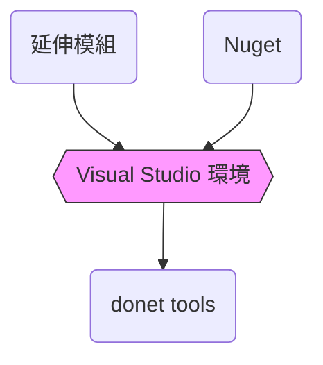

# dotnet core 開發環境建置

- dotnet core 8
    - MVC
    - Web API

整體而言，最終的開發環境如下，細節請看環境建置一節
- 後端 IDE：Visual Studio 2022 (請保持最新版本)
- 後端框架：Asp.net Core (v8) + abp framework 8.0
- 前端 IDE：Visual Studio Code
- 前端框架：Vue3, Vite + Element-Plus
- 依賴的工具：Git、Node.js、nvm

## 環境建置

### 1. 版本管理
安裝 [Git for Windows](https://gitforwindows.org/)
- 最新版為 2.46.0
- 校務組儲存庫：git.ncut.edu.tw
- 儲存庫IP：140.128.78.115

### 2. 後端開發
#### 2.1 安裝 vscode 與延伸套件
安裝 [vscode](https://code.visualstudio.com/)，並安裝下列延伸套件
- [Vue - Official](https://marketplace.visualstudio.com/items?itemName=Vue.volar)
- [Vue VSCode Snippets](https://marketplace.visualstudio.com/items?itemName=sdras.vue-vscode-snippets)
- [Live Server](https://marketplace.visualstudio.com/items?itemName=ritwickdey.LiveServer)

#### 2.2 安裝 Visual Studio 2022 (請保持最新版本)
安裝 [Visual Studio Community 2022](https://learn.microsoft.com/en-us/visualstudio/releases/2022/release-notes) 

最新版為 17.11


若有申請 Github Copilot 建議以此帳號登入



:::info
:star: 列出安裝的 .net SDK 
```bash
dotnet --list-sdks
```
:star: SSMS 連線 LocalDB

伺服器名稱 : (localdb)\MSSQLLocalDB
:::
#### a. 後端開發框架使用 Asp.net Core (ver 8)
1. 建立新專案


2. 選擇範本


3. 設定專案名稱與位置


4. 專案的檔案與目錄功能

建立專案後，出現如上圖的專案結構，其功能說明如下：
    - Connected Services: 用來管理與外部服務的連接，例如 Azure 等雲端服務。這是專案與外部服務整合的入口。
    - Properties:
        - launchSettings.json: 包含專案的啟動設定，例如伺服器 URL、啟動環境（開發、測試、正式環境）等。在本地測試時使用。
    - wwwroot:
wwwroot 資料夾通常用來存放應用程式的靜態內容，並且在 URL 中公開提供存取（例如 /css/style.css）。
        - css, js, lib: 存放靜態檔案，如 CSS 樣式、JavaScript 程式碼和第三方庫（例如 jQuery 或 Bootstrap）。
        - favicon.ico: 網站的小圖標，顯示在瀏覽器的標籤頁上。
    - Controllers:
        - HomeController.cs: 控制器類別，用來處理用戶端發出的 HTTP 請求並傳回相應的視圖或資料。HomeController 通常負責應用的首頁和基本邏輯。
    - Models:
        - ErrorViewModel.cs: 資料模型，用來定義錯誤處理頁面所需的資料結構。ASP.NET Core MVC 中，Model 負責處理與資料有關的邏輯。
    - Views:
        - Home: 包含與 HomeController 對應的視圖檔案。例如 Index.cshtml 是 HomeController 的 Index 方法的視圖。
        - Shared: 共用的視圖檔案，通常包含所有頁面會使用的部分視圖（例如頁首、頁尾）。
        - _ViewImports.cshtml: 定義共享的命名空間或標籤輔助程式，這些設定會在所有視圖中使用。
        - _ViewStart.cshtml: 定義所有視圖的起始配置，例如使用的 Layout。每次載入視圖時會先執行此檔案。
    - appsettings.json:
        - 包含應用程式的設定資訊，如資料庫連線字串、應用程式的設定參數。這是 ASP.NET Core 預設的設定檔。
        - appsettings.Development.json: 用來存放開發環境的設定，通常會覆寫 appsettings.json 中的設定。
    - Program.cs:
這是應用程式的進入點。包含建立和設定 Web 主機的邏輯，定義應用程式的啟動方式。

5. 執行應用程式
    - 按下 Ctrl + F5 在沒有偵錯工具的情況下執行應用程式。
    - 當專案尚未設定為使用 SSL 時，Visual Studio 會跳出詢問是否信任 IIS Express SSL 憑證的視窗，請都按【是】即可。
    - Visual Studio 會執行應用程式，並開啟預設瀏覽器。


:::info
若要更改預設的專案位置，可至選項 -》專案和方案 -》位置 設定

:::

#### b. 設定 nuget
1. 增加新的 nuget 套件來源 (NcutPackages)
> visual studio 選單：工具 》選項 》NuGet 套件管理員 》套件來源

按 + 鈕加入新的套件來源


- 名稱輸入：輸入NcutPackages
- 來源輸入：https://git.ncut.edu.tw/baget/v3/index.json


2. 開啟套件管理員主控台
> visual studio 選單：工具 》NuGet 套件管理員 》套件管理員主控台

#### d. 設定側邊視窗
> 檢視 》方案總管
> 檢視 》GitHub Copilot 聊天


#### e. 啟動但不偵錯
依下圖點擊執行圖示(空心三角型)或按下 Ctrl + F5


#### 2.3 安裝 dotnet 平台全域命令列工具
1. Abp 框架
ABP.IO 是一個開源應用程式框架，專注於基於ASP.NET Core的 Web 應用開發。
```
dotnet tool install -g Volo.Abp.Studio.Cli
```
2. Entity Framework Core 的命令列介面 （CLI）
安裝 dotnet ef 的全域工具，後續才能使用 dotnet ef 指令
```
dotnet tool install -g dotnet-ef
```


#### 2.4 為專案安裝套件
要使用 Entity Framework Core 與 MS SQL 資料庫，可使用以下指令安裝 NuGet 套件：
```bash=
# 安裝 EF Core 連接 SQL Server 的資料庫驅動
dotnet add package Microsoft.EntityFrameworkCore.SqlServer
# 安裝 EF Core 的命令支援，供開發過程中使用
dotnet add package Microsoft.EntityFrameworkCore.Tools
```
> `dotnet add package` 指令可對 .NET 專案新增套件

要查詢專案已安裝了哪些套件，可輸入以下指令
```bash=
dotnet list package
```


#### 2.5 為專案安裝第三方套件(選項)
EF Core Power Tools 是第三方開發的 EF Core 延伸模組，主要進行資料庫及實體類別的反向工程、資料庫移轉的管理，以及模型視覺效果。

延伸模組 》管理延伸模組 》瀏覽頁籤中搜尋 EF Core Power Tools


安裝完畢後 Visual Studio 需重開才會生效。

### 3. 前端開發
前端框架:Vue3, Vite, Element-Plus

#### 3.1 安裝 Node.js 版本管理器
NVM（Node Version Manager）可在同一台機器上安裝和切換不同版本的 Node.js。這對於測試不同 Node.js 版本下的應用程式或在不同專案中使用不同版本的 Node.js 非常有用。

<div class="btn btn-info">
注意：官方建議在安裝 NVM for Windows 之前卸載任何現有版本的 <br>
Node.js，以避免發生異常問題。另外須注意符號連結 NVM_SYMLINK <br>
預設會配置到 C:\Program Files\nodejs 目錄，因為符號連結不能 <br>
覆蓋實體目錄，因此也必須刪除此目錄。 <br>
npm 目錄也應刪除 C:\Users\<user>\AppData\Roaming\npm
</div>


首先請到 [NVM for Windows](https://github.com/coreybutler/nvm-windows/releases) Github 專案頁面下載 nvm-setup.exe，預設會安裝到路徑：`C:\Users\使用者\AppData\Roaming\nvm`


安裝完畢後到終端機輸入 `nvm version` ，若出現符合下載的版本號則為安裝成功。

#### 3.2 安裝 node.js
打開 node.js 官網 https://nodejs.org/zh-tw)，觀察目前的長期支援版號為 20.17.0


開啟終端機視窗，常用的 nvm 指令如下
```bash=
nvm install lts       # 安裝最近的長期支援版
nvm install latest    # 安裝最新版本
nvm install 20        # 安裝版本 20 的最新版
nvm install 20.16.0   # 安裝指定版本 20.16.0 版
nvm uninstall 20.15.1 # 移除指定版本 20.15.1 版

nvm list              # 目前安裝了哪些 node.js 版本
nvm use 20.16.0       # 使用指定版本 20.16.0
nvm use newest        # 使用已安裝的最新版
nvm use lts           # 使用長期支援版
nvm current           # 顯示目前使用的版本號
```

安裝完畢，可打開終端機執行下列指令確認
```bash=
node -v               # v20.17.0
npm -v                # 10.8.2
```

#### 3.3 安裝瀏覽器插件
安裝官方製作的 [Vue.js devtools](https://devtools.vuejs.org/) 瀏覽器插件可方便除錯，但有點不穩定，網友推薦使用舊版。


## 參考資料
- [ASP.NET Core MVC 入門教學](https://blog.talllkai.com/ASPNETCoreMVC/Catalog)
- [ASP.NET MVC + WebAPI課程 第一天試聽](https://www.youtube.com/watch?v=ZgmfkdQXKMU)
- [vue3 基礎教學](https://www.youtube.com/playlist?list=PLSCgthA1AnifSzKdpV4FWq1pLVF4FbZ4K)
- [重新認識 Vue.js](https://book.vue.tw/appendix/es6.html)
- [Vue 元素美麗的轉變：前端小萌新勇闖套件的魔法陣](https://ithelp.ithome.com.tw/users/20158099/ironman/6466)
    
